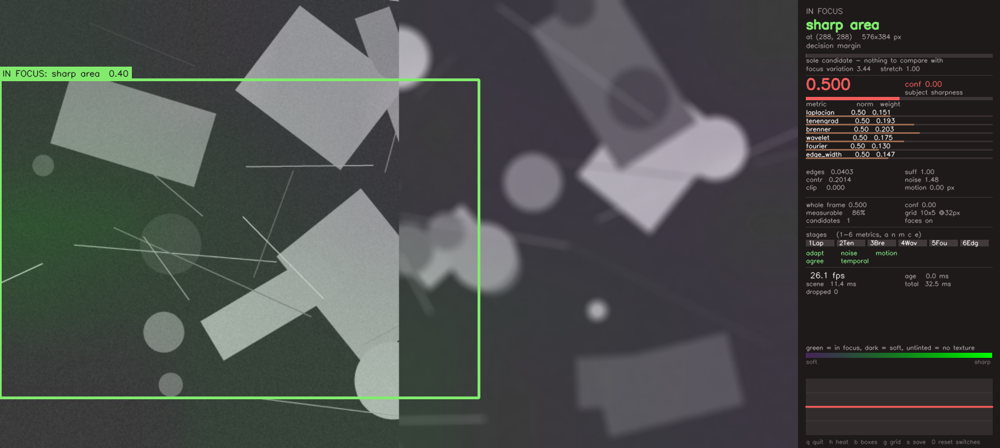
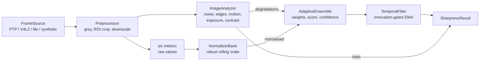
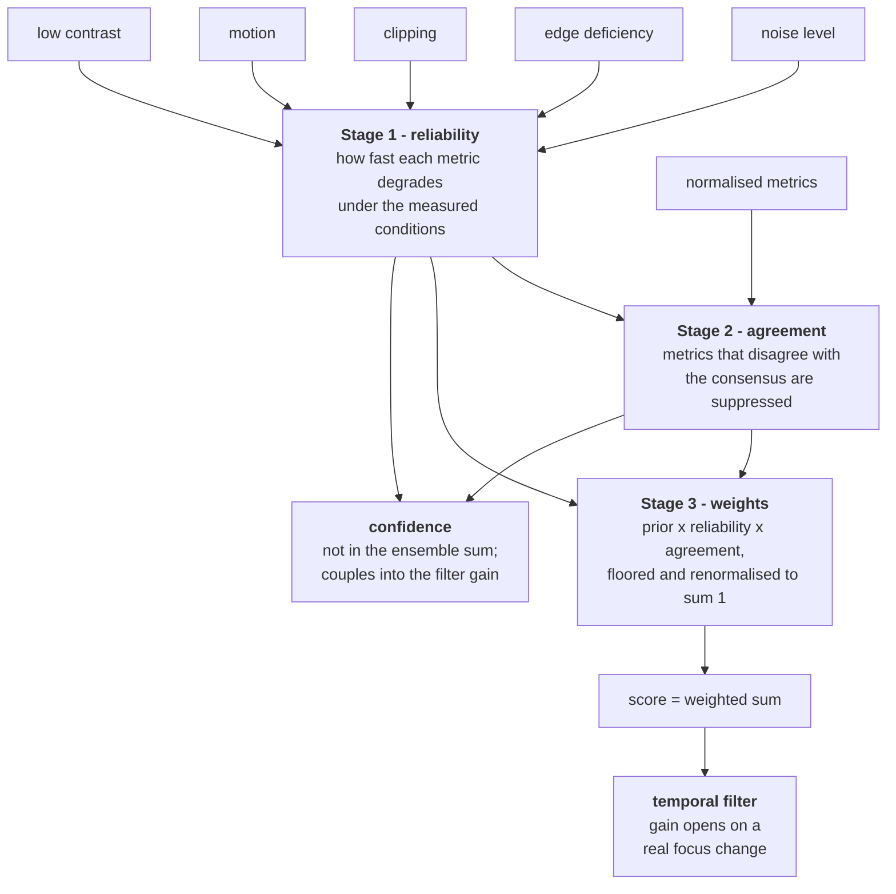
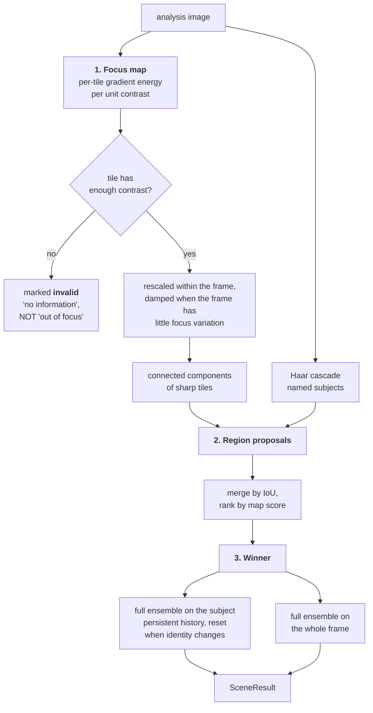
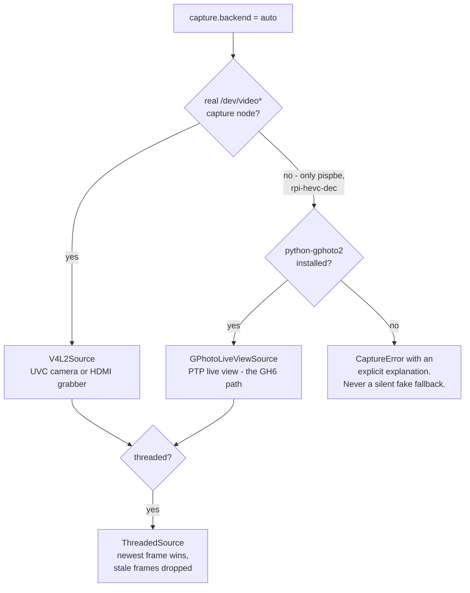

# Adaptive Sharpness

**Real-time sharpness evaluation and in-focus subject detection for autofocus systems.**

Six classical focus metrics, combined by a content-adaptive weighting scheme,
with a confidence value reported alongside the score — plus a dense focus map
that answers *which object in the frame is currently in focus*.

Built and measured on the target hardware: a **Raspberry Pi 5** with a
**Panasonic Lumix GH6** over USB-C, running at **25 fps end to end**.



*Left half sharp, right half defocused. Green marks what is in focus, dark marks
what is soft, and untinted areas have no texture to judge. The panel shows the
full breakdown: the winner, the decision margin, every metric with its current
adaptive weight, and the timings.*

---

## Contents

- [What was measured](#what-was-measured)
- [Install](#install)
- [Quick start](#quick-start)
- [How it works](#how-it-works)
- [The mathematics](#the-mathematics)
- [Results](#results)
- [The UI](#the-ui)
- [Using it as a library](#using-it-as-a-library)
- [Configuration](#configuration)
- [Project layout](#project-layout)
- [Tests](#tests)
- [Limitations](#limitations)
- [References](#references)

---

## What was measured

Every number here was measured on the hardware, not estimated. The commands that
reproduce them are in [Reproducing everything](#reproducing-everything).

### The capture path

| Fact | Measured value |
| --- | --- |
| Host | Raspberry Pi 5 Model B Rev 1.0, 8 GB, aarch64, kernel 6.12.75, Debian bookworm, Python 3.11.2 |
| Camera | `04da:2382 Panasonic DC-GH6`, USB 3.20 |
| USB interface | class 6 (Imaging) / subclass 1 (Still Image Capture) / protocol 1 (**PTP**), in **both** USB configurations |
| UVC interface | **none** |
| `/dev/video*` capture nodes | **none** — the 17 nodes present are `pispbe` and `rpi-hevc-dec`, the SoC's own ISP and codec blocks |
| Working path | PTP live view via libgphoto2 2.5.30 |
| Stream | 640×360 JPEG, ≈28 kB/frame |
| Grab / decode | 38.6 ms / 1.4 ms |
| Rate | **25.0 fps** |

**The GH6 does not expose a UVC webcam interface in its tethering USB mode**, so
`/dev/video*` capture is impossible there. This was determined from the device
descriptors, not assumed — see [docs/GH6_SETUP.md](docs/GH6_SETUP.md).

### Pipeline performance

| Quantity | Live GH6 | Synthetic source |
| --- | --- | --- |
| End-to-end throughput | **25.00 fps** (24.7 fps at the 5th percentile) | 126 fps |
| Processing per frame | 8.1 ms mean, 9.9 ms p95 | 7.9 ms |
| With the scene stage (what-is-in-focus) | 19.3 ms mean, 22.9 ms p95 | 20.2 ms |
| Capture latency | 40.0 ms | — |
| Frame age at result | 7.4 ms | — |
| Dropped (stale) frames | 0 | 0 |

The target was 15 fps. The pipeline is limited by the camera's own 25 fps
live-view rate, not by the Raspberry Pi: processing uses about a fifth of the
40 ms frame interval, or half of it with the scene stage enabled.


Note the counter-intuitive point on the left plot: **240 px is slower than
320 px**. At 240 the analysis height works out to 135, an odd and poor DFT
length; 320 gives 180. Choose an analysis width whose resulting height
factorises well, or the `fourier` metric pays for it.

---

## Install

### Raspberry Pi OS / Debian — one command

```bash
git clone https://github.com/RE22GDV/adaptive-sharpness.git
cd adaptive-sharpness
./install.sh
```

The script installs the system packages and the Python dependencies, then
verifies the camera path. `./install.sh --core` installs the library only;
`./install.sh --no-camera` skips libgphoto2.

### Manual

```bash
sudo apt install gphoto2 libgphoto2-dev python3-gphoto2 v4l-utils
python3 -m pip install --user --break-system-packages -r requirements-dev.txt
```

`--break-system-packages` is needed because Raspberry Pi OS marks its Python as
externally managed (PEP 668).

### As a package

```bash
pip install -e ".[camera,dev]"
```

### Dependencies

The core library needs **only NumPy and OpenCV**. Configuration is TOML read
with the standard library's `tomllib` (Python 3.11+), and the Haar wavelet
transform is implemented directly, so neither a TOML package nor PyWavelets is
required.

| Purpose | Package | Required? |
| --- | --- | --- |
| Core library | `numpy>=1.24`, `opencv-python>=4.8` | yes |
| PTP live view | `gphoto2>=2.3` (or `python3-gphoto2`) | only for PTP cameras |
| Tests | `pytest>=7.0` | development |
| Figures | `matplotlib>=3.5` | documentation only |

---

## Quick start

Check what the attached camera can actually do:

```bash
python3 tools/probe_camera.py
```

Run the live UI:

```bash
python3 demo/focus_ui.py --config config/default.toml --backend gphoto2
```

No camera? Everything runs against a simulated focus sweep:

```bash
python3 demo/focus_ui.py --backend synthetic --headless --frames 120
python3 demo/focus_ui.py --backend synthetic --snapshot /tmp/ui.png
```

Use it as a library:

```python
from sharpness import SharpnessEvaluator, ROI, load_config

evaluator = SharpnessEvaluator(load_config("config/default.toml"))
result = evaluator.evaluate(bgr_frame, roi=ROI(320, 180, 640, 360))

print(result.score)       # 0..1, temporally filtered
print(result.confidence)  # 0..1, how much to trust the score
print(result.weights)     # the weight each metric received on this frame
```

---

## How it works

### Overall pipeline



### The adaptive weighting, stage by stage



### Locating the in-focus subject



### Capture backend selection



---

## The mathematics

### The metrics

All six are classical and long-published; none is a contribution of this
project. Larger always means sharper.

| # | Metric | Formula | Family |
| --- | --- | --- | --- |
| 1 | Laplacian variance | $\mathrm{Var}(\nabla^2 I) / \bar{I}^2$ | 2nd derivative |
| 2 | Tenengrad | $\overline{G_x^2 + G_y^2} / \bar{I}^2$ | 1st derivative |
| 3 | Brenner | $\tfrac{1}{2}\big(\overline{(I_{x+k}-I_x)^2} + \overline{(I_{y+k}-I_y)^2}\big) / \bar{I}^2$ | pixel difference |
| 4 | Wavelet energy | $\sum_{\ell} \big(\overline{LH_\ell^2}+\overline{HL_\ell^2}+\overline{HH_\ell^2}\big) \big/ \big(4^{\ell-1}\bar{I}^2\big)$ | Haar detail |
| 5 | Spectral ratio | $\sum_{\lVert f\rVert \ge f_c} \lvert F(f)\rvert^2 \big/ \sum_f \lvert F(f)\rvert^2$ | Fourier |
| 6 | Edge width | $\big(\mathrm{median}_p\, \mathrm{range}_W(p) / \lVert\nabla I(p)\rVert\big)^{-1}$ | edge profile |

Division by $\bar{I}^2$ makes the energy metrics invariant to a multiplicative
illumination change — a requirement, since robustness to exposure change is one
of the evaluation criteria. Metrics 5 and 6 are ratios and are already
invariant.

Three details are **necessary, not cosmetic**, and each was established by
measurement rather than assumed:

- **The $4^{\ell-1}$ divisor** in the wavelet metric. The orthonormal Haar `LL`
  band has a DC gain of 2 per level, so its energy grows by 4 per level. Without
  dividing that out the metric is *not monotone in the blur*: level-1 detail
  collapses under defocus while the 4× amplified level-2 detail does not.
- **The Hann window** before the FFT. Without it the implicit discontinuity at
  the image border injects broadband energy that swamps the focus signal.
- **Percentile-adaptive Canny thresholds** in the edge-width metric. With fixed
  thresholds, fewer edges survive as defocus grows and the survivors are the
  highest-contrast ones, so the median width can *fall* while the image blurs.
  Measured at four window sizes, fixed thresholds were non-monotone at **every**
  one.

### Normalisation

Raw metric values are incommensurable, so each is mapped to $[0,1]$ by robust
percentiles of a rolling history:

$$s_i = \mathrm{clip}\left(\frac{\ln(1+x_i) - q_{5}}{q_{95} - q_{5}},\ 0,\ 1\right)$$

$\ln(1+x)$ is monotone, so it cannot change which frame is judged sharpest; it
makes the heavy-tailed energy metrics roughly symmetric, and percentile anchors
on a symmetric distribution are far more stable.

### The ensemble

$$S = \sum_i w_i s_i, \qquad \sum_i w_i = 1$$

**Stage 1 — content-conditioned reliability.** Each metric carries non-negative
sensitivity coefficients $\kappa_{ij}$ saying how fast it degrades under
condition $j$:

$$r_i = \exp\left(-\sum_j \kappa_{ij} d_j\right)$$

A log-linear model: independent degradations multiply, every $r_i$ stays in
$(0,1]$, and no condition can drive a weight negative. The five degradation
factors $d_j \in [0,1]$ are noise, edge deficiency, clipping, motion and low
contrast.

| $\kappa$ | noise | edge | clip | motion | contrast |
| --- | --- | --- | --- | --- | --- |
| laplacian | **2.2** | 0.6 | 0.5 | 0.6 | 0.7 |
| tenengrad | 1.2 | 0.7 | 0.6 | 0.7 | 0.8 |
| brenner | 1.0 | 0.9 | 0.6 | 0.9 | 0.9 |
| wavelet | 1.6 | 0.5 | 0.5 | 0.6 | 0.6 |
| fourier | 1.9 | 0.4 | 0.7 | 0.5 | 0.6 |
| edge_width | 1.4 | **2.2** | 0.9 | 1.0 | 1.0 |

The two extremes encode the two clearest facts: a second-derivative operator
amplifies white noise more than any first-derivative one, and the edge-width
metric is undefined when there are no edges to measure.

**Stage 2 — consensus agreement.** Metrics that disagree with the
reliability-weighted median $s_{\mathrm{med}}$ are suppressed by a Gaussian
kernel, where $\sigma_r = 1.4826 \cdot \mathrm{median}\lvert s_i - s_{\mathrm{med}}\rvert$:

$$a_i = \exp\left(-\frac{1}{2}\left(\frac{s_i - s_{\mathrm{med}}}{c\,\sigma_r}\right)^{2}\right)$$

**Stage 3 — weights.**

$$w_i = \frac{\max(p_i r_i a_i,\ \varepsilon)}{\sum_k \max(p_k r_k a_k,\ \varepsilon)}$$

The floor $\varepsilon$ keeps every metric marginally alive, so the ensemble can
recover when conditions improve.


Under noise the Laplacian's weight halves (0.18 → 0.09) while Brenner's rises
(0.18 → 0.28); with no edges the edge-width metric all but disappears. That is
the model doing exactly what its coefficients say it should.

### Confidence

Six factors in $[0,1]$ — edge sufficiency, SNR, exposure, contrast, inter-metric
concordance, motion — plus a resolution factor when the normalisers have no
observed range:

$$C = \min\left(\left(\prod_j c_j\right)^{1/n},\ \sqrt{\min_j c_j}\right)$$

The geometric mean alone is not enough: with six factors and a $10^{-3}$ floor
it bottoms out at 0.32 even when one factor is exactly zero. But with no edges
in the frame there is nothing whose sharpness could be measured, however good
the exposure and SNR are. The weakest-link cap expresses that; the square root
stops a merely mediocre factor from dominating.

**The confidence never enters the ensemble sum**, so `instantaneous_score` is
free of it. It *does* scale the temporal filter's baseline gain when
`temporal.confidence_coupling` is enabled, and so affects `filtered_score`.

### Temporal filtering without hiding focus changes

A plain EMA is the wrong tool: the smoothing that suppresses jitter also delays
the one event the loop is looking for. The gain is therefore made to depend on
how *surprising* the sample is:

$$z = \frac{\lvert S_t - \hat{S}_{t-1}\rvert}{\sigma_r}, \qquad g = \mathrm{smoothstep}(z; z_0, z_1)$$

$$\alpha_t = \alpha_0 + (1-\alpha_0) g, \qquad \hat{S}_t = \hat{S}_{t-1} + \alpha_t (S_t - \hat{S}_{t-1})$$

$\sigma_r$ is a robust estimate of the recent frame-to-frame variation, so the
gate measures surprise in units of the score's own noise rather than in absolute
units needing per-scene tuning. When $g \to 1$ the filter is fully transparent
and a real transition passes with no lag.


**1 frame to follow a focus step, against 6 for a plain EMA at the same baseline
gain** — with no loss of smoothing in between.

### The per-tile focus measure

For the "what is in focus" map, each tile is scored by gradient energy per unit
contrast:

$$m = \frac{\overline{\lVert\nabla I\rVert^2}}{\mathrm{Var}(I) + \epsilon}$$

A ratio, so it does not simply reward whichever region has more texture. Tiles
below a minimum contrast are marked **invalid** rather than "out of focus",
because a blank wall and a badly defocused wall are indistinguishable to any
gradient measure.


Three candidates were compared on controlled split-focus scenes, including the
adversarial case — a *sparsely textured but sharp* half beside a *densely
textured but blurred* one. On clean scenes all three work. Noise separates them:
`lap_over_grad`, a ratio of two high-pass measures, collapses below the decision
threshold at σ ≈ 20 and goes **negative** at σ = 26, meaning it picks the wrong
half. `grad_over_var` holds its margin and is the default.

---

## Results

### Metric response through a focus sweep


All six metrics fall monotonically with defocus — verified as a regression test,
not just plotted.

### Method comparison

`tools/compare_methods.py` compares each metric alone, a plain mean, a fixed
weighted mean, the adaptive ensemble and three ablations, on identical data with
identical frozen normalisation, across nine conditions.


The criterion that separates them is **hill-climb distance**: how far from the
true peak a greedy search ends up. That is what an autofocus loop actually does
— it never sees the whole curve, it takes steps and follows the gradient.

**Where the adaptive weighting clearly wins** — the `low_texture` condition,
which is the case it was designed for. With little structure in the frame the
`edge_width` metric becomes unreliable (4 steps of peak error on its own):

| method | monotonicity | peak error | hill climb | discrimination | false peaks |
| --- | --- | --- | --- | --- | --- |
| `single:edge_width` | 0.875 | 4 | 4.0 | 1.59 | 1 |
| `plain_mean` | 0.925 | 1 | 3.0 | 1.70 | **2** |
| `fixed_weighted` | 0.925 | 1 | 3.0 | 1.81 | **2** |
| **`adaptive`** | **0.975** | 1 | **1.0** | **2.74** | **0** |

The fixed schemes keep giving a failed metric its full weight and pick up two
false peaks; the adaptive scheme suppresses it and keeps a single clean maximum.

### Robustness


The peak survives noise σ = 20, exposure drift and 4 px of motion.

### Honest negative results

These matter as much as the positive ones:

- **Combining metrics matters more than how you combine them.** On a clean
  sweep a greedy search on *any* single metric ends 20 steps from the peak,
  while *every* combination scheme does far better. The choice of combination
  rule is a second-order effect next to that.
- **The adaptive scheme does not win everywhere.** Across nine conditions it
  wins or ties `plain_mean` in eight and **loses one** (`exposure_drift`, hill
  climb 2.5 against 1.0). Outside `low_texture` and `clipped_highlights` its
  margin is modest.
- **It costs repeatability.** Over five independent noise realisations of the
  same sweep, every fixed method selected the same peak every time (std 0.000
  steps) while the adaptive scheme moved between two adjacent frames (std
  0.980). Mean accuracy is unchanged, so this is variance, not bias — the
  weights are themselves computed from noisy measurements.
- **The noise adaptation never engages on this camera.** The GH6 live-view JPEG
  is denoised in-camera: measured noise σ = 0.0000 across 90 frames. Every
  noise-related result reported here comes from synthetic data.
- **Threading buys almost nothing at the operating point.** 25.00 fps threaded
  against 24.98 serial, and 7.4 ms of frame age against 9.1. It is left on
  because it is the better latency, but the pipeline is camera-bound and
  threading is not the reason the target rate is met.

### Bugs found by measurement

Each of these was found by an experiment, not by reading the code:

| Bug | How it showed up |
| --- | --- |
| `cv2.phaseCorrelate` **modifies its input arrays** | Storing the same array as the previous-frame reference silently corrupted it → drifting phantom motion on a static scene |
| `cv2.phaseCorrelate` has a size-dependent sub-pixel bias | Correlating an array with itself returns `(0.0, 0.5)` at 44×80 but `(0.0, 0.0)` at 46×82 → 2 px of reported motion on a still frame |
| Strided decimation aliases | The aliasing pattern changes with blur, so a pure focus change looked like motion |
| Fixed Canny thresholds break the edge metric | Non-monotone in defocus at every window size tested |
| Wavelet LL gain compounds per level | The metric *rose* with defocus |
| A static scene reported 0.99 confidence | Every metric pinned at a neutral 0.5 reads as perfect agreement; fixed by a resolution factor |
| `edge_ref_density` was 8× too high | Real GH6 frames measure 0.006–0.009; the guess was 0.06, capping confidence on every frame |
| `confidence_dispersion_ref` was too tight | Real subject-sized ROIs have 0.18–0.33 metric spread; the 0.25 threshold zeroed confidence on a quarter of good frames |

### Reproducing everything

```bash
python3 tools/probe_camera.py --frames 40 --json data/probe_report.json
python3 -m pytest tests/ -q
python3 tools/benchmark.py --backend gphoto2 --frames 150 --json data/bench.json
python3 tools/benchmark.py --backend gphoto2 --frames 100 --compare-threading
python3 tools/benchmark.py --backend synthetic --sweep-analysis-width
python3 tools/benchmark.py --backend gphoto2 --frames 90 --scene
python3 tools/compare_methods.py --config config/default.toml --json data/comparison.json
python3 tools/compare_focus_measures.py
python3 tools/calibrate_stats.py --backend gphoto2 --frames 90
python3 tools/make_figures.py
```

Collect a labelled dataset, optionally with the focus actuator position supplied
by an external controller, then compare methods on that recording:

```bash
python3 tools/collect_dataset.py --backend gphoto2 --frames 300 \
    --out data/run1.csv --save-frames data/run1_frames --motor-file /run/focus_position
python3 tools/compare_methods.py --frames-dir data/run1_frames --best-index 20
```

The protocol for recording a real focus sweep is in
[docs/EXPERIMENTS.md](docs/EXPERIMENTS.md).

---

## The UI

```bash
python3 demo/focus_ui.py --config config/default.toml --backend gphoto2
```

**Every stage of the algorithm can be switched on and off at run time**, so the
effect of each is visible directly rather than only in an offline ablation
table.

| key | effect | key | effect |
| --- | --- | --- | --- |
| `1`–`6` | toggle individual metrics | `h` | heat map |
| `a` | adaptive weighting → fixed weights | `b` | candidate boxes |
| `n` | noise compensation | `t` | tile grid |
| `m` | motion compensation | `g` | cycle tile size |
| `c` | consensus agreement | `f` | face detector |
| `e` | temporal filter | `s` | save a PNG |
| `0` | restore all defaults | `space` | pause |


*The same scene with the adaptive weighting and the temporal filter switched
off. The `stages` block near the bottom of the panel shows which are active, and
the weights fall back to the fixed priors.*

Two distinctions the panel keeps separate, because collapsing them would make it
lie:

- **"no texture" is not "out of focus"** — untextured tiles are left untinted
  and excluded from the ranking; the panel reports what fraction of the frame
  was measurable at all.
- **confidence in the score is not confidence in the decision** — a subject can
  be measured precisely while barely beating the runner-up. `conf` is the
  measurement, `decision margin` is the ranking.

More in [docs/FOCUS_UI.md](docs/FOCUS_UI.md).

---

## Using it as a library

```python
from sharpness import SceneEvaluator, SharpnessEvaluator, ROI, load_config

config = load_config("config/default.toml")

# Score one region over time.
evaluator = SharpnessEvaluator(config)
result = evaluator.evaluate(frame, roi=ROI(320, 180, 640, 360), motor_position=0.42)
result.score, result.confidence, result.weights, result.focus_change_detected

# Or find what is in focus across the whole frame.
scene = SceneEvaluator(config)
out = scene.evaluate(frame)
if out.has_subject:
    print(out.subject.label, out.subject.center, out.separation())
```

Driving a focus servo:

```python
result = evaluator.evaluate(frame, roi=subject_roi, motor_position=servo.position())

if result.confidence < 0.35:
    return                      # a low-confidence frame carries no usable step
if result.score > best_score:
    best_score, best_position = result.score, servo.position()
else:
    direction, step = -direction, max(step * 0.5, 0.002)
servo.move_to(servo.position() + direction * step)
```

`SharpnessEvaluator` and `SceneEvaluator` hold per-stream state and are **not
thread-safe**: construct one per stream. Full worked example in
[docs/INTEGRATION.md](docs/INTEGRATION.md).

---

## Configuration

Everything is in [`config/default.toml`](config/default.toml), fully commented.
Unknown keys and unknown sections are **rejected at load time**, so a typo fails
loudly instead of silently changing behaviour.

```python
config = SharpnessConfig().with_overrides(
    pipeline={"analysis_width": 240},
    metrics={"enabled": ("laplacian", "tenengrad", "brenner")},
    temporal={"alpha_base": 0.5, "gate_abs_jump": 0.08},
)
```

| Section | Controls |
| --- | --- |
| `pipeline` | analysis resolution, ROI default, pre-filter |
| `metrics` | which metrics, their priors, per-metric parameters |
| `normalization` | rolling window, percentile anchors, log compression |
| `analysis` | reference levels for noise, edges, contrast, motion, clipping |
| `focus_map` | tile size, per-tile measure, validity threshold |
| `regions` | detectors, face cascade parameters, merging |
| `ensemble` | the κ sensitivity matrix, agreement, confidence references |
| `temporal` | baseline gain, gate thresholds, confidence coupling |
| `capture` | backend, resolution, threading |

---

## Project layout

```
sharpness/              the library - NumPy + OpenCV only
├── types.py            ROI, Frame, ImageStats, MetricSample, SharpnessResult
├── config.py           frozen dataclasses + TOML loading and validation
├── preprocess.py       greyscale, ROI crop, analysis downscale
├── metrics/            the six metrics behind one interface
│   ├── base.py         SharpnessMetric contract, contrast normalisation
│   ├── gradient.py     Laplacian, Tenengrad, Brenner
│   ├── frequency.py    Haar wavelet, Fourier
│   └── edge.py         edge width
├── analysis.py         noise, edges, motion, exposure, anisotropy
├── normalize.py        running robust normalisation
├── ensemble.py         adaptive weighting and confidence
├── temporal.py         innovation-gated smoothing
├── evaluator.py        SharpnessEvaluator, RegionEvaluator
├── focusmap.py         dense per-tile focus map
├── regions.py          region proposals (faces, sharp blobs)
└── scene.py            SceneEvaluator - which object is in focus

capture/                frame sources behind one interface
├── base.py             FrameSource, ThreadedSource (newest frame wins)
├── gphoto_source.py    PTP live view - the working GH6 path
├── v4l2_source.py      UVC camera / HDMI capture device
├── file_source.py      video file, image directory
└── synthetic_source.py simulated focus sweep

tools/                  probe, benchmark, calibration, dataset, comparison, figures
demo/                   focus_ui.py (what is in focus), demo_app.py (whole frame)
tests/                  307 unit and integration tests
config/default.toml     fully commented configuration
docs/                   architecture, algorithm, limitations, setup, experiments
```

### Layering

`sharpness` never imports `capture`, `tools` or `demo`. It has no knowledge of
cameras, files, threads or windows — it turns arrays into scores. That is what
makes it testable without hardware and embeddable in a program that already has
its own capture.

Full description in [docs/ARCHITECTURE.md](docs/ARCHITECTURE.md).

---

## Tests

```bash
python3 -m pytest tests/ -q
```

**307 tests, all passing on the Raspberry Pi 5 in about 32 seconds.**

| File | Covers |
| --- | --- |
| `test_metrics.py` | metric contracts, monotonicity in defocus, exposure invariance, Haar orthonormality, physical plausibility of the edge width |
| `test_analysis.py` | noise estimator against known σ, motion against known translation, degradation mapping |
| `test_ensemble.py` | weight invariants, adaptive behaviour, ablation switches, confidence |
| `test_temporal.py` | gate opens on real steps, stays closed on jitter, confidence coupling |
| `test_evaluator.py` | end-to-end, ROI isolation, state handling, serialisation |
| `test_scene.py` | focus map correctness including the texture-vs-blur distinction, region proposals, subject tracking |
| `test_capture.py` | frame sources, stale-frame dropping, error propagation |
| `test_config.py` | TOML loading, typo rejection, running normaliser |
| `test_ui.py` | run-time switches, rendering in every state |

Several tests exist specifically to keep a fixed bug fixed — for example
`test_static_scene_reports_near_zero` (the `phaseCorrelate` in-place
modification) and `test_default_measure_survives_heavy_noise`.

---

## Limitations

Stated plainly, because a method's boundaries are part of its description.

- **No claim of scientific novelty is made.** All six metrics are classical.
  What is proposed is the *combination scheme*, and validating that as novel
  would require re-implementing published combination schemes and running them
  on the same data — which has **not** been done.
- **All comparisons use simulated defocus.** A disc PSF is a reasonable model of
  the circle of confusion, but a real lens adds spherical aberration,
  vignetting, focus breathing and subject motion. **No real recorded focus sweep
  has been analysed.** The tools to collect one exist; the corpus does not.
- **The κ coefficients are reasoned, not fitted.** They encode qualitative facts
  and should be estimated from a labelled sweep corpus.
- **One scene family, one camera, one lighting setup.** Five noise seeds is
  enough to notice the repeatability difference, not to bound it.
- **640×360 at 25 fps is the ceiling on this camera** and the ~40 ms capture
  latency is not ours to improve. An external HDMI capture device is the
  supported route past both.
- **Sharpness is not focus.** Motion blur, a dirty lens, haze and heavy
  compression all reduce high-frequency content without any focus error.
- **Only global translation is detected as motion.** A subject moving inside a
  static frame is not.
- **The subject is whatever is sharpest, not whatever matters.** Without a face
  in frame, "sharp area" is a geometric answer, not a semantic one.

Full list with the reasoning: [docs/LIMITATIONS.md](docs/LIMITATIONS.md).

---

## Documentation

| Document | Contents |
| --- | --- |
| [docs/ALGORITHM.md](docs/ALGORITHM.md) | full derivation, what is established vs proposed, what novelty would require |
| [docs/ARCHITECTURE.md](docs/ARCHITECTURE.md) | module boundaries, data flow, design decisions |
| [docs/FOCUS_UI.md](docs/FOCUS_UI.md) | locating the in-focus subject, and the UI |
| [docs/GH6_SETUP.md](docs/GH6_SETUP.md) | camera configuration, device descriptors, troubleshooting |
| [docs/EXPERIMENTS.md](docs/EXPERIMENTS.md) | protocol for recording and analysing a real focus sweep |
| [docs/INTEGRATION.md](docs/INTEGRATION.md) | using the library inside an autofocus loop |
| [docs/LIMITATIONS.md](docs/LIMITATIONS.md) | what this does not do |

---

## References

- Brenner, J. F. et al. (1976). An automated microscope for cytologic research. *J. Histochem. Cytochem.* 24(1).
- Donoho, D. L. & Johnstone, I. M. (1994). Ideal spatial adaptation by wavelet shrinkage. *Biometrika* 81(3).
- Ferzli, R. & Karam, L. J. (2009). A no-reference objective image sharpness metric based on the notion of just noticeable blur. *IEEE TIP* 18(4).
- Kautsky, J. et al. (2002). A new wavelet-based measure of image focus. *Pattern Recognition Letters* 23(14).
- Krotkov, E. (1987). Focusing. *Int. J. Computer Vision* 1(3).
- Marziliano, P. et al. (2002). A no-reference perceptual blur metric. *ICIP*.
- Pech-Pacheco, J. L. et al. (2000). Diatom autofocusing in brightfield microscopy: a comparative study. *ICPR*.
- Pertuz, S., Puig, D. & Garcia, M. A. (2013). Analysis of focus measure operators for shape-from-focus. *Pattern Recognition* 46(5).
- Yang, G. & Nelson, B. J. (2003). Wavelet-based autofocusing and unsupervised segmentation of microscopic images. *IROS*.

---

## License

MIT — see [LICENSE](LICENSE).
