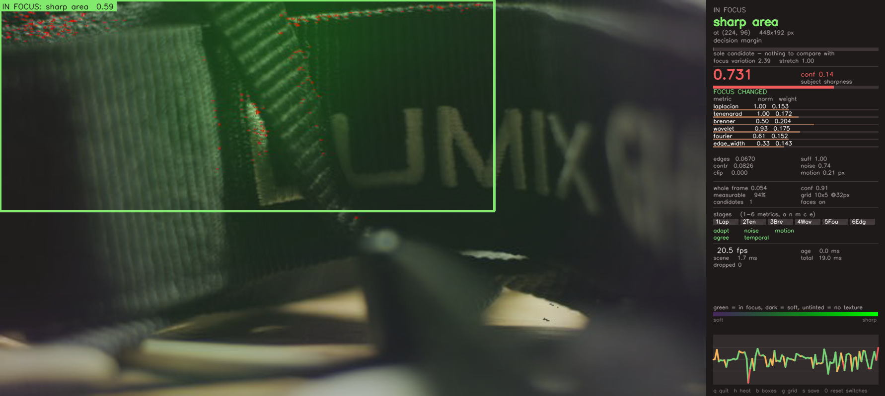
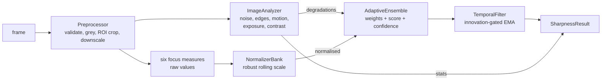
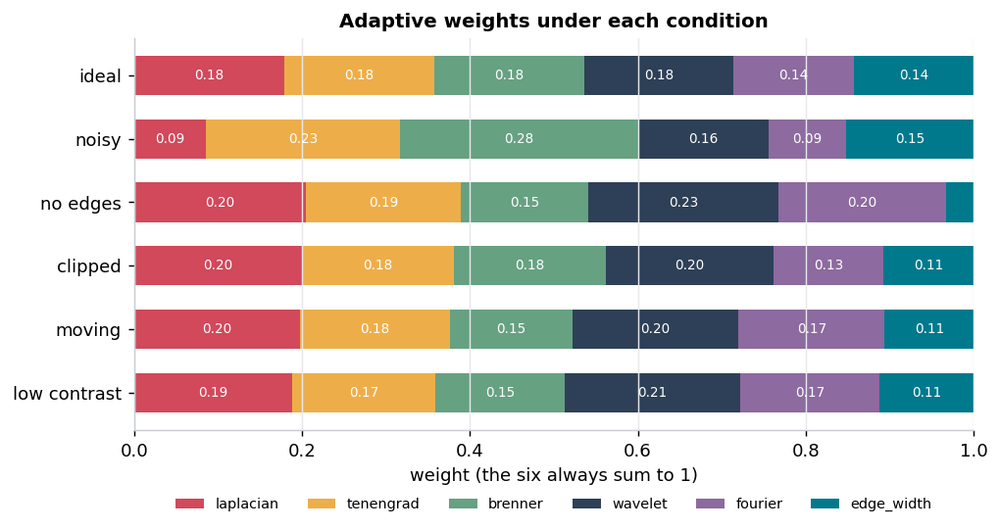
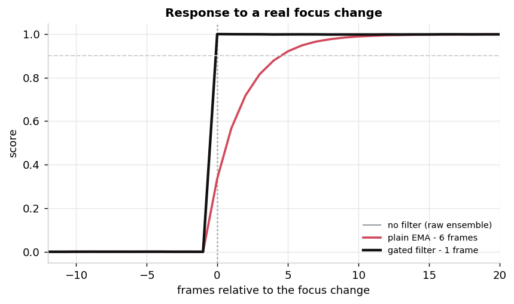
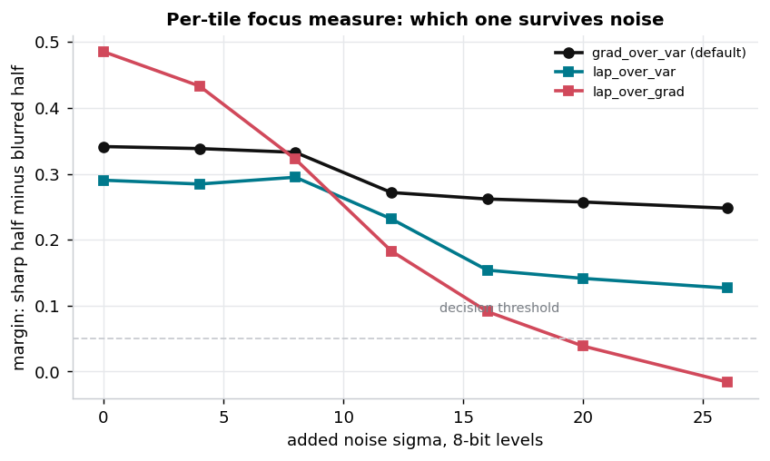
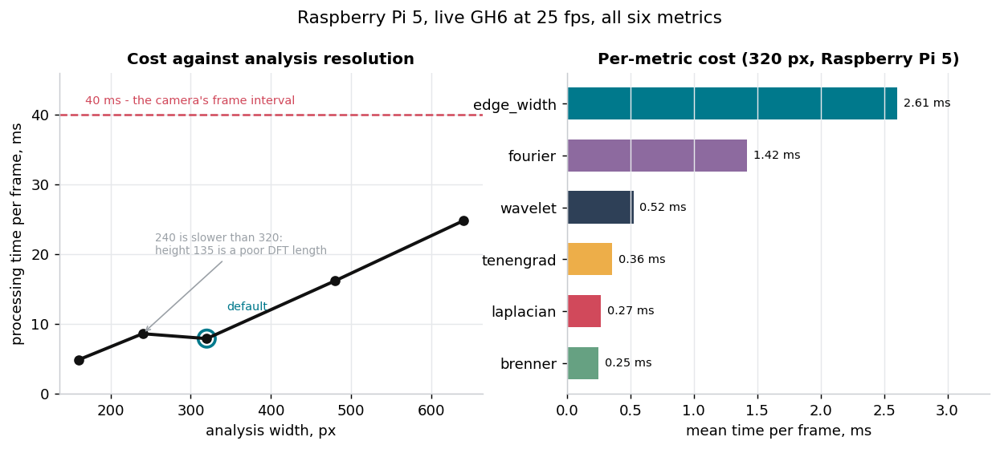
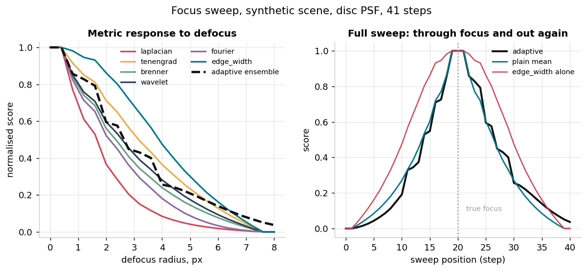
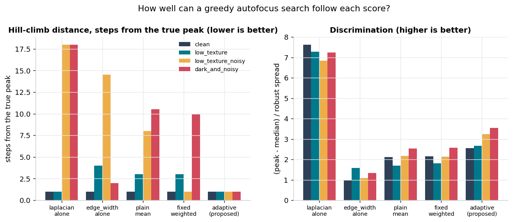
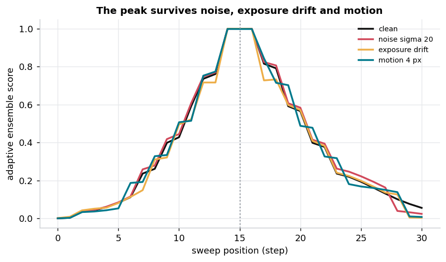

# Adaptive Sharpness

A stateful Python library for real-time, no-reference focus evaluation.

The library accepts grayscale or BGR NumPy frames and returns:

- a **relative** focus score;
- raw values of six focus measures;
- adaptive per-metric weights;
- a heuristic measurement-confidence estimate;
- an optional spatial map of the sharpest textured regions.

**The core library does not control a camera, lens or focus motor.** Capture
backends, the UI and the experimental tools are optional examples built around
the core API.



*Optional UI on a live Panasonic GH6. Green marks the regions the map found
sharpest, dark marks soft ones, and untinted areas have too little texture to
judge. The panel shows the winner, the decision margin, every metric with its
current weight, and the timings.*

---

## Contents

- [Scope](#scope)
- [Installation](#installation)
- [Minimal integration](#minimal-integration)
- [Input contract](#input-contract)
- [Output fields](#output-fields)
- [State, warm-up and reset](#state-warm-up-and-reset)
- [How the score is built](#how-the-score-is-built)
- [Configuration](#configuration)
- [Optional: spatial focus map](#optional-spatial-focus-map)
- [Optional: capture backends and UI](#optional-capture-backends-and-ui)
- [Reference hardware benchmark](#reference-hardware-benchmark)
- [Preliminary synthetic validation](#preliminary-synthetic-validation)
- [Limitations](#limitations)
- [Research tools](#research-tools)
- [References](#references)

---

## Scope

### What it does

Given a stream of frames, it estimates how sharp each one is *relative to the
recent history of that stream*, by combining six focus measures with weights
that adapt to the measured conditions of each frame.

### What it does not do

| Not provided | Why |
| --- | --- |
| Camera control | The library never opens a device. `adaptive_sharpness.capture` is an optional convenience with a `FrameSource` interface you can ignore or replace. |
| Focus motor control | No search strategy, no actuator driver. `docs/INTEGRATION.md` shows how to write one on top. |
| Absolute sharpness | The score is relative to a rolling history. There is no calibrated "this frame is 0.8 sharp" scale. |
| Object recognition | The optional scene map finds the *sharpest textured region*. It does not know which object matters. |
| A calibrated probability | `confidence` is a heuristic indicator, not a statistically calibrated quantity. |

### Score semantics — read this before integrating

`instantaneous_score` and `filtered_score` are **relative to the recent history
of one evaluator instance**. They depend on:

- previous frames and the current normalisation window;
- the scene and the ROI;
- which metrics are enabled;
- the order frames arrive in;
- the state of the temporal filter.

**Scores from different scenes, ROIs, configurations or evaluator instances are
not directly comparable.** Two evaluators both reporting `0.8` do not
necessarily see equally sharp images. Within one instance, on one stream, a
rising score does mean increasing sharpness — that is the property a focus
search needs.

---

## Installation

```bash
python -m venv .venv
source .venv/bin/activate      # Windows: .venv\Scripts\activate
pip install .
```

Development install (editable, with tests and figure tooling):

```bash
pip install -e ".[dev]"
```

PTP camera support is optional:

```bash
pip install ".[camera]"
```

### Requirements

| Purpose | Package | Required? |
| --- | --- | --- |
| Core library | `numpy>=1.24`, `opencv-python>=4.8,<5` | yes |
| PTP live view | `gphoto2>=2.3` | only for the optional PTP backend |
| Tests | `pytest>=7.0` | development |
| Figures | `matplotlib>=3.5` | documentation only |

Python 3.11+ is required: configuration loading uses the standard library's
`tomllib`. The Haar wavelet transform is implemented directly, so PyWavelets is
not needed.

OpenCV is pinned below 5.0. A 5.0 run was reported to fail a substantial part of
the suite, largely around `CascadeClassifier` availability; the bound will be
lifted once a 5.x run is green.

<details>
<summary>Raspberry Pi OS</summary>

Raspberry Pi OS marks its Python installation as externally managed (PEP 668),
so a virtualenv or `--break-system-packages` is needed. `install.sh` handles
that plus the system packages for the optional PTP path:

```bash
git clone https://github.com/RE22GDV/adaptive-sharpness.git
cd adaptive-sharpness
./install.sh                # core + camera + dev
./install.sh --core         # library only
```

</details>

---

## Minimal integration

```python
import numpy as np
from adaptive_sharpness import SharpnessEvaluator, load_default_config

evaluator = SharpnessEvaluator(load_default_config())

for frame in frames:                     # H x W x 3 uint8 BGR
    result = evaluator.evaluate(frame)
    if not result.ready:
        continue                         # normalisers have no scale yet
    print(result.filtered_score, result.confidence)
```

With a region of interest, in **source-frame** pixel coordinates:

```python
from adaptive_sharpness import ROI

result = evaluator.evaluate(frame, roi=ROI(x=320, y=180, width=640, height=360))
```

Passing the focus actuator position through, so a recorded run stays analysable:

```python
result = evaluator.evaluate(frame, roi=roi, motor_position=servo.position())
```

`SharpnessConfig()` gives the built-in defaults without touching the filesystem;
`load_default_config()` reads the TOML shipped inside the package;
`load_config(path)` reads your own.

---

## Input contract

`evaluate()` takes a `numpy.ndarray` or a `Frame`.

| Property | Accepted | Notes |
| --- | --- | --- |
| Shape | `(H, W)`, `(H, W, 1)`, `(H, W, 3)`, `(H, W, 4)` | anything else raises |
| Channel order | **BGR** by default | set `pipeline.color_order = "RGB"` for RGB; getting this wrong is otherwise silent |
| dtype | `uint8` (recommended), `uint16`, `float32`, `float64` | `int32` and friends raise |
| Range | `[0, 255]` | `float` input in `[0, 1]` is **rejected** with an explanatory error |
| Partial-range integers | set `pipeline.input_max` | e.g. `4095` for 12-bit samples stored in `uint16` |

The frame is never modified. Violations raise `ValueError`/`TypeError` with a
message naming the fix, rather than producing plausible but wrong numbers.

```python
config = SharpnessConfig().with_overrides(
    pipeline={"color_order": "RGB", "input_max": 4095}
)
```

---

## Output fields

`evaluate()` returns a frozen `SharpnessResult`.

### Scores

| Field | Meaning |
| --- | --- |
| `instantaneous_score` | Ensemble output for **this frame alone**, in `[0, 1]`. Never affected by the confidence. |
| `filtered_score` | `instantaneous_score` after the temporal filter, in `[0, 1]`. **Affected by the confidence** when `temporal.confidence_coupling` is enabled. |
| `score` | Deprecated alias for `filtered_score`. |

Use `instantaneous_score` when you want the raw per-frame measurement, and
`filtered_score` for a control loop that wants jitter suppressed.

### Confidence

| Field | Meaning |
| --- | --- |
| `confidence` | A heuristic indicator of whether the frame contains sufficient information for focus evaluation. **It is not a calibrated probability.** |

It is the geometric mean of six necessary-condition factors — edge sufficiency,
SNR, exposure, contrast, inter-metric concordance, motion — capped by the
weakest one. A value near zero means one factor collapsed, most often "there is
nothing textured in this frame to measure".

### State

| Field | Meaning |
| --- | --- |
| `ready` | The normalisers have a usable observed range. Scores before this are placeholders. |
| `warmup_samples` | Frames the normalisers have observed. |
| `informative_fraction` | Fraction of metrics whose normalisation is meaningful. `0.0` means every metric is pinned at its neutral value because nothing in the stream has varied. |
| `score_change_detected` | The score jumped far beyond its recent noise. A focus change is one cause; subject motion, a ROI change or an exposure change are others. `focus_change_detected` is a deprecated alias. |

### Detail

| Field | Meaning |
| --- | --- |
| `metrics` | Per metric: `raw`, `normalized`, `weight`, `reliability`, `agreement`, `compute_time_s` |
| `stats` | Measured frame conditions: noise, edge density, contrast, brightness, clipping, motion, anisotropy |
| `roi`, `motor_position`, `frame_index`, `timestamp` | As supplied |
| `processing_time_s`, `capture_latency_s` | Timing |

`result.as_row()` gives a flat dict for CSV; `result.to_dict()` / `to_json()`
give a structured form. Neither drops anything that was computed.

---

## State, warm-up and reset

**One evaluator instance corresponds to one video stream.** The normalisers, the
motion reference and the temporal filter all hold history.

`SharpnessEvaluator` and `SceneEvaluator` are **not thread-safe**. Evaluating
two streams from two threads with one instance corrupts both.

Call `reset()` whenever the context changes:

- a different camera or stream;
- a different resolution;
- a change of ROI size or position;
- a scene cut;
- switching between whole-frame and ROI analysis (the analysis scale differs, so
  the raw metric ranges differ).

```python
if roi != previous_roi:
    evaluator.reset()
```

Readiness needs **observed variation**, not merely a number of frames. A
perfectly frozen scene drives every metric to its neutral value and never
becomes ready — reported honestly as `informative_fraction == 0.0` and a
confidence near zero, rather than as a confident 0.5.

---

## How the score is built



### The six focus measures

**Derived from classical operators**, with documented modifications — they are
not used unchanged. Larger always means sharper.

| # | Measure | Formula | Deviation from the textbook form |
| --- | --- | --- | --- |
| 1 | Laplacian variance | $\mathrm{Var}(\nabla^2 I) / \bar{I}^2$ | divided by $\bar{I}^2$ |
| 2 | Tenengrad | $\overline{G_x^2 + G_y^2} / \bar{I}^2$ | no gradient threshold; divided by $\bar{I}^2$ |
| 3 | Brenner | $\tfrac{1}{2}(\overline{(I_{x+k}-I_x)^2} + \overline{(I_{y+k}-I_y)^2}) / \bar{I}^2$ | both directions, not horizontal only |
| 4 | Wavelet energy | $\sum_{\ell} (\overline{LH_\ell^2}+\overline{HL_\ell^2}+\overline{HH_\ell^2}) / (4^{\ell-1}\bar{I}^2)$ | per-level gain correction |
| 5 | Spectral ratio | $\sum_{\lVert f\rVert \ge f_c} \lvert F\rvert^2 / \sum_f \lvert F\rvert^2$ | Hann window before the transform |
| 6 | Edge width | $(\mathrm{median}_p\, \mathrm{range}_W(p) / \lVert\nabla I(p)\rVert)^{-1}$ | percentile-adaptive Canny thresholds |

Division by $\bar{I}^2$ makes the energy measures invariant to a multiplicative
illumination change. Three of the deviations are **necessary, not cosmetic**,
and each was established by measurement:

- Without the $4^{\ell-1}$ divisor the wavelet measure **rises** with defocus:
  the orthonormal Haar `LL` band has a DC gain of 2 per level, so deeper levels
  are inflated fourfold.
- Without the Hann window the image border injects broadband energy that swamps
  the focus signal.
- With fixed Canny thresholds the edge-width measure is non-monotone in
  defocus — fewer edges survive as blur grows, and the survivors are the
  highest-contrast ones. Measured at four window sizes, fixed thresholds failed
  at **every** one.

### Adaptive weighting

$$S = \sum_i w_i s_i, \qquad \sum_i w_i = 1$$

**Stage 1 — reliability.** Each measure carries non-negative sensitivity
coefficients $\kappa_{ij}$ describing how fast it degrades under condition $j$:

$$r_i = \exp\left(-\sum_j \kappa_{ij} d_j\right)$$

The five degradation factors $d_j \in [0,1]$ are noise, edge deficiency,
clipping, motion and low contrast.

| $\kappa$ | noise | edge | clip | motion | contrast |
| --- | --- | --- | --- | --- | --- |
| laplacian | **2.2** | 0.6 | 0.5 | 0.6 | 0.7 |
| tenengrad | 1.2 | 0.7 | 0.6 | 0.7 | 0.8 |
| brenner | 1.0 | 0.9 | 0.6 | 0.9 | 0.9 |
| wavelet | 1.6 | 0.5 | 0.5 | 0.6 | 0.6 |
| fourier | 1.9 | 0.4 | 0.7 | 0.5 | 0.6 |
| edge_width | 1.4 | **2.2** | 0.9 | 1.0 | 1.0 |

**These are reasoned starting points, not values fitted to data.**

**Stage 2 — agreement.** Measures that disagree with the reliability-weighted
median are suppressed by a Gaussian kernel.

**Stage 3 — weights.** $w_i \propto \max(p_i r_i a_i, \varepsilon)$, renormalised
to sum to 1. The floor keeps every measure marginally alive so the ensemble can
recover when conditions improve.



Under noise the Laplacian's weight halves (0.18 → 0.09) while Brenner's rises
(0.18 → 0.28); with no edges the edge-width measure all but disappears.

### Temporal filtering

The gain depends on how *surprising* the sample is, so smoothing does not delay
a real transition:

$$z = \frac{\lvert S_t - \hat{S}_{t-1}\rvert}{\sigma_r}, \quad g = \mathrm{smoothstep}(z), \quad \alpha_t = \alpha_0 + (1-\alpha_0) g$$

$\sigma_r$ is a robust estimate of the recent **frame-to-frame variation of the
input**, so the gate measures surprise in units of the score's own noise.



1 frame to follow a step, against 6 for a plain EMA at the same baseline gain.

Full derivation: [docs/ALGORITHM.md](docs/ALGORITHM.md).

---

## Configuration

The shipped defaults live inside the package
(`adaptive_sharpness/data/default.toml`) and are reachable through
`default_config_path()`. Unknown keys and sections are **rejected at load time**.

```python
from adaptive_sharpness import SharpnessConfig, load_config, default_config_path

config = SharpnessConfig().with_overrides(
    pipeline={"analysis_width": 240, "color_order": "RGB"},
    metrics={"enabled": ("laplacian", "tenengrad", "brenner")},
    temporal={"alpha_base": 0.5, "confidence_coupling": False},
)
# or start from the shipped file:
config = load_config(default_config_path())
```

| Section | Controls |
| --- | --- |
| `pipeline` | analysis resolution, colour order, input range, ROI default |
| `metrics` | which measures, their priors, per-measure parameters |
| `normalization` | rolling window, percentile anchors, log compression |
| `analysis` | reference levels for noise, edges, contrast, motion, clipping |
| `focus_map` | tile size, per-tile measure, validity threshold |
| `regions` | detectors, face cascade parameters, merging |
| `ensemble` | the κ matrix, agreement, confidence references |
| `temporal` | baseline gain, gate thresholds, confidence coupling |
| `capture` | optional backends only |

---

## Optional: spatial focus map

`SceneEvaluator` adds a dense per-tile map and region proposals, answering
**which textured region appears sharpest in the frame**.

```python
from adaptive_sharpness import SceneEvaluator, load_default_config

scene = SceneEvaluator(load_default_config())
out = scene.evaluate(frame)

if out.has_subject:
    print(out.subject.label, out.subject.center)
    print("lead over runner-up:", out.separation())
```

The design turns on one fact: **low gradient energy has two different causes** —
the region is defocused, or it has no texture at all. A blank wall, the sky and
a heavily defocused object can be indistinguishable. Tiles below a contrast
threshold are therefore marked *invalid* rather than reported as blurred, and
`FocusMap.valid_fraction` says how much of the frame was measurable.

Ranking uses the map, not the ensemble: the ensemble score is normalised against
a rolling history, which is the wrong basis for comparing regions *within* one
frame.

Per-tile measure, chosen by measurement:



`lap_over_grad` — a ratio of two high-pass measures — starts best on clean
scenes but collapses below the decision threshold at σ ≈ 20 and goes **negative**
at σ = 26, meaning it picks the wrong half. `grad_over_var` holds its margin and
is the default.

Details and caveats: [docs/FOCUS_UI.md](docs/FOCUS_UI.md).

---

## Optional: capture backends and UI

Neither is needed to use the library.

```python
from adaptive_sharpness.capture import open_source
```

| Backend | Use |
| --- | --- |
| `gphoto2` | PTP live view (Panasonic GH6 and other PTP cameras) |
| `v4l2` | UVC camera or HDMI capture device |
| `file` | video file or image directory — reproducible replay |
| `synthetic` | simulated focus sweep, no hardware |

The UI has every algorithm stage switchable at run time, so each one's effect is
visible directly rather than only in an offline table:

```bash
python3 demo/focus_ui.py --backend synthetic --headless --frames 120
python3 demo/focus_ui.py --backend gphoto2
```

| key | effect | key | effect |
| --- | --- | --- | --- |
| `1`–`6` | individual measures | `h` `b` `t` | heat map, boxes, grid |
| `a` | adaptive weighting → fixed | `g` | cycle tile size |
| `n` `m` `c` | noise, motion, agreement | `f` | face detector |
| `e` | temporal filter | `0` | restore defaults |


---

## Reference hardware benchmark

**These numbers describe one specific setup and do not generalise.**

Raspberry Pi 5 Model B Rev 1.0 (8 GB, aarch64, kernel 6.12.75, Debian bookworm,
Python 3.11.2, NumPy 1.26.4, OpenCV 4.13.0), analysis width 320×180, all six
measures, Panasonic Lumix GH6 preview at 640×360.

| Quantity | Live GH6 | Synthetic source |
| --- | --- | --- |
| End-to-end throughput | 25.00 fps | 126 fps |
| Processing per frame | 8.1 ms mean, 9.9 ms p95 | 7.9 ms |
| With the scene map | 19.3 ms mean, 22.9 ms p95 | 20.2 ms |
| Capture latency | 40.0 ms | — |
| Dropped (stale) frames | 0 | 0 |

The rate is limited by the camera's own 25 fps live view, not by the Pi.



Note that **240 px is slower than 320 px**: at 240 the analysis height is 135, a
poor DFT length, while 320 gives 180. Pick a width whose resulting height
factorises well.

<details>
<summary>The GH6 capture path, for anyone attempting the same</summary>

The GH6 in its tethering USB mode presents **PTP only**: interface class 6 /
subclass 1 / protocol 1, in **both** USB configurations, with no UVC interface.
No `/dev/video*` capture node appears — the 17 nodes present on a Pi 5 belong to
`pispbe` and `rpi-hevc-dec`, the SoC's own ISP and codec blocks. Live view
therefore goes through libgphoto2 at 640×360, 25 fps, ≈28 kB per JPEG, 38.6 ms
per grab and 1.4 ms to decode.

Full device descriptors and troubleshooting: [docs/GH6_SETUP.md](docs/GH6_SETUP.md).

</details>

---

## Preliminary synthetic validation

**These experiments test implementation behaviour on one bundled synthetic scene
generator. They do not establish accuracy on real optical defocus.**

```bash
python3 tools/compare_methods.py --json data/comparison.json
```

Twelve methods on identical data with identical frozen normalisation, across
nine synthetic conditions.

### Monotonicity

On the bundled synthetic sweep, all six implementations are **non-increasing as
simulated defocus grows**. This is asserted as a regression test.



### Method comparison



The criterion is **hill-climb distance**: how far from the true peak a greedy
search ends up, averaged over both starting directions. It models what a focus
loop does — it never sees the whole curve.

| condition | laplacian | fourier | plain mean | fixed weighted | **adaptive** |
| --- | --- | --- | --- | --- | --- |
| clean | 1.0 | 1.0 | 1.0 | 1.0 | **1.0** |
| low texture | 1.0 | 1.0 | 3.0 | 3.0 | **1.0** |
| low texture + noise | 18.0 | 10.5 | 8.0 | 1.0 | **1.0** |
| dark + noise | 18.0 | 19.5 | 10.5 | 10.0 | **1.0** |
| noise + motion | 10.5 | 19.5 | 1.0 | 1.0 | **1.0** |

The adaptive scheme is the only one at 1.0 in every condition. On `low_texture`
the plain and fixed means additionally pick up **2 false peaks** each, where the
adaptive scheme has none.

### What this does not show

- **On a clean sweep every method is equivalent.** Any advantage claimed there
  would be noise.
- **The criterion is fragile.** The normalisation clips to `[0, 1]`, so the
  three frames nearest focus tie exactly (`peak_plateau = 3`). An earlier
  version of this criterion stopped dead on that plateau and reported 20.0 for
  almost everything; the numbers above come from a version that traverses flat
  regions. Treat the criterion as indicative, not decisive.
- **The temporal filter is neutral-to-harmful here.** On an offline sweep every
  frame is a genuine change, so smoothing only lags; `adaptive_no_temporal`
  sometimes scores slightly better. The step-response test is the right place to
  judge the filter.
- **Adaptive weighting costs repeatability.** Over five independent noise
  realisations of the same sweep, every fixed method selected the same peak
  every time (std 0.000 steps) while the adaptive scheme moved between adjacent
  frames (std 0.800). Mean accuracy is unchanged — this is variance, not bias,
  because the weights are themselves computed from noisy measurements.
- **The noise adaptation never engages on the reference camera.** The GH6
  live-view JPEG is denoised in-camera: measured noise σ = 0.0000 across 90
  frames. Every noise result here is synthetic.

### Robustness



### Defects found by measurement

Each was found by an experiment, not by reading the code, and each has a
regression test:

| Defect | How it showed up |
| --- | --- |
| `cv2.phaseCorrelate` **modifies its input arrays** | the previous-frame reference was silently corrupted → phantom motion on a static scene |
| `cv2.phaseCorrelate` has a size-dependent sub-pixel bias | `(0.0, 0.5)` at 44×80 but `(0.0, 0.0)` at 46×82 → 2 px of motion on a still frame |
| Strided decimation aliases | the aliasing pattern changes with blur, so a pure focus change looked like motion |
| Fixed Canny thresholds | edge-width measure non-monotone at every window size |
| Wavelet `LL` gain compounds per level | the measure *rose* with defocus |
| A static scene reported 0.99 confidence | every metric pinned at 0.5 reads as perfect agreement |
| An intensity scale shadowed the geometric one | every tile and region box reported in analysis pixels, not source pixels |
| `edge_ref_density` 8× too high | real frames measure 0.006–0.009 against a guessed 0.06 |
| Hill-climb stopped on the clipping plateau | reported 20.0 for nearly every method, inverting the conclusion |

---

## Limitations

- **No claim of scientific novelty.** The six measures derive from classical
  operators. What is proposed is the combination scheme; validating that as
  novel would require re-implementing published schemes and running them on the
  same data, which has **not** been done.
- **All comparisons use simulated defocus.** A disc PSF models the circle of
  confusion, but a real lens adds aberration, vignetting, focus breathing and
  subject motion. **No real recorded focus sweep has been analysed.**
- **The κ coefficients are reasoned, not fitted.**
- **One scene family, one camera, one lighting setup**; five noise seeds is
  enough to notice a difference, not to bound it.
- **Sharpness is not focus.** Motion blur, a dirty lens, haze and heavy
  compression all reduce high-frequency content with no focus error.
- **Only global translation is detected as motion.** A subject moving inside a
  static frame is not.
- **The scene map finds the sharpest textured region, not the important one.**

Full list with reasoning: [docs/LIMITATIONS.md](docs/LIMITATIONS.md).

---

## Research tools

Not part of the installed library; run them from a checkout.

| Tool | Purpose |
| --- | --- |
| `tools/probe_camera.py` | what the attached camera can actually do |
| `tools/benchmark.py` | throughput, latency, per-metric cost |
| `tools/calibrate_stats.py` | measure the reference constants for your camera |
| `tools/compare_methods.py` | the method comparison above |
| `tools/compare_focus_measures.py` | per-tile measure selection |
| `tools/collect_dataset.py` | log every frame's full evaluation to CSV |
| `tools/make_figures.py` | regenerate every figure in this README |

Known gaps in the tooling, listed so nobody mistakes them for finished work: the
recording analyser reads an image directory and ignores the collector's CSV, so
real motor positions and sweep direction are not used; the collector reads the
motor position after the frame, so their synchronisation is approximate; and the
hill-climb criterion is fragile as described above.

Protocol for recording a real sweep: [docs/EXPERIMENTS.md](docs/EXPERIMENTS.md).

---

## Tests

```bash
python -m pytest tests/ -q
```

338 tests. They cover the measure contracts and monotonicity, the noise and
motion estimators against known ground truth, the weighting invariants and
ablation switches, the temporal gate, the input contract, capture including
stale-frame dropping, configuration loading, and the UI switches.

---

## Documentation

| Document | Contents |
| --- | --- |
| [docs/ALGORITHM.md](docs/ALGORITHM.md) | derivation, what is established vs proposed, what novelty would require |
| [docs/ARCHITECTURE.md](docs/ARCHITECTURE.md) | module boundaries, data flow, design decisions |
| [docs/FOCUS_UI.md](docs/FOCUS_UI.md) | the spatial focus map and the UI |
| [docs/GH6_SETUP.md](docs/GH6_SETUP.md) | camera configuration and troubleshooting |
| [docs/EXPERIMENTS.md](docs/EXPERIMENTS.md) | protocol for a real focus sweep |
| [docs/INTEGRATION.md](docs/INTEGRATION.md) | using the library inside a focus loop |
| [docs/LIMITATIONS.md](docs/LIMITATIONS.md) | what this does not do |

---

## References

- Brenner, J. F. et al. (1976). An automated microscope for cytologic research. *J. Histochem. Cytochem.* 24(1).
- Donoho, D. L. & Johnstone, I. M. (1994). Ideal spatial adaptation by wavelet shrinkage. *Biometrika* 81(3).
- Ferzli, R. & Karam, L. J. (2009). A no-reference objective image sharpness metric based on the notion of just noticeable blur. *IEEE TIP* 18(4).
- Kautsky, J. et al. (2002). A new wavelet-based measure of image focus. *Pattern Recognition Letters* 23(14).
- Krotkov, E. (1987). Focusing. *Int. J. Computer Vision* 1(3).
- Marziliano, P. et al. (2002). A no-reference perceptual blur metric. *ICIP*.
- Pech-Pacheco, J. L. et al. (2000). Diatom autofocusing in brightfield microscopy: a comparative study. *ICPR*.
- Pertuz, S., Puig, D. & Garcia, M. A. (2013). Analysis of focus measure operators for shape-from-focus. *Pattern Recognition* 46(5).
- Yang, G. & Nelson, B. J. (2003). Wavelet-based autofocusing and unsupervised segmentation of microscopic images. *IROS*.

---

## License

MIT — see [LICENSE](LICENSE).
