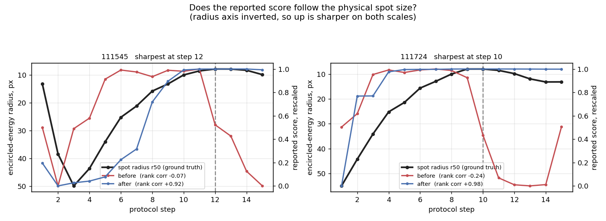
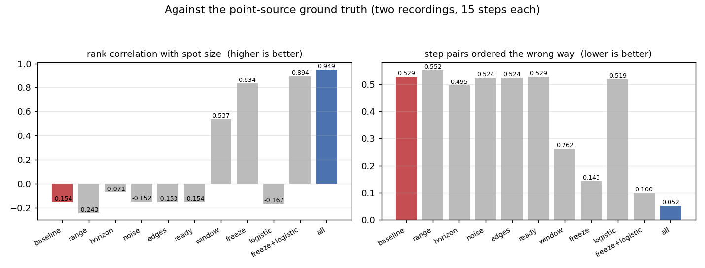

# Calibration: what the protocol recordings changed

Every constant in this project used to come from one of two places: a
qualitative argument, or a single 70-second handheld recording. This document
records what eight tripod recordings with exact focus-step labels said instead,
and which defaults changed as a result.

Source: 9 017 saved frames across eight recordings made with the UI's protocol
buttons — four exposure strata, two full sweeps (rich and low texture), and two
point-source runs. Hardware: Raspberry Pi 5, Panasonic GH6 live view at
640×360, 320-wide analysis. The recordings themselves are not published; they
are photographs of the operator's room.

```bash
python3 tools/protocol_study.py data --json data/protocol_study.json
python3 tools/ablation.py data --group fixes --json data/ablation_fixes.json
```

---

## Why these recordings could settle anything

| | earlier handheld run | protocol recordings |
| --- | --- | --- |
| focus-position labels | inferred from the signal, 30% coverage | recorded as they happened, 70% |
| inter-frame motion, p95 | 29.0 px | 0.47 – 0.87 px |
| brightness drift within a run | 0.431 | 0.006 – 0.044 |
| dynamic range of tenengrad | 62× | 78 – 283× |
| independent ground truth | none | point-source spot size |

The point source is the part that matters most. A point imaged through a
defocused lens spreads into a disc, and the radius holding half the spot's
energy can be measured directly in pixels. That gives a reference which uses
**no focus measure at all**, so for the first time a claim about accuracy can be
checked rather than argued.

---

## 1. The score did not track focus

The headline measurement, and the reason for most of what follows. Rank
correlation between a signal and the physical spot size, over the two
point-source runs:

| signal | run 1 | run 2 |
| --- | --- | --- |
| raw `tenengrad`, no normalisation | **0.974** | **0.984** |
| the score the system actually produced | **−0.235** | **−0.383** |

The metrics were never the problem. The normalisation was.



The radius axis is inverted, so up is sharper on both scales. The red trace is
what the system reported: it rises, then collapses at exactly the steps where
the image is sharpest.

### Why

The normaliser scaled each metric against the 5th and 95th percentiles of a
rolling 120-frame window — under five seconds. That makes the score answer
*"is this frame sharper than the last few seconds"* rather than *"how sharp is
this frame"*. On a slow approach to focus the window fills with high values, so
the sharpest frames of the whole sweep are scored as no better than their
immediate past, and the score collapses exactly where it should peak.

Measured on `point_source_20260916_111545`, per protocol step:

| step | raw tenengrad | reported score |
| --- | --- | --- |
| 10 | 0.843 | 0.981 |
| 11 | 1.059 | 0.999 |
| 12 | 1.081 | 0.526 |
| 13 | 1.097 | 0.411 |
| 14 | 1.115 | 0.095 |
| 15 | 0.908 | 0.006 |

The raw metric peaks at step 14. The score peaks at step 11 and is at its
minimum where the image is sharpest.

### What fixed it

Two changes, both needed.

**A fixed scale.** Any time-varying map breaks the one property a focus search
depends on — that a higher score means a sharper frame. The normaliser now
waits until the observed range stops growing and then freezes its anchors
(`auto_freeze`). A host that runs its own coarse sweep should call
`NormalizerBank.freeze()` itself instead.

**A logistic map instead of linear-with-clipping.** A clipped linear map gives
every frame beyond an anchor exactly the same score, so wherever the anchors do
not span the working range the ordering is destroyed outright. The logistic map
`1/(1+exp(-gain·(x−mid)/span))` is strictly monotone everywhere.

| configuration | run 1 | run 2 | frames pinned at 0 or 1 |
| --- | --- | --- | --- |
| rolling 120, linear (shipped before) | −0.083 | −0.137 | 6.3% |
| frozen, linear | 0.884 | 0.842 | **40.7%** |
| **frozen, logistic** | **0.940** | **0.967** | **0.3%** |

That recovers essentially all of the raw metrics' tracking ability.

The window itself was lengthened to 960 frames (38 s at 25 fps), which matters
for the period before the scale freezes:

| window | run 1 | run 2 |
| --- | --- | --- |
| 120 | 0.767 | 0.126 |
| 480 | 0.827 | 0.237 |
| 960 | 0.876 | 0.323 |
| 1920 | 0.884 | 0.360 |

### Thawing is off, deliberately

A frozen scale should ideally re-calibrate when the *scene* changes. No
threshold tested could tell a scene change from a focus change: a sweep
legitimately runs past anchors that are percentiles of an earlier window, so
the rule fires mid-sweep and discards the fixed scale exactly when it is doing
its job.

| thaw margin | run 1 | run 2 | thaw events |
| --- | --- | --- | --- |
| 1 span | 0.913 | 0.277 | 3 / 5 |
| 3 spans | 0.930 | 0.329 | 3 / 5 |
| 5 spans | 0.937 | 0.354 | 1 / 5 |
| **off** | **0.940** | **0.967** | 0 |

`auto_thaw` therefore defaults to `false`. A host that *knows* the scene
changed — the camera was repointed, the lens swapped, the exposure altered —
should call `unfreeze()`, which is information no statistic in the stream can
recover.

---

## 2. The degenerate-range guard could never be satisfied

The guard against normalising a signal with no range was

```
floor = min_range_ratio · max(|high|, |low|, 1.0)
```

The `1.0` makes it absolute at `1e-3` for any metric whose values sit below 1 —
which is all of them, because contrast normalisation divides by `mean(I)²`.

Measured over the defocused half of the sweeps:

| metric | typical anchor magnitude | floor | window span | span/floor |
| --- | --- | --- | --- | --- |
| `brenner` | 0.00029 | 0.001 | 0.000088 | **0.09** |
| `fourier` | 0.00060 | 0.001 | 0.000110 | **0.11** |
| `laplacian` | 0.00137 | 0.001 | 0.000147 | **0.15** |
| `wavelet` | 0.00064 | 0.001 | 0.000217 | **0.22** |
| `tenengrad` | 0.00736 | 0.001 | 0.002767 | 2.77 |
| `edge_width` | 0.09772 | 0.001 | 0.003936 | 3.94 |

For `brenner` the floor is larger than the largest value the metric ever takes,
so the guard could not be satisfied at any focus position. Four metrics of six
returned the neutral 0.5 sentinel on every defocused frame.

**Consequences measured on the recordings.** 33% of all frames had at least
three of six metrics pinned at 0.5. On `cond_20260916_110656`, step 2 (raw
tenengrad 0.00113) scored 0.500 while step 8 (raw tenengrad 0.01834, sixteen
times sharper) scored 0.001 — the score was inverted, and a hill-climbing
search would have been pushed away from focus.

`min_range_absolute` is now `1e-6`, making the guard genuinely relative. The
sentinel rate over the eight recordings falls from 0.401 to 0.002.

A held focus position still has no range of its own, so the normaliser also
falls back to a longer history before giving up (`long_window_multiple`).

---

## 3. The noise estimator reported zero on every real frame

`noise_sigma` was exactly 0.0000 on 100% of frames in six of the eight
recordings, and on ≥81% in the other two. Consequently `snr` sat at its
sentinel of 1000, the SNR confidence factor was pinned at 1, and the noise
branch of the reliability model — whose coefficients are the largest and the
most argued-for in the design — **never once activated on real camera data**.

The estimator itself is correct. On continuous data it is unbiased:

| applied σ | reported |
| --- | --- |
| 1.0 | 1.05 |
| 3.0 | 2.96 |
| 10.0 | 9.95 |

The failure is the input. 58–74% of the Haar HH coefficients of this camera's
live-view stream are **exactly zero** after 8-bit quantisation, so the median is
zero by definition and `median(|HH|)·1.4826` returns zero whatever the true
noise is. This is a breakdown of the median under heavy quantisation, not a
coding error.

Reading the same distribution at a higher quantile, with the matching Gaussian
scale factor `Φ⁻¹((1+p)/2)`:

| applied σ (expected 0.5×) | p50 | p75 | p90 |
| --- | --- | --- | --- |
| 0.5 → 0.25 | 0.741 | 0.435 | 0.456 |
| 1.0 → 0.50 | 0.741 | 0.435 | 0.608 |
| 2.0 → 1.00 | 0.741 | 0.869 | 0.912 |
| 4.0 → 2.00 | 1.483 | 1.304 | 1.520 |
| 8.0 → 4.00 | 2.965 | 2.608 | 2.736 |

`noise_quantile` now defaults to 75. The zero-noise rate over the recordings
falls from 0.976 to 0.002.

**What this does not fix.** Every high quantile carries a floor of 0.3–0.44 set
by image structure rather than noise, and the reported value runs about 35% low
on the quantised path. The estimator is now a usable *relative* noise signal on
this camera; it is not an absolute measurement, and a scene-dependent floor
means the noise level partly tracks texture. A temporal estimator was tried —
the difference of consecutive frames of a static scene — and was no better,
being quantised in the same way.

---

## 4. Edge sufficiency was unreachable

`edge_ref_density` was 0.03. Measured edge density on the protocol recordings:

| recording | median | p95 | frames ≥ 0.03 |
| --- | --- | --- | --- |
| `cond_…110502` | 0.00000 | 0.0049 | **0%** |
| `cond_…110600` | 0.00000 | 0.0671 | 11% |
| `cond_…110656` | 0.00109 | 0.0724 | 24% |
| `cond_…110746` | 0.00000 | 0.0449 | 8% |
| `point_source_…111545` | 0.00115 | 0.0032 | **0%** |
| `point_source_…111724` | 0.00118 | 0.0036 | **0%** |
| `sweep_plain_…110955` | 0.00773 | 0.0977 | 44% |
| `sweep_texture_…110108` | 0.01743 | 0.0738 | 45% |

Edge sufficiency is a *necessary* confidence factor, subject to the
weakest-link cap, so a zero there zeroes the confidence outright. Confidence
was exactly zero on 28–78% of frames across every recording.

Note the confound this exposes: edge density is itself a sharpness measure, so
"not enough edges" and "out of focus" are the same observation. The factor
collapses hardest in the defocused regime a search has to traverse.

`edge_ref_density` is now 0.006, the level an ordinary indoor subject reaches —
which is also what this file's own comment claimed before the constant
contradicted it.

---

## 5. `ready` did not mean ready

```python
ready = warmed_up and informative > 0.0
```

One informative metric out of six was enough. On frames where three or more
metrics sat at the sentinel, `ready` was still true 75–100% of the time, while
`informative_fraction` correctly reported 0.22–0.40. The information was
exposed; the flag a caller naturally checks did not act on it.

`ready` now requires `informative_fraction ≥ ready_informative_fraction`
(default 0.5). Over the recordings the ready rate drops from 0.948 to 0.599 —
the frames removed are the ones that were never usable.

---

## 6. `Preprocessor.prepare` hands back a scratch buffer

Not a calibration issue, but found the same way and equally silent: the
returned `gray` array is overwritten by the next call. Holding the reference
and later comparing two "different" frames yields a difference of exactly zero
and raises nothing. It cost one wrong measurement during this study. The
behaviour is intentional and now documented at the call site, and pinned by
tests in `tests/test_input_contract.py`.

---

## What the repairs are worth, together and apart

Every variant below runs the same code on the same 9 017 frames and differs
only in configuration, so a difference between two rows is caused by the
setting. `baseline` reproduces what shipped before.



| variant | rank corr. with spot size | inversions | adj | mono | sentinel | noise=0 | ms |
| --- | --- | --- | --- | --- | --- | --- | --- |
| baseline | −0.097 | 0.538 | 0.755 | 0.770 | 0.401 | 0.976 | 9.90 |
| `range` | −0.170 | 0.543 | 0.747 | 0.805 | **0.002** | 0.976 | 9.90 |
| `horizon` | −0.021 | 0.505 | 0.755 | 0.698 | 0.255 | 0.976 | 11.06 |
| `noise` | −0.095 | 0.533 | 0.756 | 0.770 | 0.401 | **0.002** | 9.89 |
| `edges` | −0.096 | 0.533 | 0.750 | 0.770 | 0.401 | 0.976 | 9.92 |
| `ready` | −0.097 | 0.538 | 0.755 | 0.770 | 0.401 | 0.976 | 9.87 |
| `window` 960 | 0.569 | 0.267 | **0.851** | 0.787 | 0.262 | 0.976 | 10.55 |
| `freeze` | 0.923 | 0.114 | 0.814 | 0.779 | 0.262 | 0.976 | 9.06 |
| `logistic` | −0.109 | 0.524 | 0.708 | 0.761 | 0.401 | 0.976 | 9.89 |
| `freeze+logistic` | 0.835 | 0.167 | 0.783 | 0.832 | 0.368 | 0.976 | 9.05 |
| **`all`** | **0.946** | **0.057** | 0.816 | **0.876** | **0.002** | **0.002** | **8.79** |

Three things are worth reading out of that table.

**No single repair is sufficient, and two are useless alone.** `logistic` on its
own is the worst row in the table (−0.109): a monotone map cannot help while
the scale underneath it keeps moving. `range` alone removes the sentinel
entirely and still leaves the correlation negative.

**Wrong orderings fall by a factor of nine**, from 538 pairs in a thousand to
57. That is the number that matters to a search: it is how often the model
would send it the wrong way.

**The repaired pipeline is also the fastest**, at 8.79 ms against 9.90.
Freezing the scale stops the percentile computation altogether, which more than
pays for the longer history before the freeze.

### What did not move

`confidence == 0` sits at 0.502 in every row, including `edges`. Lowering
`edge_ref_density` cannot help where the measured edge density is *exactly*
zero, which it is on four of the eight recordings: the gradient magnitude of a
defocused frame on this stream never exceeds about 3 intensity units per pixel,
so Canny marks nothing at any sane threshold.

This is not a threshold to be tuned. Edge density is itself a sharpness
measure, so "not enough edges" and "out of focus" are the same observation, and
using it as a precondition for trusting a focus score is circular. A sound
version would ask whether the *scene* has structure — for instance the highest
edge density seen recently, rather than this frame's — which is a design change
and not a constant. It is listed in [What is still open](#what-is-still-open).

---

## What did *not* change, and why

**The metric set stays at six.** The offline comparison in
[COMPARATIVE_STUDY.md](COMPARATIVE_STUDY.md) suggested dropping `fourier` and
`edge_width`, the two most expensive and least separating measures. Replaying
the recordings through the real online evaluator says the opposite:

| metric set | adjacent-step discrimination | ms/frame |
| --- | --- | --- |
| all six | **0.755** | 9.60 |
| five (no `fourier`) | 0.727 | 7.76 |
| five (no `edge_width`) | 0.703 | 7.13 |
| four | 0.675 | 5.27 |
| three | 0.640 | 4.56 |
| one (`tenengrad`) | 0.555 | 2.88 |

More metrics is monotonically better online. The offline ranking gave every
measure the same whole-sequence normalisation, which is not what the system
does; fewer metrics means a noisier fused score and more saturation
(instantaneous `sat` rises 0.094 → 0.166 → 0.226 → 0.444 as metrics are
removed). The offline result is not wrong, it answers a different question.

**A seventh metric is available but off.** `gradient_variance` (TENV, Pertuz et
al. 2013) separated adjacent focus steps better than any of the project's own
six in the offline study, and costs 0.31 ms. It ships built, with a prior and a
sensitivity row, and is not in `metrics.enabled` until it has earned that on the
same online evidence as the rest.

**VOL4 is not available.** Vollath's F4 ranked first offline, but it is negative
on 40–85% of frames on these recordings, and the metric contract clamps at
zero. Adding it would flatten it across most of a sweep. Supporting it needs a
contract change, not a registration.

---

## Does the adaptivity earn its keep?

The same replay, varying only which mechanism of the weighting model is
active, on the repaired pipeline:

| variant | rank corr. | inversions | adj | mono | ms |
| --- | --- | --- | --- | --- | --- |
| adaptive (all stages) | 0.946 | 0.057 | 0.816 | **0.876** | 8.90 |
| **without the agreement kernel** | **0.964** | **0.052** | 0.818 | **0.876** | 8.82 |
| without the reliability model (κ = 0) | 0.892 | 0.105 | 0.796 | 0.849 | 8.90 |
| fixed prior weights | 0.947 | 0.067 | 0.821 | 0.849 | 8.82 |
| plain mean | 0.946 | 0.067 | **0.823** | 0.858 | 8.82 |
| without the temporal filter | 0.949 | 0.062 | 0.766 | 0.858 | 8.84 |
| filter without confidence coupling | 0.949 | 0.062 | 0.791 | 0.858 | 8.90 |

**The reliability model earns its place.** Zeroing every κ nearly doubles the
wrong orderings (0.057 → 0.105) and is the worst row on all four criteria. The
content-conditioned weighting is doing real work.

**The consensus-agreement kernel does not.** Switching it off is better on
every criterion and cheaper. Widening the kernel only walks the result back
towards "off" — 0.958 at scale 1.0, 0.963 at scale 8.0, 0.965 off — so this is
not a tuning failure. It is now off by default.

What that does *not* establish: the kernel exists to protect the score when one
metric is fooled by a specular highlight or a blown region, and none of these
eight recordings contains that failure. It is off because it costs measurably
and its benefit is untested here, not because the idea is wrong.

Note that the kernel and the confidence's *concordance* factor used to share
one switch. They are two mechanisms: the kernel reweights the metrics, the
dispersion tells the confidence that the metrics disagree. They are now
separate, so turning the kernel off leaves the confidence seeing as much as
before (median confidence 0.197 either way).

**The temporal filter is worth more than any weighting choice.** Removing it
costs 0.050 of adjacent-step discrimination — more than the entire spread
between the fusion rules — and removing only its confidence coupling costs
0.025. It does cost a little agreement with ground truth (0.949 → 0.946),
which is the lag a filter must have.

**Against a plain mean, the adaptive scheme wins narrowly and not everywhere.**
It orders step pairs better (0.057 against 0.067 wrong) and is more monotone
(0.876 against 0.858), while the plain mean edges it on adjacent-step
discrimination (0.823 against 0.816). Anyone who wants one number: the adaptive
scheme is better at not being wrong, the mean is marginally better at resolving
neighbours.

---

## What is still open

- **Edge sufficiency is circular.** See above. The candidate fix is to measure
  scene structure over a history rather than per frame.
- **`auto_freeze` has four constants**, fitted on the same two recordings that
  evaluate them.
- **The noise estimate has a structure-dependent floor** of 0.3–0.44 and reads
  about 35% low on the quantised path. It is a relative signal, not a
  measurement.
- **`gradient_variance` is built but not enabled**, pending the same online
  evidence the other six now have.
- **No closed-loop test.** Everything here measures the signal a search would
  consume, never a search.

---

## Threats to validity

- **One camera, one room, one operator.** Everything here is measured on a GH6
  live-view stream at 640×360. The quantisation finding in particular is a
  property of that stream.
- **Two point-source runs.** They are the only independent ground truth in the
  project, and `peak_err` over two runs takes very few distinct values.
- **The spot saturates near focus.** Peak intensity reaches 251–253 of 255, so
  some energy is missing from the core exactly where the radius is smallest.
  That biases against fine resolution near the peak; it does not move the
  minimum.
- **`auto_freeze` has four constants** and they were chosen on the same two
  recordings they are evaluated on. They are not independent.
- **Nothing here measures a closed autofocus loop.** Every number is about the
  signal a search would consume, not about a search.
