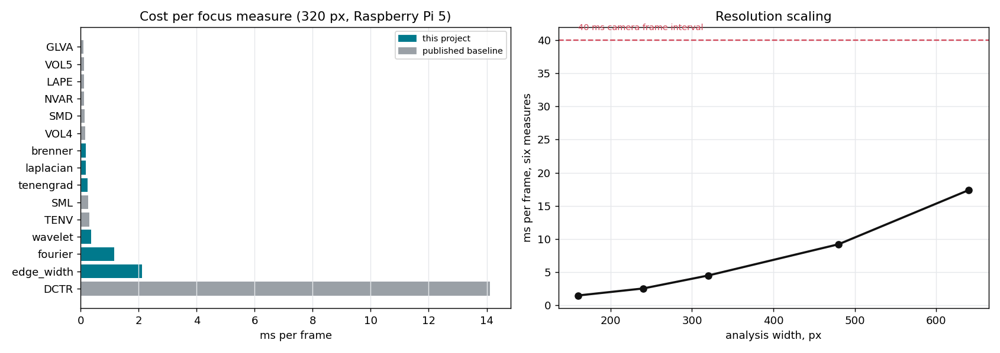
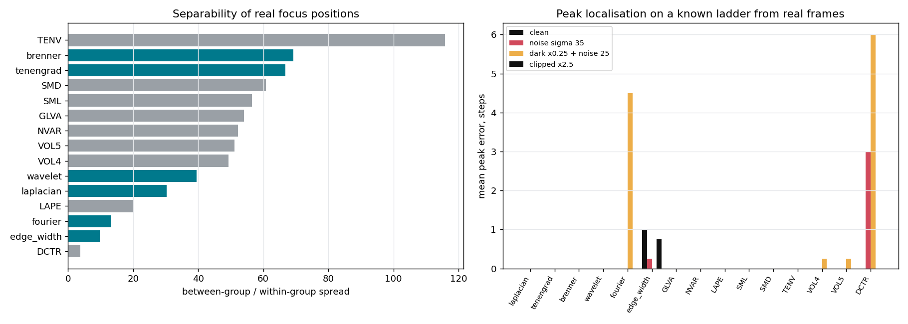
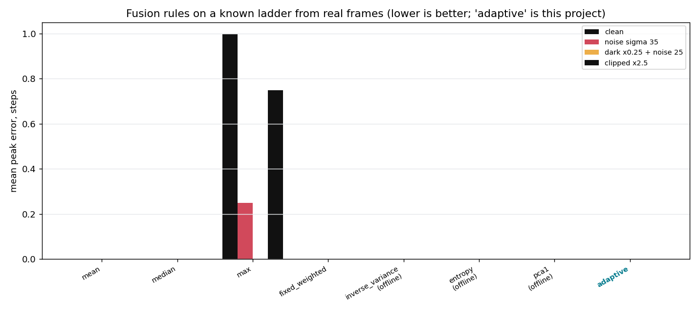

# Comparative study: how fast, and is it better?

Nine published focus measures and seven standard fusion rules, run against this
project's six measures and its adaptive fusion, on frames from a real recording.

This is the comparison the rest of the documentation kept deferring. The
headline result is not flattering, and is stated first.

```bash
python3 tools/comprehensive_study.py data/run1 --figures docs/figures
```

Hardware: Raspberry Pi 5, 320×180 analysis, Python 3.11.2, NumPy 1.26.4,
OpenCV 4.13.0. Source: the 70.7 s handheld GH6 recording described in
[FIELD_TEST.md](FIELD_TEST.md).

---

## Summary

| Question | Answer |
| --- | --- |
| Is it fast enough? | Yes. Six measures cost **3.99 ms**, the adaptive fusion **1.51 ms**, against a 40 ms frame interval. |
| Is any single measure of ours the best available? | **No.** A published baseline, TENV, separates real focus positions **1.7× better** than our best, at **1/13** the cost of our set. |
| Does the adaptive fusion beat simpler rules? | **Only in the hardest conditions.** In easy ones all eight rules tie exactly. A plain median beats it in one condition; it wins in another. |
| Is the extra machinery worth it? | Conditionally. It costs 2500× more than an arithmetic mean and earns that back only on low-texture, heavily degraded frames. |

---

## A. Speed



Cost per focus measure, best of three passes over 20 real frames:

| measure | ms/frame | source |
| --- | --- | --- |
| GLVA | 0.088 | baseline |
| VOL5 | 0.103 | baseline |
| LAPE | 0.109 | baseline |
| NVAR | 0.118 | baseline |
| SMD | 0.136 | baseline |
| VOL4 | 0.152 | baseline |
| **brenner** | 0.176 | this project |
| **laplacian** | 0.181 | this project |
| **tenengrad** | 0.244 | this project |
| SML | 0.261 | baseline |
| TENV | 0.309 | baseline |
| **wavelet** | 0.362 | this project |
| **fourier** | 1.148 | this project |
| **edge_width** | 1.883 | this project |
| DCTR | 14.691 | baseline |

**Our six together cost 3.99 ms**, and two of them account for 76% of that.
`edge_width` alone costs six times what TENV does.

DCTR (block-DCT energy ratio) is unusable in real time on this hardware at
14.7 ms — worth recording, since it appears in the literature without a cost
figure attached.

### Fusion cost

| rule | ms/frame |
| --- | --- |
| max | 0.0002 |
| fixed_weighted | 0.0004 |
| mean | 0.0006 |
| inverse_variance | 0.0017 |
| median | 0.0018 |
| entropy | 0.0033 |
| pca1 | 0.0039 |
| **adaptive (this project)** | **1.5072** |

The adaptive rule costs **about 2500× an arithmetic mean**. That is not the
arithmetic — the weighted sum itself is microseconds — it is the image analysis
the rule depends on: noise, edge density, motion, exposure and contrast all have
to be measured before a weight can be chosen. Section D says what that buys.

### Resolution scaling

| analysis width | six measures, ms |
| --- | --- |
| 160 | 1.56 |
| 240 | 2.66 |
| 320 | 4.60 |
| 480 | 9.29 |
| 640 | 17.48 |

Roughly linear in pixel count, as expected: every measure is a small number of
full-frame passes.

---

## B. Separability on real frames



How well does each measure distinguish real focus positions? The recording
contains groups of frames where the operator held the ring still, so the spread
*between* groups can be compared against the scatter *within* a group. No ground
truth is needed, because the comparison is internal.

| measure | within | between | separability | source |
| --- | --- | --- | --- | --- |
| **TENV** | 0.0044 | 0.514 | **115.8** | baseline |
| brenner | 0.0085 | 0.590 | 69.2 | this project |
| tenengrad | 0.0088 | 0.589 | 66.9 | this project |
| SMD | 0.0045 | 0.273 | 60.7 | baseline |
| SML | 0.0085 | 0.481 | 56.5 | baseline |
| GLVA | 0.0083 | 0.447 | 54.1 | baseline |
| NVAR | — | — | 52.2 | baseline |
| VOL5 | — | — | 51.1 | baseline |
| VOL4 | — | — | 49.2 | baseline |
| wavelet | — | — | 39.5 | this project |
| laplacian | — | — | 30.3 | this project |
| LAPE | — | — | 20.4 | baseline |
| fourier | — | — | 13.1 | this project |
| edge_width | — | — | 9.8 | this project |
| DCTR | — | — | 3.7 | baseline |

**A published baseline wins, and not narrowly.** TENV — the variance of the
Sobel gradient magnitude, Pertuz et al. (2013) — is 1.7× better than our best
measure and costs 0.309 ms. Our whole six-measure set costs 13× that and does
not contain anything better.

Two of our measures sit near the bottom. `fourier` (13.1) and `edge_width` (9.8)
carry an order of magnitude less positional information than TENV while costing
3.7× and 6.1× more. On the evidence of this recording they earn their place in
the ensemble only through *diversity* — they fail differently from the gradient
measures, which is what the agreement stage exploits — and not through
individual quality.

The Laplacian's position (30.3, eighth) is worth noting against the synthetic
study, where it had by far the highest discrimination figure. Its between-group
spread is large, but so is its scatter at a fixed position, and a search cares
about the ratio.

**Caveat:** only 6 held-position groups contained saved frames, because frames
were sampled every tenth. This ranking is indicative, not settled. Recording
with `--save-every 1` would give a proper sample.

---

## C. Accuracy on a known ladder

A symmetric defocus ladder is built from real frames by applying a known disc
PSF, giving exact ground truth with real image statistics. Peak at index 6 of
13.

Under **clean, noise σ=35 and clipped ×2.5**, every measure except `edge_width`
and `DCTR` locates the peak exactly (error 0.00) with monotonicity 1.000. The
ladder does not discriminate.

The only conditions that separate anything:

| measure | dark ×0.25 + noise 25, peak error |
| --- | --- |
| fourier | **4.50** |
| DCTR | 6.00 |
| VOL4, VOL5 | 0.25 |
| everything else | 0.00 |

`fourier` fails badly when the frame is dark and noisy — noise fills the
high-frequency band it measures, which is exactly the failure mode its
sensitivity coefficient in the weighting model predicts.

---

## D. Fusion rules head to head



Eight rules on the same ladders. Three are **offline** — they need the whole
sequence before they can weight anything, so no real-time system can use them.
They are included to bound what any fusion of these measures can achieve.

### On sharp real frames

| condition | best | adaptive (ours) |
| --- | --- | --- |
| clean | all tie at 1.000 / 0.00 | 1.000 / 0.00 |
| noise σ=35 | all tie at 1.000 / 0.00 | 1.000 / 0.00 |
| clipped ×2.5 | all tie at 1.000 / 0.00 | 1.000 / 0.00 |
| **dark ×0.25 + noise 25** | **median 1.000** | 0.979 |

Under the one condition that separates them, a **plain median beats the adaptive
rule**, which ties with the best offline method (pca1, 0.979) and beats the
arithmetic mean (0.875), the fixed weighting (0.875) and two of three offline
rules.

### On low-texture real frames

Low texture was the condition under which the adaptive scheme won clearly in the
synthetic study. Frames were selected from the recording by lowest
`edge_density × contrast` — real content, not generated.

| condition | ranking |
| --- | --- |
| clean | mean, fixed, entropy, pca1, **adaptive** all 1.000 / 0.00; median 0.958 |
| **noise σ=35** | **adaptive best**: 0.542 / 3.50, ahead of fixed (0.500), mean (0.479), pca1 (0.458 / 4.75), median (0.479 / 5.25) |
| dark ×0.25 + noise 25 | every rule fails: 4.50 – 5.50 steps of peak error |
| clipped ×2.5 | mean, fixed, inverse_variance, pca1, **adaptive** all 1.000 / 0.00 |

**The adaptive rule wins exactly where it was designed to** — low texture with
heavy noise — and beats all three offline rules there, which is the stronger
claim of the two.

It also shows the method's limit plainly: on low-texture frames that are both
dark and noisy, **every rule including ours is 4.5 to 5.5 steps from the peak on
a 13-step ladder**. That is not a working autofocus signal. Being least bad is
not the same as working.

---

## What this changes

**The `fourier` and `edge_width` measures are the weakest link.** They are the
two most expensive of our six (1.15 ms and 1.88 ms, 76% of the total) and the
two least separating (13.1 and 9.8). Dropping both would cut the measure cost
from 3.99 ms to 0.96 ms. Whether the ensemble loses accuracy is testable and has
not been tested — their value is supposed to be diversity, and that claim now
has a specific price attached to it.

**TENV belongs in the set.** It is cheaper than three of ours and separates
better than all six. There is no argument for excluding it other than that it
was not part of the original design.

**The adaptive fusion has a narrow but real advantage.** It is never worse than
the alternatives, ties them in every easy condition, and wins on low-texture
noisy frames, including against methods that see the whole sequence in advance.
Whether 1.5 ms per frame is worth that depends entirely on whether the
application meets those conditions.

---

## Threats to validity

- **One recording, one scene, one camera.** Section B rests on 6 held-position
  groups. Everything here should be repeated on a tripod recording with
  `--save-every 1` and several scenes.
- **Ladders are synthetic degradations of real frames.** Image content is real;
  the defocus is a disc PSF, validated against the lens only at sub-pixel blur
  ([REAL_FRAME_STUDY.md](REAL_FRAME_STUDY.md) §E5).
- **Baselines are implemented here, not taken from reference code.** They follow
  the published formulas in `tools/baselines.py`, without the contrast
  normalisation this project applies to its own measures — deliberately, since a
  quietly modified baseline is not a baseline. An error in one of them would
  distort its ranking.
- **Separability and peak error measure different things.** A measure can
  separate positions well and still put its maximum in the wrong place, and the
  two rankings here do differ.
- **No accuracy ground truth.** Section C's ground truth is the applied defocus,
  not the true optical focus of the original frame. Establishing the latter
  needs a point source or a slanted-edge target.
