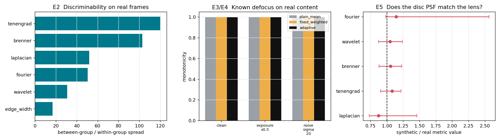

# Study of a real recording

Every validation elsewhere in this project uses a synthetic scene generator and
a synthetic defocus model. That leaves two questions open: whether the
conclusions transfer to real image content, and whether the disc point-spread
function used for the synthetic sweeps resembles what a real lens does.

These five experiments run on a recording rather than on generated scenes. None
of them needs an external ground-truth measurement, which is what makes them
runnable today — a proper accuracy study still needs an independent reference
(see [Still missing](#still-missing)).

```bash
python3 tools/study_real_frames.py data/run1 --figures docs/figures
```

Source recording: 70.7 s, 1288 frames, 129 saved as PNG, handheld GH6, focus
ring turned by hand. Details in [FIELD_TEST.md](FIELD_TEST.md).



---

## E1 — How much of the score is history rather than image?

The raw metrics are stateless, so re-evaluating a shuffled sequence must give
identical raw values and different normalised ones. The size of that difference
is a direct measurement of the relativity that the API documents.

129 frames, 12 independent shuffles, each frame compared against itself:

| quantity | value |
| --- | --- |
| raw metrics, worst relative difference | **0.000e+00** |
| instantaneous score, mean absolute difference | 0.094 |
| instantaneous score, p95 | 0.353 |
| instantaneous score, **maximum** | **0.833** |
| filtered score, maximum | 0.896 |
| rank correlation across orders | 0.910 mean, 0.867 worst |

**The same frame can be scored 0.83 apart on a 0–1 scale purely because of the
order it arrived in.** The ordering is largely preserved (rank correlation
0.91), which is what a focus search actually relies on, but the absolute value
carries no meaning across contexts.

This is the strongest available evidence for the warning in the README that
scores are not comparable between streams, and it is a measurement rather than
an argument.

---

## E2 — Discriminability on real frames, without any ground truth

When the operator pauses on each focus position, the recording contains natural
groups of frames at one constant — though unknown — position. Comparing the
scatter *within* a group against the spread *between* groups measures how well
each metric separates focus positions on real data. No ground truth is needed
because the comparison is internal.

Segmentation ran on a stateless signal (raw Tenengrad) so the grouping could not
inherit the normaliser's memory. It recovered **32 groups**, median 7 frames,
covering 30% of the run.

| metric | within-group | between-group | discriminability |
| --- | --- | --- | --- |
| tenengrad | 0.0046 | 0.553 | **120×** |
| brenner | 0.0054 | 0.554 | 103× |
| laplacian | 0.0145 | 0.755 | 52× |
| fourier | 0.0148 | 0.751 | 51× |
| wavelet | 0.0178 | 0.551 | 31× |
| edge_width | 0.0112 | 0.190 | **17×** |

Two things worth noting, both of which differ from the synthetic results:

**Tenengrad and Brenner lead, not the Laplacian.** In the synthetic comparison
the Laplacian had by far the highest discrimination figure. On real frames it
comes fourth: its between-group spread is the largest, but so is its
frame-to-frame scatter at a fixed position, and the ratio is what matters to a
search. The first-derivative operators are quieter.

**The edge-width metric is last by a factor of seven.** Its between-group spread
is 0.19 against 0.55 for the others — it simply moves less as focus changes on
this scene. It is still monotone; it just carries less signal.

This does not overturn the synthetic ranking, because the two measure different
things (peak prominence there, position separability here). It does show that a
ranking taken from synthetic scenes should not be assumed to hold.

---

## E3 / E4 — Known defocus applied to real content

The sharpest real frames, selected by consensus rank across all six metrics, are
degraded by a *known* disc PSF. Real image statistics, exact ground truth.

Monotonicity, as the fraction of ladder steps moving in the correct direction,
over 5 base frames and 7 defocus steps:

| metric | clean | exposure ×0.5 | noise σ=20 |
| --- | --- | --- | --- |
| laplacian | 1.00 | 1.00 | 1.00 |
| tenengrad | 1.00 | 1.00 | 1.00 |
| brenner | 1.00 | 1.00 | 1.00 |
| wavelet | 1.00 | 1.00 | 1.00 |
| fourier | 1.00 | 1.00 | 1.00 |
| edge_width | 0.83 | 0.87 | 0.93 |

| method | clean | exposure ×0.5 | noise σ=20 |
| --- | --- | --- | --- |
| plain mean | 1.00 | 1.00 | 1.00 |
| fixed weighted | 1.00 | 1.00 | 1.00 |
| adaptive | 1.00 | 1.00 | 1.00 |

**The synthetic monotonicity result transfers to real image content**, including
under halved exposure and σ=20 noise. That is a positive result for the metrics.

It is also a weak test of the *combination*: every method scores 1.00, so this
ladder cannot separate them. The synthetic comparison needed harsher conditions
(low texture, dark-and-noisy) before the methods diverged, and those conditions
are not present in this recording.

`edge_width` is the only metric that misses steps, which is consistent with its
low discriminability in E2.

---

## E5 — Does the disc PSF behave like the lens?

This is the only experiment here that can invalidate the synthetic model.

The edge-width metric estimates blur radius in pixels from physics rather than
by analogy: for a Gaussian of width σ the edge width is σ√(2π). So a really
defocused frame and a synthetically defocused one can be matched on *measured*
blur, and the remaining five metrics compared. If the disc PSF is what the lens
does, the ratio is 1.

### The first version of this test was wrong

It compared one sharp reference frame against every other frame in the
recording, and reported ratios of 2.4–3.7 with spreads up to 83 — an apparently
dramatic finding that the model was badly wrong.

It was not. The recording is handheld across a room, so most of those pairs
showed **different scenes**. Comparing metric values between different content
measures the content, not the point-spread function.

The corrected test accepts a pair only when the two frames demonstrably show the
same view: mean intensity within 6%, and phase correlation placing the two
within 6 px with a response above 0.25.

**495 of 512 candidate pairs were rejected on that basis.** The original test was
measuring scene differences in 97% of its samples.

### The corrected result

17 same-view pairs, median view displacement 3.4 px, edge width matched to
within 0.16 px:

| metric | synthetic / real | interquartile |
| --- | --- | --- |
| laplacian | 0.87 | 0.73 – 1.46 |
| tenengrad | 1.08 | 0.90 – 1.22 |
| brenner | 1.06 | 0.88 – 1.23 |
| wavelet | 1.05 | 0.87 – 1.24 |
| fourier | 1.14 | 0.98 – 2.57 |

**At small defocus the disc PSF matches real optical defocus to within about
15%.** For the three mid-frequency metrics the agreement is within 8%.

### What this does not establish

The median applied radius is **0.77 px**. This validates the model only in the
sub-pixel to roughly one-pixel range. The handheld recording never held a view
steady while the focus changed substantially, so every large-blur pair failed
the same-view gate.

**Larger defocus remains untested.** That is exactly where a PSF model is most
likely to diverge, since aberrations grow with the defocus.

---

## What to record next

The gaps above are all recordable, and they need one change of method: **a
tripod**. The same-view gate rejected 97% of pairs purely because the camera
moved.

1. **Tripod, static scene, focus ring swept slowly through the full range.**
   This alone would give large-blur pairs for E5 and turn it into a real test of
   the model.
2. **Pause for a second at each position.** E2's segmentation already works, but
   30% coverage becomes near-100%, and the groups become long enough for
   per-position confidence intervals.
3. **Sweep forward and then backward** through the same range. Comparing the two
   directions separates actuator backlash, temporal-filter lag and normaliser
   memory — none of which is measurable from a single pass.
4. **A textured target and a low-texture target**, recorded separately. The
   conditions under which the adaptive scheme beat a plain mean synthetically
   (low texture, dark and noisy) are absent from this recording, which is why
   E3/E4 could not separate the methods.

---

## Still missing

None of these five experiments measures **accuracy** — whether the reported peak
is at the true best focus. That needs a reference independent of all six
metrics. The two practical options:

- **A point source.** Photograph a small bright point; the circle of confusion
  is measurable directly in pixels. This gives a physical defocus ground truth
  in the same units the synthetic model uses.
- **Slanted-edge MTF50 (ISO 12233).** The standard method, independent of
  everything here, implementable in roughly 150 lines against a printed target.

Until one of those exists, this study establishes internal consistency,
transfer of the monotonicity result to real content, and a limited validation of
the PSF model — but not accuracy.
