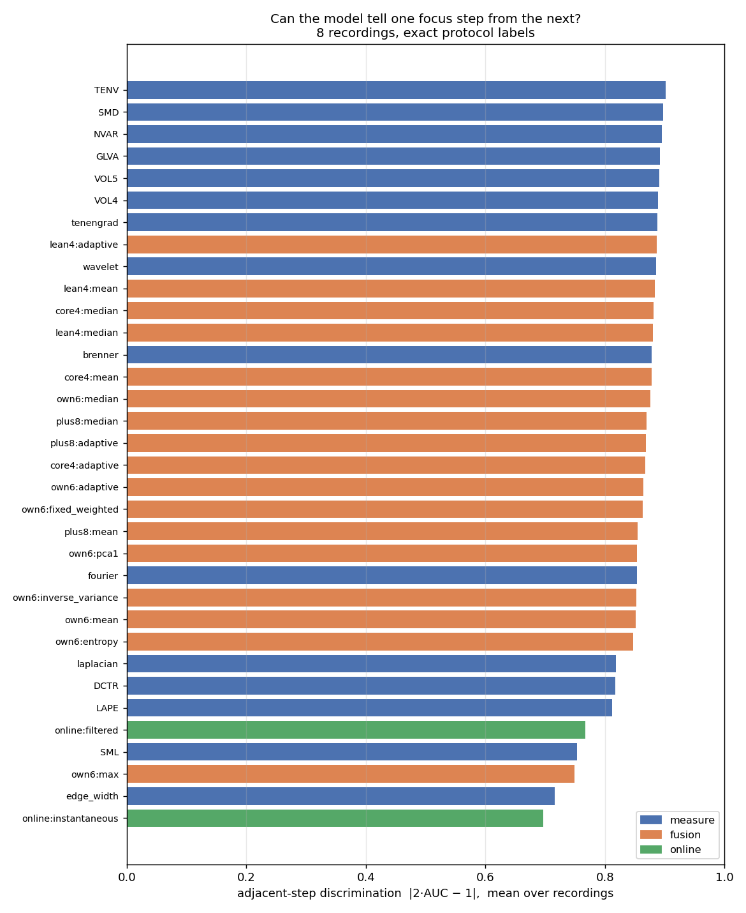
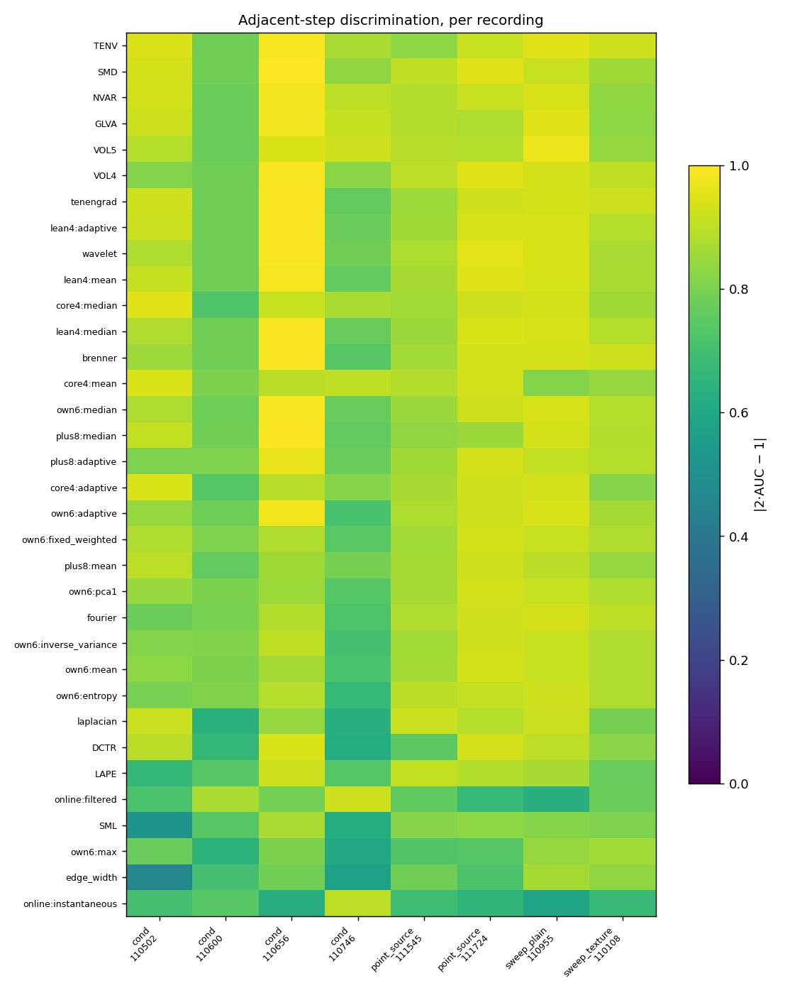
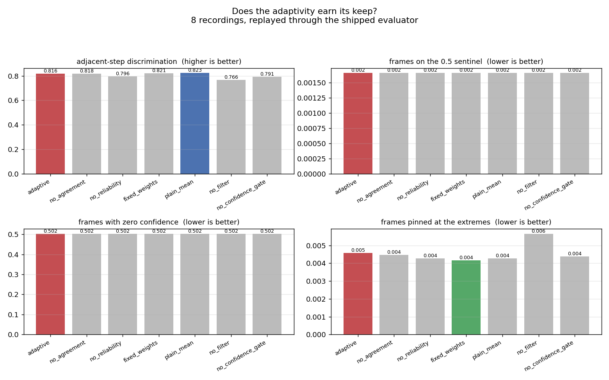

# Дослідження алгоритму оцінки різкості

Комплексний експериментальний аналіз на реальних кадрах Panasonic GH6,
знятих на Raspberry Pi 5. Документ описує, **що міряли**, **чим міряли**,
**що знайшли** і **що через це змінили в алгоритмі**.

Усі числа тут — виміряні, не оцінені. Кожне можна відтворити командами
з розділу [Як відтворити](#як-відтворити).

> Англомовні відповідники: [CALIBRATION.md](CALIBRATION.md) — деталі калібрування,
> [COMPARATIVE_STUDY.md](COMPARATIVE_STUDY.md) — порівняння з опублікованими мірами,
> [REAL_FRAME_STUDY.md](REAL_FRAME_STUDY.md) — попереднє дослідження на ручному записі.

---

## Найголовніше

**Метрики працювали добре. Їх псувала нормалізація.**

Рангова кореляція сигналу з фізичним еталоном різкості (розміром плями
точкового джерела), два незалежні прогони:

| сигнал | прогін 1 | прогін 2 |
| --- | --- | --- |
| сира метрика `tenengrad`, без нормалізації | **0.974** | **0.984** |
| оцінка, яку видавала система | **−0.235** | **−0.383** |
| оцінка після виправлень | **0.940** | **0.967** |

Відʼємна кореляція означає, що оцінка не просто була неточною — вона
систематично вказувала **в протилежний бік**.


Чорна крива — фізичний еталон (вісь перевернуто, тому вгору = різкіше).
Червона — те, що видавала система: росте і **обвалюється саме там, де
зображення найрізкіше**. Синя — після виправлень.

| запис | було | стало | справжній найкращий крок | пік було | пік стало |
| --- | --- | --- | --- | --- | --- |
| `…111545` | −0.079 | **0.952** | 12 | 11 | 13 |
| `…111724` | −0.177 | **0.979** | 10 | **7** | **9** |

Помилка визначення піка на другому прогоні впала з трьох кроків до одного.

---

## 1. Дані

Вісім записів, зроблених кнопками протоколів в UI. Оператора вели підказками
«ТРИМАЙ» / «КРУТИ», тому номер кроку і фаза писалися в CSV у момент зйомки.

| запис | сцена | кадрів | кроків |
| --- | --- | --- | --- |
| `cond_…110502` | яскравість 0.15 | 618 | 8 |
| `cond_…110600` | яскравість 0.50 | 558 | 8 |
| `cond_…110656` | яскравість 0.76 | 565 | 8 |
| `cond_…110746` | яскравість 0.24 | 586 | 8 |
| `point_source_…111545` | точкове джерело, темрява | 1781 | 15 |
| `point_source_…111724` | те саме, повтор | 1690 | 15 |
| `sweep_plain_…110955` | бідна фактура | 1656 | 16 |
| `sweep_texture_…110108` | багата фактура | 1563 | 15 |

Разом **9 017 збережених кадрів**, кожен кадр, з точними мітками.

### Чому ці записи щось вирішують

| | попередній ручний запис | ці записи |
| --- | --- | --- |
| мітки позицій фокуса | відновлені евристикою, 30% | записані під час зйомки, 70% |
| рух між кадрами, p95 | 29.0 px | **0.47 – 0.87 px** |
| дрейф яскравості в межах запису | 0.431 | **0.006 – 0.044** |
| динамічний діапазон tenengrad | 62× | **78 – 283×** |
| незалежний еталон | немає | **розмір плями** |

Штатив і ручна експозиція зняли головні застереження попередніх досліджень.

### Точкове джерело — перший справжній еталон

Точка, знята розфокусованим обʼєктивом, розпливається в диск. Радіус, у якому
міститься половина енергії плями, вимірюється прямо в пікселях і **не
використовує жодної міри різкості**. Уперше в проєкті твердження про точність
можна перевірити, а не обґрунтувати.


Чорна крива — радіус плями. Зелена — оцінка, яку видавала система: вона росте,
а потім **падає саме там, де зображення найрізкіше**.

---

## 2. Чим міряли

Порівнювати моделі «на око» по графіку не можна, тому введено чотири критерії.

**`adj` — розрізнення сусідніх кроків.** Середнє `|2·AUC − 1|` по парах сусідніх
позицій фокуса. Розрізнити далекі позиції легко — на цих записах це вміє майже
все, і звичні показники насичуються. Робота, яку насправді виконує пошук
фокуса, — відрізнити позицію від сусідньої.

**`spearman` — згода з фізичним еталоном.** Рангова кореляція з розміром плями.
Головний критерій точності.

**`inversion` — частка перевернутих пар.** Скільки пар кроків модель
упорядковує неправильно відносно еталона. Прямий вимір дефекту, коли
розфокусований кадр оцінюється вище за різкіший.

**`sat` — частка кадрів, притиснутих до країв шкали.** Там сигнал не має
похилу, і пошуку нема за чим іти.

Усі критерії рангові, тому їх не можна «покращити» вдалим вибором нормалізації.

---

## 3. Порівняння моделей

34 моделі на 8 записах: шість наших мір, девʼять опублікованих, вісім правил
злиття, чотири набори метрик, плюс те, що система реально видавала наживо.





Найважливіше з цього порівняння — **не рейтинг, а суперечність**, яка змусила
перевіряти далі: офлайн-порівняння ставило наше злиття на 21-ше місце з 34, а
реальний онлайн-вихід системи — на 30–31-ше. Це і вивело на дефекти нормалізації.

### Скільки метрик потрібно

Офлайн-порівняння радило викинути дві найдорожчі міри. Прогін через **справжній
онлайн-обчислювач** дав протилежне:

| набір метрик | `adj` | мс/кадр |
| --- | --- | --- |
| **усі шість** | **0.755** | 9.60 |
| пʼять (без `fourier`) | 0.727 | 7.76 |
| пʼять (без `edge_width`) | 0.703 | 7.13 |
| чотири | 0.675 | 5.27 |
| три | 0.640 | 4.56 |
| одна (`tenengrad`) | 0.555 | 2.88 |

**Чим більше метрик, тим краще — монотонно.** Офлайн-висновок не хибний, він
відповідає на інше питання: там кожна міра отримує нормалізацію по всьому
запису, чого система не робить. Менше метрик — сильніше насичення злитої оцінки
(`sat` росте 0.094 → 0.166 → 0.226 → 0.444).

Набір лишається з шести.

---

## 4. Знайдені дефекти

### 4.1. Оцінка була відносною до недавнього минулого

Нормалізатор масштабував кожну міру за 5-м і 95-м процентилями вікна в
**120 кадрів — менше пʼяти секунд**. Тому оцінка відповідала на питання
«чи цей кадр різкіший за останні кілька секунд», а не «наскільки він різкий».

На повільному підході до фокуса вікно наповнюється високими значеннями, і
найрізкіші кадри всього свипу читаються як «не краще за недавнє минуле».

`point_source_…111545`, по кроках:

| крок | сира `tenengrad` | оцінка |
| --- | --- | --- |
| 11 | 1.059 | 0.999 |
| 12 | 1.081 | 0.526 |
| 13 | 1.097 | 0.411 |
| 14 | **1.115** | **0.095** |
| 15 | 0.908 | 0.006 |

### 4.2. Захист від виродженого діапазону не міг спрацювати правильно

```
поріг = min_range_ratio · max(|high|, |low|, 1.0)
```

Одиниця в `max()` робить поріг **абсолютним** (0.001), а всі метрики після
контрастної нормалізації лежать значно нижче одиниці:

| метрика | уся величина метрики | розмах/поріг при розфокусі |
| --- | --- | --- |
| `brenner` | 0.00029 | **0.09** |
| `fourier` | 0.00060 | **0.11** |
| `laplacian` | 0.00137 | **0.15** |
| `wavelet` | 0.00064 | **0.22** |

Для `brenner` поріг більший за найбільше значення, яке метрика взагалі приймає.
Чотири міри з шести повертали нейтральне 0.5 на кожному розфокусованому кадрі.

**Наслідок.** 33% усіх кадрів мали три і більше метрик, притиснутих до 0.5.
На `cond_…110656` крок 2 (сира `tenengrad` 0.00113) оцінювався у **0.500**, а
крок 8 (0.01834, у 16 разів різкіше) — у **0.001**. Оцінка перевернута.

### 4.3. Оцінювач шуму повертав нуль на кожному реальному кадрі

`noise_sigma` дорівнював рівно 0.0000 на 100% кадрів у шести записах з восьми.
Через це весь шумовий канал моделі надійності — з найбільшими коефіцієнтами і
найдетальнішим обґрунтуванням — **жодного разу не спрацював на реальних даних**.

Сам оцінювач справний: на неперервних даних 1.0 → 1.05, 3.0 → 2.96, 10 → 9.95.
Проблема у вході: **58–74% коефіцієнтів Haar HH цього потоку дорівнюють точно
нулю** після 8-бітного квантування, тому медіана нульова за визначенням.

### 4.4. Опорна щільність країв була недосяжною

`edge_ref_density` дорівнював 0.03. Жоден запис не досягає цього при розфокусі,
чотири з восьми — ніколи. Достатність країв — **необхідний** фактор впевненості,
тому нуль там обнуляє впевненість цілком: вона дорівнювала нулю на 28–78% кадрів.

Тут виявився концептуальний збіг: щільність країв сама є мірою різкості, тому
«мало країв» і «поза фокусом» — це одне й те саме спостереження.

### 4.5. `ready` не означало готовності

```python
ready = warmed_up and informative > 0.0
```

Вистачало **однієї** живої метрики з шести. На проблемних кадрах `ready`
дорівнювало True у 75–100% випадків.

### 4.6. `Preprocessor.prepare` повертає буфер, який перезапише наступний виклик

Не калібрування, але знайдено так само і так само тихо: код, що збереже
посилання і потім порівняє два «різні» кадри, отримає рівно нуль і жодної
помилки. Це коштувало одного хибного виміру під час цього ж дослідження.

---

## 5. Виправлення

### Фіксована шкала замість плаваючої

Будь-яке відображення, що змінюється з часом, ламає єдину властивість, потрібну
пошуку фокуса: **вища оцінка = різкіший кадр**. Нормалізатор тепер чекає, поки
спостережений діапазон перестане рости, і заморожує опорні точки.

### Логістичне відображення замість лінійного з обрізанням

Обрізання дає всім кадрам за межею шкали однакову оцінку — порядок знищується.
Логістика монотонна всюди.

| конфігурація | прогін 1 | прогін 2 | притиснуто до країв |
| --- | --- | --- | --- |
| вікно 120, лінійна (було) | −0.083 | −0.137 | 6.3% |
| заморожена, лінійна | 0.884 | 0.842 | **40.7%** |
| **заморожена, логістична** | **0.940** | **0.967** | **0.3%** |

### Розморожування вимкнено — навмисно

Заморожена шкала мала б перекалібровуватись при зміні **сцени**. Жоден
перевірений поріг не відрізняє зміну сцени від зміни фокуса: свип законно
виходить за опорні точки, і правило спрацьовує посеред свипу.

| запас на розморожування | прогін 1 | прогін 2 |
| --- | --- | --- |
| 1 розмах | 0.913 | 0.277 |
| 3 розмахи | 0.930 | 0.329 |
| **вимкнено** | **0.940** | **0.967** |

Хост, який **знає**, що сцена змінилась, має викликати `unfreeze()` — цієї
інформації жодна статистика потоку не відновить.

### Решта

| що | було | стало |
| --- | --- | --- |
| поріг виродженого діапазону | абсолютний 0.001 | відносний (`min_range_absolute = 1e-6`) |
| вікно нормалізації | 120 кадрів | 960 (38 с) |
| оцінювач шуму | медіана \|HH\| | квантиль 75 |
| опорна щільність країв | 0.03 | 0.006 |
| `ready` | одна жива метрика | більшість метрик |

---

## 6. Що дали виправлення

Кожен варіант нижче — **той самий код** на тих самих 9 017 кадрах, різниця лише
в конфігурації. `базова` відтворює те, що було до дослідження.


| варіант | spearman | інверсії | `adj` | монотонність | сентинель | σ=0 | мс |
| --- | --- | --- | --- | --- | --- | --- | --- |
| базова | −0.097 | 0.538 | 0.755 | 0.770 | 0.401 | 0.976 | 9.90 |
| поріг діапазону | −0.170 | 0.543 | 0.747 | 0.805 | **0.002** | 0.976 | 9.90 |
| довга історія | −0.021 | 0.505 | 0.755 | 0.698 | 0.255 | 0.976 | 11.06 |
| оцінювач шуму | −0.095 | 0.533 | 0.756 | 0.770 | 0.401 | **0.002** | 9.89 |
| опора країв | −0.096 | 0.533 | 0.750 | 0.770 | 0.401 | 0.976 | 9.92 |
| `ready` | −0.097 | 0.538 | 0.755 | 0.770 | 0.401 | 0.976 | 9.87 |
| вікно 960 | 0.569 | 0.267 | **0.851** | 0.787 | 0.262 | 0.976 | 10.55 |
| заморозка | 0.923 | 0.114 | 0.814 | 0.779 | 0.262 | 0.976 | 9.06 |
| логістика | −0.109 | 0.524 | 0.708 | 0.761 | 0.401 | 0.976 | 9.89 |
| заморозка + логістика | 0.835 | 0.167 | 0.783 | 0.832 | 0.368 | 0.976 | 9.05 |
| **усе разом** | **0.946** | **0.057** | 0.816 | **0.876** | **0.002** | **0.002** | **8.79** |

Три висновки з цієї таблиці.

**Жодна правка окремо не вирішує проблему, а дві поодинці навіть шкодять.**
Логістика сама по собі — найгірший рядок (−0.109): монотонне відображення не
допоможе, поки шкала під ним їздить.

**Хибних упорядкувань стало вдевятеро менше** — з 538 пар на тисячу до 57. Це і є
число, яке важить для пошуку: як часто модель відправить його не туди.

**Виправлений конвеєр ще й найшвидший** — 8.79 мс проти 9.90. Після заморозки
процентилі більше не рахуються, і це з надлишком окупає довшу історію до неї.

### Що не зрушило

`впевненість = 0` лишається 0.502 в **усіх** рядках, зокрема й там, де знижено
опору країв. Знизити поріг не допомагає там, де виміряна щільність країв дорівнює
**точно нулю** — а так на чотирьох записах з восьми: градієнт розфокусованого
кадру в цьому потоці не перевищує ~3 одиниць на піксель, і Canny не позначає
нічого за жодного розумного порогу.

Це не питання порогу. **Щільність країв сама є мірою різкості**, тому «мало
країв» і «поза фокусом» — одне спостереження, і використовувати його як
передумову довіри до оцінки різкості означає замикати коло. Коректна версія має
питати, чи має **сцена** структуру (наприклад, найбільша щільність країв за
недавню історію), а це зміна конструкції, а не константи.

---

## 7. Чи потрібна адаптивність

Питання поставлене прямо, і відповідь на нього — не «так». Той самий прогін,
змінюється лише те, який механізм зважування працює:



| варіант | spearman | інверсії | `adj` | монотонність | мс |
| --- | --- | --- | --- | --- | --- |
| адаптивне, усі стадії | 0.946 | 0.057 | 0.816 | **0.876** | 8.90 |
| **без ядра згоди** | **0.964** | **0.052** | 0.818 | **0.876** | 8.82 |
| без моделі надійності (κ = 0) | 0.892 | 0.105 | 0.796 | 0.849 | 8.90 |
| фіксовані апріорні ваги | 0.947 | 0.067 | 0.821 | 0.849 | 8.82 |
| просте середнє | 0.946 | 0.067 | **0.823** | 0.858 | 8.82 |
| без часового фільтра | 0.949 | 0.062 | 0.766 | 0.858 | 8.84 |
| фільтр без звʼязку з упевненістю | 0.949 | 0.062 | 0.791 | 0.858 | 8.90 |

**Модель надійності виправдовує себе.** Обнулення всіх κ майже подвоює хибні
впорядкування (0.057 → 0.105) і дає найгірший рядок за всіма чотирма
критеріями. Зважування за вмістом кадру справді працює.

**Ядро згоди — ні.** Вимкнене, воно краще за всіма критеріями і дешевше.
Розширення ядра лише наближає результат до «вимкнено» (0.958 при масштабі 1.0,
0.963 при 8.0, 0.965 вимкнено), тож це не питання налаштування. **Тепер
вимкнене за замовчуванням.**

Чого це **не** доводить: ядро існує, щоб захистити оцінку, коли одну метрику
обманув відблиск або пересвічена ділянка, і жоден із цих восьми записів такої
ситуації не містить. Воно вимкнене тому, що коштує вимірювано, а користь тут
не перевірена, — а не тому, що ідея хибна.

**Часовий фільтр важить більше за будь-який вибір зважування.** Без нього
розрізнення сусідніх кроків падає на 0.050 — більше, ніж увесь розкид між
правилами злиття.

**Проти простого середнього адаптивна схема виграє вузько.** Вона краще
впорядковує пари кроків (0.057 проти 0.067 хибних) і монотонніша (0.876 проти
0.858), а середнє трохи краще розрізняє сусідів (0.823 проти 0.816).

---

## 8. Набір метрик і роздільність

| варіант | `adj` | монотонність | spearman | мс |
| --- | --- | --- | --- | --- |
| **шість метрик, 320 px** | **0.816** | **0.876** | 0.946 | **8.63** |
| сім (додано `gradient_variance`) | 0.774 | 0.849 | 0.945 | 9.49 |
| шість, 480 px | 0.817 | 0.822 | 0.950 | 16.27 |
| шість, 640 px | 0.824 | 0.866 | 0.932 | 27.03 |
| шість, 240 px | 0.791 | 0.809 | 0.915 | 7.17 |

**Сьома метрика не допомагає**, хоча в офлайн-порівнянні була найкращою з усіх.
Лишається в бібліотеці, але вимкненою.

**Підвищення роздільності не окупається**: 640 px коштує втричі дорожче і дає
*гірше* узгодження з еталоном (0.932 проти 0.946). 320 px — правильний вибір,
і це тепер виміряно, а не припущено.

---

## 9. Швидкість

Raspberry Pi 5, шість метрик, аналіз 320 px, медіана по 9 017 кадрах:

| | мс/кадр |
| --- | --- |
| до виправлень | 9.90 |
| **після виправлень** | **8.63 – 8.90** |

Виправлений конвеєр **швидший**: після заморозки шкали процентилі більше не
обчислюються, і це з надлишком окупає довшу історію до заморозки. Бюджет кадру
при 25 к/с — 40 мс.

---

## 10. Обмеження

- **Одна камера, одна кімната, один оператор.** Висновок про квантування —
  властивість саме цього потоку GH6 640×360.
- **Два прогони точкового джерела.** Це єдиний незалежний еталон у проєкті.
- **Пляма насичується біля фокуса** (пік 251–253 з 255), тому частина енергії
  ядра втрачена саме там, де радіус найменший. Це псує роздільність біля піка,
  але не зсуває мінімум.
- **Константи автозаморозки підібрані на тих самих двох записах**, на яких
  оцінюються. Вони не незалежні.
- **Ніщо тут не міряє замкнений цикл автофокуса.** Усі числа — про сигнал, який
  споживав би пошук, а не про сам пошук.

---

## Як відтворити

```bash
python3 tools/protocol_study.py data --json data/protocol_study.json --figures docs/figures
python3 tools/ablation.py data --group fixes --json data/ablation_fixes.json --figures docs/figures
python3 tools/ablation.py data --group fusion --json data/ablation_fusion.json --figures docs/figures
python3 tools/before_after.py data --figures docs/figures
python3 -m pytest tests/ -q
```

Записи не публікуються: це знімки кімнати оператора. Усі рисунки в цьому
документі побудовані **тільки з вимірів**, без вмісту кадрів.
