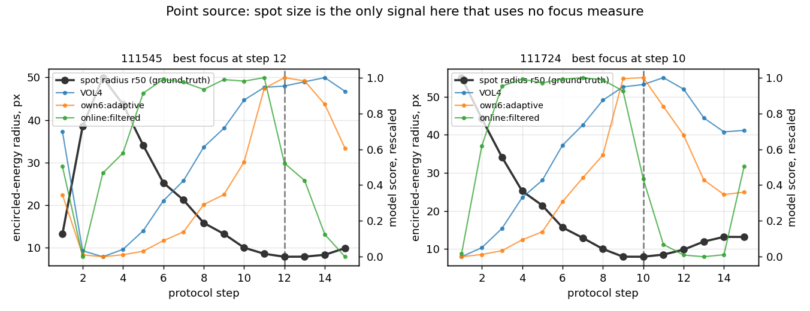
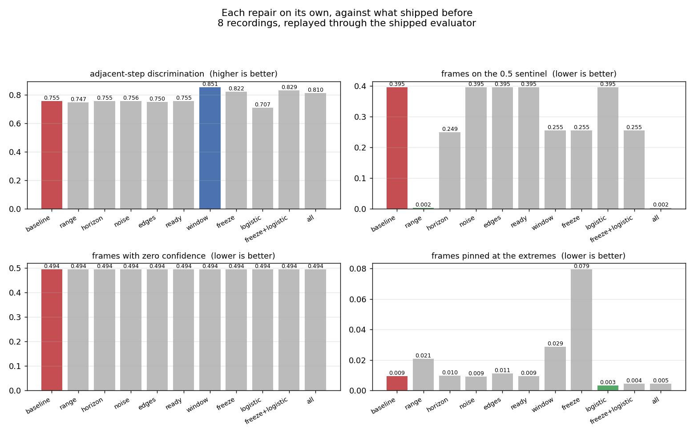
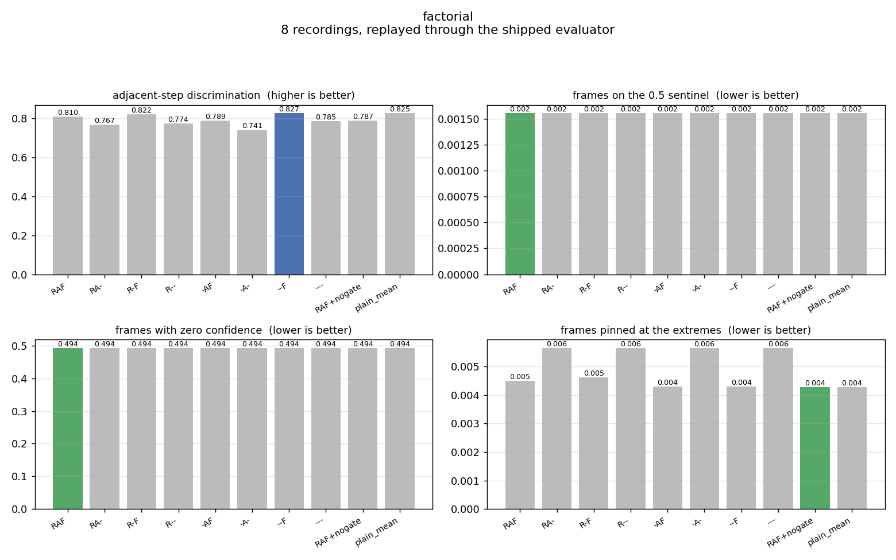
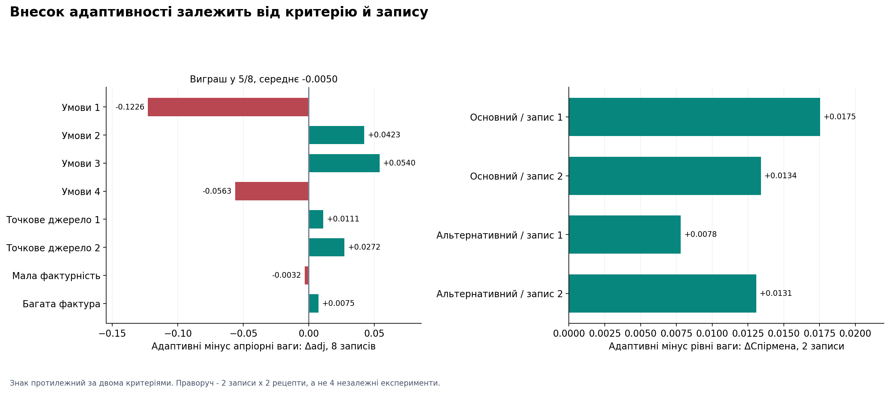

# Дослідження алгоритму оцінки різкості

Експериментальний аналіз на реальних кадрах Panasonic GH6, знятих на
Raspberry Pi 5. Документ описує, **що міряли**, **чим міряли**, **що знайшли**,
**що через це змінили** — і, окремо, **чого ці вимірювання не доводять**.

> **Усі таблиці — у [RESULTS.md](RESULTS.md)**, згенерованому з збережених
> звітів; кожна несе хеш коміту й відбиток конфігурації того прогону. Тут
> пояснення й висновки, а не переписані вручну числа.
>
> Англомовний відповідник цього тексту: [CALIBRATION.md](CALIBRATION.md).
>
> Опис **принципу роботи**, схеми, історія змін і програма подальших
> досліджень — у [STUDY_UA_REPORT.md](STUDY_UA_REPORT.md).

---

## Найголовніше

**Метрики працювали добре. Їх псувала нормалізація.**

Проти фізичного еталона — розміру плями точкового джерела, який не використовує
жодної міри різкості — сира метрика відстежує фокус майже ідеально, а оцінка,
яку видавала система, була з ним **відʼємно** корельована.


Чорна крива — еталон (вісь перевернуто, тому вгору = різкіше). Червона — те, що
видавала система: росте і **обвалюється саме там, де зображення найрізкіше**.
Синя — після виправлень.

Числа: [до і після](RESULTS.md#before-and-after-against-the-spot-reference).
На двох прогонах з еталоном рангова кореляція перейшла з **−0.072 і −0.237** до
**0.952 і 0.979**, а частка хибно впорядкованих пар кроків — з **0.486 і 0.571**
до **0.057 і 0.038**. Помилка визначення піка на другому прогоні впала з трьох
кроків до одного.

---

## 0. Спершу довелося полагодити самі вимірювальні інструменти

Розбір коду показав дефекти не лише в алгоритмі, а й у тому, чим його міряли.
Кожен відтворено до виправлення, і кожен знецінював якісь опубліковані числа.

| дефект | що робив |
| --- | --- |
| Варіанти абляції успадковували типові налаштування | після зміни `use_agreement` варіант «адаптивний» став дублікатом «без згоди» |
| Нічиї в підрахунку інверсій розвʼязувались в один бік | постійний сигнал отримував **1.000** або **0.000** залежно від напряму еталона |
| Кожен інструмент відбирав свої кадри | вибірки різнились на 3.3% і 5.5% |
| Кеш перевірявся лише за кількістю кадрів і назвами метрик | зміна роздільності чи оцінювача шуму мовчки використовувала застарілі дані |
| Критерій стабілізації порівнював з максимумом, що оновлювався щокроку | шкала замерзала через 119 спостережень, поки розмах виріс у 3.3 раза |
| Звіти не несли походження | дві групи абляції відпрацювали з різними налаштуваннями, і в результатах цього не видно |

**Усі значення інверсій, опубліковані до цього виправлення, скасовані.** Рангові
кореляції зсунулись менш ніж на 0.06.

---

## 1. Дані

Вісім записів, зроблених кнопками протоколів в UI: оператора вели підказками
«ТРИМАЙ» / «КРУТИ», тому номер кроку й фаза писались у CSV під час зйомки.
Разом **9 017 збережених кадрів**.

| запис | сцена | кадрів |
| --- | --- | --- |
| `cond_…110502 / 110600 / 110656 / 110746` | яскравість 0.15 / 0.50 / 0.76 / 0.24 | 618 / 558 / 565 / 586 |
| `point_source_…111545 / 111724` | точкове джерело, темрява | 1781 / 1690 |
| `sweep_plain_…110955` | бідна фактура | 1656 |
| `sweep_texture_…110108` | багата фактура | 1563 |

Штатив і ручна експозиція зняли головні застереження попередніх досліджень:
рух між кадрами впав з 29 px до 0.5–0.9 px, дрейф яскравості — з 0.43 до
0.006–0.044.

Скільки кадрів увійшло в кожне порівняння і чому решта виключена —
[у таблицях](RESULTS.md#each-repair-on-its-own).

### Точкове джерело — єдиний незалежний еталон

Точка, знята розфокусованим обʼєктивом, розпливається в диск. Радіус, у якому
міститься половина фонововіднятої **суми пікселів** плями, вимірюється прямо в
пікселях і не використовує жодної міри різкості.

Це **опорне впорядкування, а не оптичне вимірювання**: на вході 8-бітне
прев’ю з невідомою тоновою кривою, тож сума пікселів — проксі енергії, а не
енергія. Для питання «який кадр розфокусованіший» цього досить, і саме для
цього воно й використовується.



---

## 2. Чим міряли

**Головні критерії** — там, де є еталон:

- **`spearman`** — рангова кореляція з `−r50`.
- **`inversion`** — частка пар кроків, упорядкованих неправильно. Тепер правильні,
  хибні й **нерозрізнені** пари рахуються окремо; нічия коштує пів-помилки.
- **`peak_err`** — відстань від піка моделі до піка еталона, разом із **шириною
  плато**, бо `argmax` відповідає на інше питання, ніж «де пік».

**Допоміжні** — там, де еталона немає:

- **`adj`** — розрізнення сусідніх кроків, `|2·AUC − 1|`. Каже, чи можна відрізнити
  позицію від сусідньої, але **не каже, чи правильний напрям**.
- **`mono`** — монотонність відносно **власного** максимуму сигналу. Максимум може
  бути не там, а профіль усе одно монотонним.

Номер кроку протоколу — **ручний номер, а не каліброване положення обʼєктива**;
кроки не рівновіддалені за розфокусом.

---

## 3. Що дали виправлення



Таблиця: [кожна правка окремо](RESULTS.md#each-repair-on-its-own).

**Жодна правка окремо не вирішує проблему, а дві поодинці навіть шкодять.**
Логістичне відображення саме по собі — найгірший рядок: монотонна шкала не
допоможе, поки шкала під нею їздить. Виправлення порога діапазону саме по собі
прибирає сентинель повністю й лишає кореляцію відʼємною.

**Виправлений конвеєр ще й найшвидший**: після заморозки шкали процентилі більше
не обчислюються, і це з надлишком окупає довшу історію до неї.

Важливо, що означає рядок «усі правки»: це **лише правки**, з моделлю зважування
в точності такою, якою вона була, разом із ядром згоди. Це навмисно **не**
відвантажена конфігурація — щоб питання нормалізації й питання адаптивності не
приписували заслуги одне одному. Вимкнення ядра згоди додає ще 0.016, і це
належить розділу 4, а не правкам.

### Що саме було зламано

**Оцінка була відносною до недавнього минулого.** Вікно в 120 кадрів — менше
пʼяти секунд. На повільному підході до фокуса воно наповнюється високими
значеннями, і найрізкіші кадри читаються як «не краще за недавнє минуле».

**Захист від виродженого діапазону не міг спрацювати.** Поріг був абсолютним
(0.001), а вся величина `brenner` при розфокусі — 0.00029. Чотири міри з шести
повертали 0.5 на кожному розфокусованому кадрі; 33% усіх кадрів мали три й
більше прижатих.

**Оцінювач шуму повертав нуль на 100% реальних кадрів** у шести записах з восьми:
58–74% коефіцієнтів Haar HH дорівнюють точно нулю після 8-бітного квантування,
тому медіана нульова за визначенням. Шумовий канал моделі надійності — з
найбільшими коефіцієнтами — **жодного разу не спрацював на реальних даних**.

**Достатність країв була недосяжною — і замкненою сама на себе.** Щільність
країв сама є мірою різкості, тому «мало країв» і «поза фокусом» — одне
спостереження. Зниження порога не допомогло й не могло: на чотирьох записах
виміряна щільність дорівнює **точно нулю**.

**`ready` не означало готовності**: вистачало однієї живої метрики з шести.

---

## 4. Чи потрібна адаптивність



Таблиця: [усі 2³ комбінації](RESULTS.md#adaptivity-all-combinations-of-the-three-mechanisms).

**Модель надійності виправдовує себе.** Без неї — найгірший квадрант за всіма
критеріями, з відривом більшим за будь-який інший ефект у таблиці.

**Ядро згоди — ні.** Вимкнене, воно краще за всіма критеріями; розширення ядра
лише наближає результат до «вимкнено»: 0.949 при відвантаженому масштабі 1.5,
0.952 при 1.0, 0.958 при 4.0, 0.960 при 8.0 і 0.965 вимкнено
([таблиця](RESULTS.md#consensus-kernel-width)). Це не питання налаштування. **Вимкнене за замовчуванням.**
Чого це не доводить: ядро існує проти ситуації, коли одну метрику обманув
відблиск, а жоден із цих записів такої ситуації не містить.

**Є взаємодія, і вона змінює формулювання.** Користь моделі надійності значно
більша при ввімкненому ядрі згоди, ніж при вимкненому — значна частина того, що
вона робила, була виправленням шкоди від ядра. З вимкненим ядром її внесок
малий.

**Часовий фільтр важить більше за будь-який вибір зважування** для розрізнення
сусідніх кроків, і не коштує згоди з еталоном.

**Проти фіксованих ваг результат залежить від критерію, і два критерії дають
протилежний знак.** Це найнезручніше місце в дослідженні.

| порівняння | Спірмен, 2 записи | `adj`, 8 записів |
| --- | --- | --- |
| адаптивні − апріорні | **+0.0145** | **−0.0050** |
| адаптивні − рівні | **+0.0155** | **−0.0036** |

За рангової кореляції з еталоном поточна конфігурація попереду на **обох**
записах і при **обох** рецептах — чотири виміри одного знаку, і парна різниця
переживає зміну рецепта зі зсувом 0.003–0.005. За розрізненням сусідніх кроків
на всіх восьми записах вона **позаду**.



Розподіл за записами пояснює чому: **адаптивні ваги виграють у 5 записах із 8 і
все одно програють у середньому**, бо дві поразки (−0.123 і −0.056) у кілька
разів більші за будь-який виграш. Обидві — найтемніші записи корпусу
(яскравість 0.2, виміряна щільність меж 0.0000 при опорі 0.006), де межовий та
експозиційний чинники притиснуті до крайніх значень і модель надійності будує
ваги з насичених входів.

Це асоціація на двох записах і правдоподібний механізм, **не доведена причина**.
Детально — [§5.3 технічного звіту](STUDY_UA_REPORT.md#53-що-дають-саме-адаптивні-ваги).

**Головне розрізнення.** «Злиття шести краще за одну міру» і «адаптивні ваги
краще за фіксовані» — різні твердження з різними доказами. Перше тримається на
всіх восьми записах і за обома критеріями. Друге — ні.

---

## 5. Чого коштує конвеєр, і чи це плата за реальний час

Таблиця: [сигнали й конвеєри окремо](RESULTS.md#signals-and-pipelines-compared-separately).

Попередня редакція цього розділу стверджувала, що конвеєр втрачає ~0.04, і що
це плата за роботу в реальному часі. **Обидва твердження були неправильні**, бо
порівнювали конвеєр з **іншою** мірою: у таблиці не було ні відвантаженої
конфігурації, ні конвеєра для `wavelet`.

Тепер порівняння однорідне:

| | spearman | мс |
| --- | --- | --- |
| сира `wavelet` | **0.988** | — |
| її власний конвеєр `single:wavelet` | 0.937 | 2.39 |
| `six:shipped` — те, що відвантажується | **0.965** | 6.85 |
| `six:plain_mean` | 0.950 | 6.80 |

Розкладається на два кроки, кожен виміряний окремо:

- **Потоковий апарат коштує 0.051** для однієї міри (0.988 → 0.937). Це
  нормалізація плюс часовий фільтр.
- **Злиття шести повертає 0.028** (0.937 → 0.965) за 4.5 мс.

**Чистий розрив із найкращою сирою мірою — 0.023**, і він на рівні власної
неоднозначності еталона: його розумні варіанти узгоджені між собою на 0.98.
Тобто **цей залишок еталон розділити не може**.

Отже: більша частина втрати походить не від роботи в реальному часі, а від
використання **однієї** міри; злиття повертає більшу її половину; те, що
лишається, недовимірне. Формулювання «необхідна плата за реальний час» цими
даними не підтверджується.

Ще одна відмінність, якої не було видно раніше: одиничні міри в конвеєрі дають
**нічиї** між кроками (`resolved` 0.814–0.952), а набір із шести — ні (1.000).
Злиття прибирає нічиї.

### Чи вистачить однієї міри

Попереднє порівняння зроблене **лише на двох записах точкового джерела** — і це
найлегша можлива мішень для високочастотної міри: яскрава точка на чорному.
Саме там одна міра має блищати, і саме там **не перевіряється** те, заради чого
існує злиття.

На всіх восьми записах, разом із бідною фактурою й темними експозиціями
([таблиця](RESULTS.md#one-measure-against-the-whole-set-on-every-scene-type)):

| конфігурація | `adj` | плато піка | насичення |
| --- | --- | --- | --- |
| **шість, як відвантажено** | **0.822** | **1.00 крок** | 0.005 |
| лише `brenner` | 0.747 | 2.00 | 0.090 |
| лише `wavelet` | 0.743 | 2.12 | 0.090 |
| лише `tenengrad` | 0.729 | 2.00 | 0.089 |
| лише `laplacian` | 0.720 | 2.50 | 0.165 |
| лише `edge_width` | 0.705 | 1.75 | 0.179 |
| лише `fourier` | 0.690 | 3.62 | 0.250 |

Кожна колонка — середнє за тими самими вісьмома записами.

Розрив тут **0.075–0.132**, тоді як на точковому джерелі він був 0.025. Шість
виграють на **шести записах із восьми**, і найбільший відрив — саме на бідній
фактурі (`sweep_plain`: 0.735 проти 0.640 у найкращої одиничної).

Плато піка в ансамбля теж вужче — 1.00 проти 1.75–3.62 кроку, — а насичення в
одиничних мір у **19–54 рази** вище.

> **Тут була помилка, і її варто назвати.** У попередній редакції в колонці
> плато стояли числа 5–7, узяті зі статистики `peak_plateau`, визначеної лише
> на **двох** точкових записах, у таблиці із заголовком «на всіх восьми». Із
> них випливав висновок «одна міра не локалізує максимум узагалі», який
> неправильний: за `peak_plateau_steps` на восьми записах різниця втричі
> менша. До того ж 5–7 не було навіть діапазоном тієї колонки — `edge_width`
> там дорівнює 1. Тепер обидві статистики показані поруч на
> [рисунку 5](figures/ua/05_plateaus.png), а
> [tests/test_claims.py](../tests/test_claims.py) перевіряє кожне число разом
> із його вибіркою.

Отже: на точковому джерелі одна міра майже наздоганяє, на реальних сценах —
ні.

### Сира міра — не офлайнова категорія

`wavelet` обчислюється з одного кадру й **не потребує майбутніх**. Її відсутність
у відвантаженій системі — не через неможливість рахувати онлайн.

Чого їй бракує: обмеженої шкали 0–1, впевненості й того, що зливати. Для пошуку
максимуму в межах одного потоку **шкала не потрібна** — потрібен лише порядок, і
сира міра його дає краще за конвеєр. Чи варті перелічені властивості 0.023 — це
вибір, а не наслідок.

**Порівнюваності між сценами тут немає**, хоча попередня редакція називала її в
цьому переліку. Шкалу підігнано під історію одного потоку й зафіксовано на ній,
тож два потоки нормалізуються за двома різними історіями —
[README](../README.md#what-it-does-not-do) каже це прямо. Конвеєр купує
обмежене число й впевненість до нього, а не одиницю вимірювання.

І розрив 0.023 **не є шумом еталона**, як стверджувала попередня редакція. Заміна
рецепта еталона зсуває парні різниці лише на 0.002–0.005 — приблизно вп'ятеро
менше (див. [§5.8 технічного звіту](STUDY_UA_REPORT.md#58-чутливість-опорного-вимірювання)).

Окремо варто записати: три опубліковані міри — NVAR, GLVA і VOL5 — дають проти
цього еталона близько **0.10**. Це міри сімейства дисперсії, вони відповідають
на контраст, а не на концентрацію, що на точковому джерелі — не те. **Рейтинг
мір залежить від мішені.**

---

## 6. Наскільки можна довіряти самому еталону

Таблиця: [чутливість еталона](RESULTS.md#how-much-the-reference-itself-depends-on-its-parameters).

Варіанти еталона розпадаються на дві групи. Радіуси у вікні 50 або 80 px при
25-му чи 50-му процентилі узгоджені між собою на **0.98–0.997**. Усі варіанти з
вікном 120 px **анти-корельовані** з ними (−0.74…−0.89): таке вікно захоплює край
екрана, на якому стоїть джерело, і його різкість теж змінюється, тож вимірювання
перестає бути про джерело. Його радіус ніколи не падає нижче 20 px, що для
сфокусованої точки на кадрі 640×360 неправдоподібно.

Наслідки:

- Еталон визначає найкращий крок **з точністю близько одного кроку, а не точно**.
  Опубліковані `peak_err` у 1.0–1.5 лежать усередині цієї невизначеності й
  **не можуть розділяти моделі**.
- Рангові кореляції стійкіші: рейтинг у факторній абляції **не змінився** при
  іншому рецепті еталона, усі варіанти просіли на 0.004–0.011.
- Виключення кадрів із засвіченим ядром (11.8% і 12.4%) зсуває найкращий крок
  щонайбільше на один.

---

## 7. Набір метрик

Таблиця: [набір і роздільність](RESULTS.md#metric-set-and-analysis-resolution).

**Жодна метрика не є незамінною.** Виключення `tenengrad` навіть трохи покращує
згоду з еталоном, а виключення `fourier` чи `edge_width` найбільше псує
розрізнення сусідніх кроків. Різниці лежать усередині розкиду між записами, тож
набір з шести захищуваний, але **не оптимальний**, і скорочувати його ці дані не
дозволяють.

**Сьома метрика не допомагає.** `gradient_variance` (TENV) була найкращою в
офлайн-порівнянні й гіршою онлайн. Лишається в бібліотеці вимкненою.

**320 px лишається**: 240 гірше, 480 і 640 коштують удвічі-втричі дорожче й
узгоджуються з еталоном **гірше**.

---

## 8. Чого ці вимірювання не доводять

- **Порівняння з еталоном спирається на два записи.** Будь-яка різниця менша за
  ~0.02 рангової кореляції — це напрям, а не результат.
- **Достатність країв лишається замкненою на себе**; правильна версія має питати
  про структуру **сцени** за історією, а це зміна конструкції.
- **Константи автозаморозки підібрані на тих самих записах**, на яких оцінюються.
- **Оцінка шуму має поріг від структури кадру** й занижує приблизно на 35%.
- **Ніщо тут не міряє замкнений цикл автофокуса** і не міряє його затримку:
  положення обʼєктива не записувалось.
- **Спотворення після захоплення — не те саме, що зйомка в таких умовах.**
  Ніщо тут не змінює ISO чи фізичне освітлення.

---

## Як відтворити

```bash
python3 tools/protocol_study.py data --refresh --json reports/protocol_study.json
for g in fixes normalisation factorial metrics agreement; do
  python3 tools/ablation.py data --group $g --json reports/ablation_$g.json
done
python3 tools/ablation.py data --group factorial --reference r25_w50_median     --json reports/ablation_factorial_altref.json
python3 tools/before_after.py data           --json reports/before_after.json
python3 tools/fair_comparison.py data        --json reports/fair_comparison.json
python3 tools/reference_sensitivity.py data  --json reports/reference_sensitivity.json
python3 tools/render_results.py reports --out docs/RESULTS.md --figures docs/figures
python3 -m pytest tests/ -q
```

Звіти в `reports/` лежать у репозиторії: кожен несе коміт, стан вихідного коду,
версії, повну конфігурацію та її відбиток. `docs/RESULTS.md` і всі рисунки
згенеровані **лише** з них.

Записи не публікуються: це знімки кімнати оператора. Усі рисунки побудовані
**тільки з вимірів**, без вмісту кадрів.
