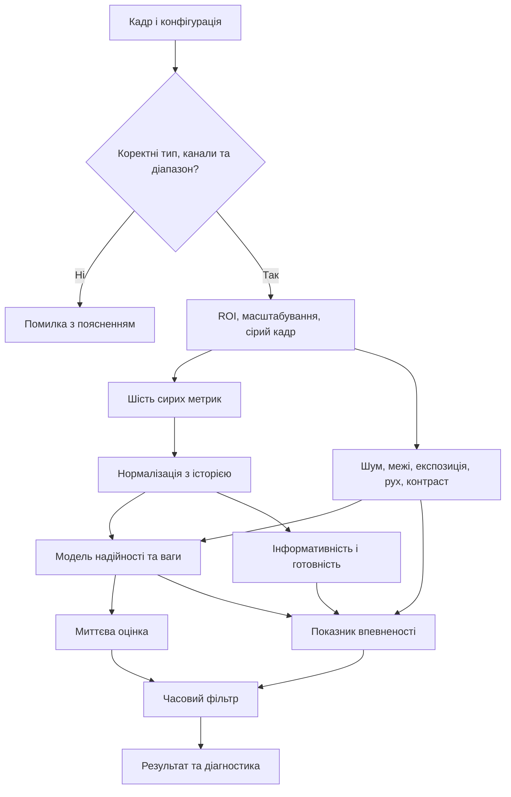
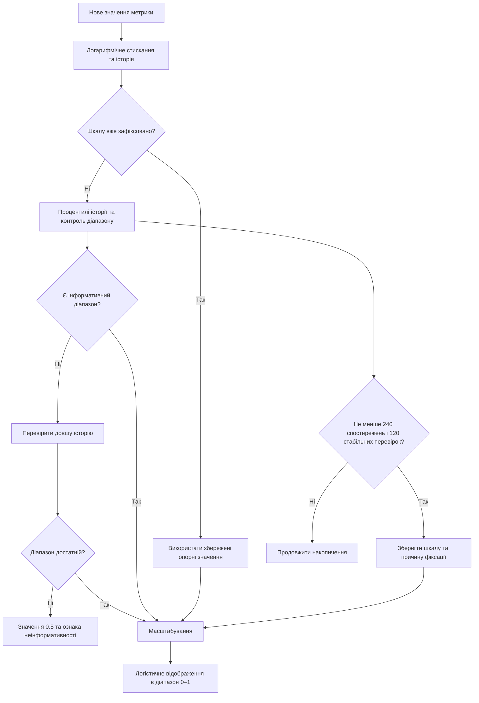
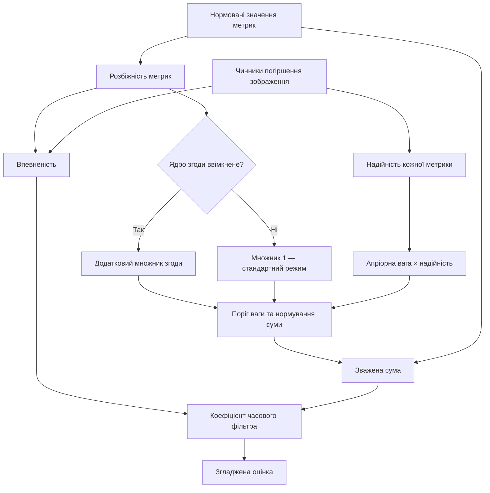
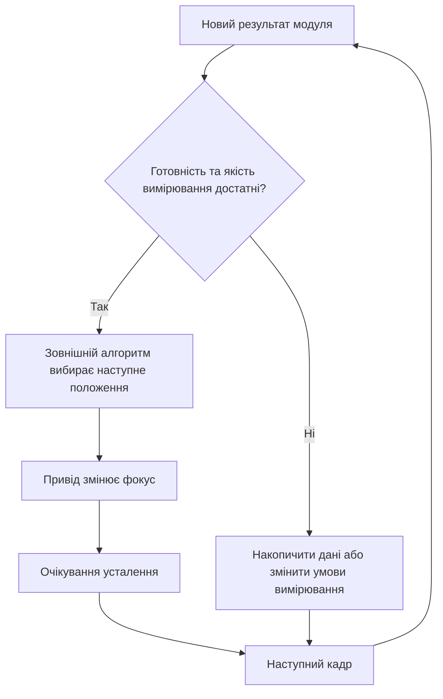
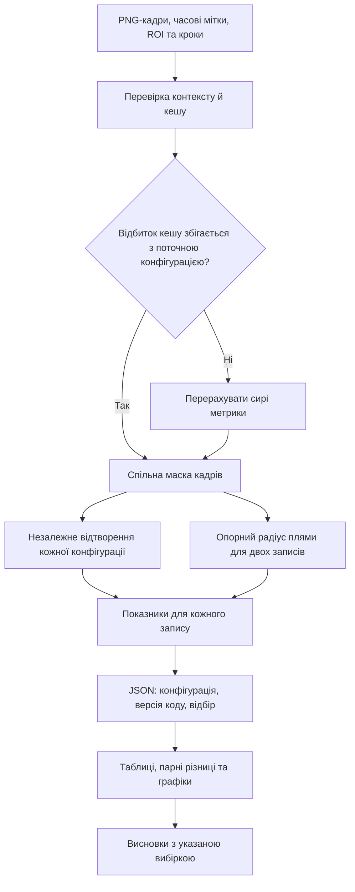

# Технічний звіт: принцип роботи, еволюція та результати

Українською. Описує **як модуль влаштований**, **що в ньому змінилося від
першої версії**, **що показали вимірювання** і **яких вимірювань бракує**.

> **Три українські документи, і вони не дублюють один одного.**
>
> | Документ | Про що |
> | --- | --- |
> | [STUDY_UA.md](STUDY_UA.md) | Що знайшли й що через це змінили — висновки. |
> | **цей файл** | Як воно працює, схеми, історія змін, програма подальших досліджень. |
> | [RESULTS.md](RESULTS.md) | Усі таблиці, згенеровані зі збережених звітів. |
>
> Числа тут узято з JSON у [reports/](../reports/). Ті, що стоять у реченнях, а
> не в згенерованих таблицях, зареєстровано в [claims.toml](claims.toml) і
> перевіряються тестом [tests/test_claims.py](../tests/test_claims.py): якщо
> звіт перерахують і число зрушиться, тест впаде й назве файл, який треба
> виправити.
>
> Кадри записів **не входять** у репозиторій — це фотографії приміщення.
> Публікуються лише виміряні величини й графіки з них.

---

## 1. Призначення та межі

Модуль оцінює ознаки різкості зображення в потоці. Він може бути **джерелом
вимірювання** для зовнішнього алгоритму пошуку фокуса, але сам по собі не є
завершеним контуром керування об'єктивом.

Результат містить миттєву оцінку, згладжену оцінку, ваги й сирі значення
метрик, показник впевненості, готовність та діагностику. Оцінка належить
**конкретній історії потоку**, конфігурації та ROI. Шкала 0–1 не задає
абсолютної оптичної різкості й **не робить різні сцени порівнюваними** — шкалу
підігнано під історію одного потоку й зафіксовано на ній.

**Схема 1. Основний шлях обробки кадру.**



Реалізація: [evaluator.py](../src/adaptive_sharpness/evaluator.py),
[preprocess.py](../src/adaptive_sharpness/preprocess.py),
[ensemble.py](../src/adaptive_sharpness/ensemble.py).

---

## 2. Принцип роботи

### 2.1. Підготовка кадру

Перевіряються тип масиву, кількість каналів, порядок RGB/BGR та діапазон
інтенсивностей. За потреби задається `input_max` для даних, які займають лише
частину діапазону типу. ROI обрізається **перед** масштабуванням. Основне
зображення аналізу — одноканальне float32 у шкалі 0–255, стандартна ширина
**320 пікселів**. Геометричний масштаб зберігається для повернення координат у
систему вихідного кадру.

Результат підготовки може містити **повторно використаний робочий буфер**. Для
довгого зберігання або порівняння кількох кадрів потрібна власна копія — цей
факт колись зіпсував власний тест часового шуму, який через нього порівнював
кадр сам із собою.

### 2.2. Метрики

Очікувана поведінка — зростання показника зі збільшенням високочастотної
деталізації. Ця тенденція залежить від сцени, шуму та обробки; вона **не є**
універсальною гарантією правильного фокуса.

| Метрика | Операція | Особливість реалізації |
| --- | --- | --- |
| Лапласіан | Дисперсія другої похідної | Висока чутливість до дрібних деталей і шуму. |
| Тененград | Середня енергія градієнта Собеля | Об'єднуються горизонтальна й вертикальна складові. |
| Бреннер | Квадрати різниць інтенсивності зі зсувом 2 пікселі | Усереднюються два напрямки; модифікація одновимірного оператора. |
| Вейвлетна | Енергія смуг деталей перетворення Гаара | Два рівні; енергії скориговано на міжрівневе підсилення. |
| Фур'є | Частка високочастотної спектральної енергії | Віднімання середнього та вікно Ганна; відносний поріг частоти 0.25. |
| Ширина меж | Обернена медіанна оцінка ширини переходів | Локальний розмах / градієнт; морфологічне вікно 11; адаптивний поріг. |

Для енергетичних мір застосовано ділення на `max(середня інтенсивність², 1)`.
Це зменшує залежність від множення яскравості **у некліпованому діапазоні**; за
насичення пікселів або додавання шуму така інваріантність не гарантується.

Сьома міра — дисперсія градієнта (TENV) — реалізована, має апріорну вагу й
рядок чутливості, але **не входить** у стандартний набір: офлайн вона
розрізняла кроки краще за будь-яку з шести, онлайн — трохи гірша за кожним
критерієм.

Джерела: [gradient.py](../src/adaptive_sharpness/metrics/gradient.py),
[frequency.py](../src/adaptive_sharpness/metrics/frequency.py),
[edge.py](../src/adaptive_sharpness/metrics/edge.py).

### 2.3. Нормалізація та стан

Нехай `x` — сире значення метрики, `z = ln(1 + max(x, 0))`. Опорні значення `l`
і `h` — 5-й та 95-й процентилі історії. Логістичне відображення:

$$
s = \frac{1}{1+\exp[-g\,(z-(l+h)/2)/(h-l)]},\qquad g = 4.
$$

Аргумент експоненти обмежено; за дуже великих значень машинна арифметика може
створювати нічиї. Якщо діапазон недостатній, повертається нейтральне **0.5** та
ознака неінформативності. **Це значення не можна читати як «середню
різкість»** — саме воно давало 0.5 при повному розфокусуванні, коли жодна
метрика не мала інформативного діапазону.

Основна історія — до **960** спостережень, довша — до 1920. Автофіксація
розглядається після **240** спостережень і вимагає **120** перевірок без
перевищення порога росту діапазону **5 %** від опори інтервалу. Це
алгоритмічний критерій, а не доказ фізичної стаціонарності сцени. Автоматичне
розморожування **вимкнено** за замовчуванням: жоден поріг не дав кращого
результату за вимкнений стан.

**Схема 2. Оновлення та фіксація нормалізації.**



Ознака `ready` потребує завершеного накопичення **та** не менше 50 %
інформативних метрик. Це оцінка придатності числової шкали, а не гарантія
малого промаху фокуса. Джерело:
[normalize.py](../src/adaptive_sharpness/normalize.py).

### 2.4. Умови зображення й адаптивні ваги

Оцінюються шум, нестача меж, пересвіт або недостатня експозиція, глобальний рух
і низький контраст. Шум визначається за **75-м** процентилем абсолютних
HH-коефіцієнтів Гаара:

$$
\widehat\sigma = Q_{p}(|HH|)\,/\,\Phi^{-1}\!\left(\tfrac{1+p}{2}\right),\qquad p = 0.75.
$$

При `p = 0.5` це зводиться до класичного `median(|HH|)/0.6745` (Donoho &
Johnstone, 1994). Медіану довелося покинути, бо на 8-бітному потоці більшість
HH-коефіцієнтів дорівнюють **точно нулю**: медіана прилипає до нуля й показує
відсутність шуму незалежно від його величини. Це оцінювач за моделлю розподілу,
який реагує і на структуру зображення; він **не є** прямим вимірюванням лише
сенсорного шуму.

Глобальний рух оцінюється фазовою кореляцією; локальний рух об'єкта таким
зсувом не описується.

Надійність метрики `i` та її вага:

$$
r_i=\exp\!\left(-\sum_j\kappa_{ij}d_j\right),\qquad
u_i=\max(p_i r_i a_i,\;0.02),\qquad
w_i=\frac{u_i}{\sum_k u_k},\qquad S=\sum_i w_i s_i.
$$

`d` — чинники погіршення, `κ` — задані чутливості, `p` — апріорні ваги.
**Коефіцієнти κ задано евристично**; вони не оцінені як фізичні сталі. Нижня
межа 0.02 застосовується до ненормованої ваги й **не** гарантує кінцеву вагу
2 %.

Ядро згоди `a_i` **вимкнене** за замовчуванням, тобто `a_i = 1`. При ввімкненні
воно зменшує ваги мір, віддалених від зваженої медіани. Розбіжність метрик
продовжує впливати на впевненість і при вимкненому ядрі — це окремий шлях.

**Схема 3. Зважування та зв'язок із впевненістю.**



### 2.5. Впевненість і часовий фільтр

Впевненість обчислюється з характеристик меж, сигнал/шум, експозиції,
контрасту, узгодженості, руху й стану нормалізації: геометричне середнє
чинників разом із обмеженням за необхідними умовами. Це **евристичний
індикатор, а не калібрована ймовірність** правильного фокуса.

Миттєвий `S` **не** множиться на впевненість. Натомість впевненість змінює
базовий коефіцієнт часового фільтра:

$$
\widehat S_t=\widehat S_{t-1}+\alpha_t\,(S_t-\widehat S_{t-1}).
$$

При великій інновації коефіцієнт наближається до 1; при малих змінах працює
згладжування. Прапорець `score_change_detected` повідомляє про стрибок сигналу,
причиною якого може бути фокус, рух, експозиція або зміна ROI. Керування
здійснюється **за кадрами**; число кадрів слід переводити в час за фактичними
часовими мітками.

Джерела: [analysis.py](../src/adaptive_sharpness/analysis.py),
[ensemble.py](../src/adaptive_sharpness/ensemble.py),
[temporal.py](../src/adaptive_sharpness/temporal.py).

**Схема 5. Місце модуля в майбутній інтеграції.**



Зовнішній контролер, механіка привода й умови завершення пошуку **не
перевірені** наведеними нижче графіками. Замкненого контуру не вимірювали
жодного разу.

---

## 3. Зміни від найпершої версії

Перший коміт уже містив шість метрик, аналіз умов, часовий фільтр і виправлення
низки низькорівневих дефектів. Тому ці механізми **не** зараховуються як додані
пізніше.

| Параметр або властивість | Перший коміт | Поточна версія |
| --- | --- | --- |
| Структура пакета | `sharpness`, `capture`, `tools` | Єдиний пакет `src/adaptive_sharpness` |
| Встановлювана конфігурація | Зовнішній `config/default.toml` | Конфігурація всередині пакета |
| Історія нормалізації | 120 кадрів | 960 кадрів і довший горизонт |
| Відображення шкали | Лінійне з обрізанням | Логістичне |
| Автоматична фіксація | Відсутня | 240 спостережень + контроль стабільності |
| Квантиль оцінювання шуму | Медіана, 50-й | 75-й |
| Опорний рух | 3 пікселі | 15 пікселів |
| Опорна щільність меж | 0.03 | 0.006 |
| Ядро згоди | Ввімкнене | **Вимкнене** за замовчуванням |
| Контракт входу | Неповні явні перевірки | Тип, канали, порядок кольорів, інтенсивність |
| Готовність результату | Обмежена діагностика | Явні `ready` та `informative_fraction` |
| Відтворення записів | Початковий засіб збору | Спільний реєстратор, PNG, протоколи й метадані |
| Автоматизована перевірка | 307 тестів | 480+ тестів |

Кожний наступний коміт — у [додатку A](#додаток-a-історія-змін).

---

## 4. Дані та методика

Корпус — **8 записів** від 16.09.2026, **9017** кадрів. Для порівняння одиничних
мір відібрано **6231** кадр після виключення фаз переміщення та, на точкових
записах, надмірного зміщення джерела.

Числові значення ISO/EV для чотирьох записів умов не відновлюються зі
збережених зведень, тому вони названі «Умови 1–4» без вигаданих режимів камери.

| Позначення | Ідентифікатор запису | Кадрів | Відібрано | Яскравість | Щільність меж |
| --- | --- | --- | --- | --- | --- |
| Умови 1 | `cond_20260916_110502` | 618 | 435 | 0.2 | 0.0000 |
| Умови 2 | `cond_20260916_110600` | 558 | 390 | 0.5 | 0.0000 |
| Умови 3 | `cond_20260916_110656` | 565 | 394 | 0.8 | 0.0011 |
| Умови 4 | `cond_20260916_110746` | 586 | 410 | 0.2 | 0.0000 |
| Точкове джерело 1 | `point_source_20260916_111545` | 1781 | 1204 | 0.1 | 0.0011 |
| Точкове джерело 2 | `point_source_20260916_111724` | 1690 | 1125 | 0.1 | 0.0012 |
| Мала фактурність | `sweep_plain_20260916_110955` | 1656 | 1181 | 0.6 | 0.0077 |
| Багата фактура | `sweep_texture_20260916_110108` | 1563 | 1092 | 0.7 | 0.0174 |


*Рисунок 1. Кадри одного запису — не незалежні повторення.*

**Схема 4. Відтворюване дослідження.**



**Опорне вимірювання.** Для точкового джерела використано радіус, що охоплює
задану частку суми інтенсивностей після віднімання оцінки фону. Основний
рецепт: **50 %, півширина вікна 80 пікселів, медіанний фон**. Менший радіус —
компактніша пляма. Це опорний порядок за 8-бітним попереднім переглядом, а
**не** вимірювання MTF чи гарантовано некліпованої PSF.

**Критерії, і на скількох записах кожен визначений.**

| Показник | Записів | Що вимірює |
| --- | --- | --- |
| Спірмен | **2** | Рангова кореляція оцінки з мінусом радіуса плями. Більше — краще. |
| `adj` | **8** | Середнє `abs(2·AUC−1)` між сусідніми групами кроків. Розрізнення, не правильність напряму. |
| Інверсії | **2** | Частка неправильних пар; нічия важить 0.5. Читати разом із часткою нічиїх. |
| `peak_plateau` | **2** | Ширина плато поблизу максимуму, відносно еталонного профілю. |
| `peak_plateau_steps` | **8** | Ширина плато за самим профілем кроків. **Це не те саме число.** |
| Насичення | **8** | Частка кадрів біля власних крайніх значень сигналу; допуск 10⁻⁶ від діапазону. |
| Час | **8** | Медіана та 95/99-й процентилі в кожному записі; зведення — середні цих показників. |

> **Дві ширини плато — окремі статистики, і їх легко сплутати.** Саме це
> сталося: таблиця в [CALIBRATION.md](CALIBRATION.md) мала заголовок «усі вісім
> записів», а в колонці плато стояли значення `peak_plateau` з **двох**
> точкових записів. Число було завищене втричі, а побудований на ньому висновок
> («одна міра взагалі не локалізує максимум») — хибний. Тепер обидві статистики
> друкуються з явною кількістю записів, а
> [tests/test_claims.py](../tests/test_claims.py) перевіряє кожне число в тексті
> **разом із його вибіркою**.

Кадри одного запису **часово залежні**. Розмах між записами не слід називати
довірчим інтервалом. Два рецепти того самого еталона **не** створюють нові
незалежні сцени.

---

## 5. Результати

### 5.1. Історичні й поточні параметри

Кореляція з еталоном змінилася з **−0.0715 до 0.9519** у першому точковому
записі та з **−0.2369 до 0.9788** у другому.

Варіант «до» — реконструкція історичних параметрів (`HISTORIC`) у **сучасному
коді**. Це не запуск першого коміту з його власними реалізаціями. Джерело:
[before_after.json](../reports/before_after.json).


*Рисунок 2. Верхній ряд — профіль оцінки за кроками, нижній — радіус плями (вісь перевернуто, тому вгору = різкіше).*

### 5.2. Шість метрик проти одиничних

Усі колонки — середнє за **вісьмома** записами:

| Варіант | `adj` | Плато, кроків | Насичення, % |
| --- | --- | --- | --- |
| **Шість метрик** | **0.822** | **1.00** | **0.46** |
| Бреннер | 0.747 | 2.00 | 9.02 |
| Вейвлетна | 0.743 | 2.12 | 9.03 |
| Тененград | 0.729 | 2.00 | 8.94 |
| Лапласіан | 0.720 | 2.50 | 16.51 |
| Ширина меж | 0.705 | 1.75 | 17.86 |
| Фур'є | 0.690 | 3.62 | 24.97 |

Розрив за `adj` — **0.075…0.132**, проти 0.025 на самому лише точковому
джерелі. Ансамбль виграє в **6 із 8** записів проти вейвлетної міри, і
найбільший відрив саме там, де злиття й має допомагати — на малотекстурному
проході (0.735 проти 0.640). Проти **найкращої одиничної міри, вибраної окремо
для кожного запису**, ансамбль виграє в 5 із 8; це ретроспективне порівняння, а
не реалізований автоматичний вибір міри.

Плато ансамбля вужче (1.00 проти 1.75…3.62 кроку), насичення — у **19…54 рази**
менше. Джерело: [ablation_singles.json](../reports/ablation_singles.json).


*Рисунок 3. Стовпчики — середнє за 8 записами; точки — окремі записи.*


*Рисунок 4. Кожна клітинка — один запис і один варіант.*


*Рисунок 5. **Дві різні статистики поруч.** Ліворуч — `peak_plateau_steps` на восьми записах, праворуч — `peak_plateau` на двох. Саме праву панель колись помилково подали як ліву.*


*Рисунок 6. Поріг — 10⁻⁶ від власного діапазону сигналу.*

### 5.3. Що дають саме адаптивні ваги

**Це найнезручніший результат у документі, і два критерії дають протилежний
знак.**

| Порівняння | Спірмен, n=2 | `adj`, n=8 |
| --- | --- | --- |
| адаптивні − апріорні | **+0.0145** | **−0.0050** |
| адаптивні − рівні | **+0.0155** | **−0.0036** |

Покроково: адаптивні 0.965 / 0.822, апріорні 0.951 / 0.827, рівні 0.950 / 0.825.

Розподіл за записами пояснює, чому середнє від'ємне:

| Запис | Адаптивні | Апріорні | Різниця |
| --- | --- | --- | --- |
| Умови 1 | 0.704 | 0.827 | **−0.123** |
| Умови 4 | 0.772 | 0.829 | **−0.056** |
| Мала фактурність | 0.735 | 0.738 | −0.003 |
| Багата фактура | 0.797 | 0.790 | +0.007 |
| Точкове джерело 1 | 0.934 | 0.923 | +0.011 |
| Точкове джерело 2 | 0.828 | 0.801 | +0.027 |
| Умови 2 | 0.856 | 0.814 | +0.042 |
| Умови 3 | 0.948 | 0.894 | +0.054 |

**Адаптивні ваги виграють у 5 записах із 8 і все одно програють у середньому** —
бо дві поразки в кілька разів більші за будь-який виграш.

Ці дві — найтемніші записи корпусу: яскравість 0.2, виміряна щільність меж
0.0000 при `edge_ref_density` 0.006. Там і межовий, і експозиційний чинники
погіршення **притиснуті до своїх крайніх значень**, тобто модель надійності
будує ваги з входів, які вже насичені й перестали нести інформацію. Найбільший
виграш — «Умови 3», яскравість 0.8.

Це **асоціація на двох записах і правдоподібний механізм, а не доведена
причина**: точкові записи теж мають майже нульову щільність меж, і там
адаптивність виграє. Записано, бо це перевірюване передбачення (див. Д12) і бо
воно вказує на той самий дефект, що й «достатність меж» у §7.

**Висновок.** «Злиття шести краще за одну міру» і «адаптивні ваги краще за
фіксовані» — **різні твердження з різними доказами**. Перше тримається на всіх
восьми записах і за обома критеріями. Друге тримається за критерієм еталона, не
тримається за критерієм розрізнення й **не є встановленим**.


*Рисунок 16. Ліворуч — `adj` на восьми записах: виграш у 5/8 і від'ємне середнє. Праворуч — Спірмен на двох записах під двома рецептами еталона.*

### 5.4. Факторний план 2³

Перевірено всі вісім комбінацій моделі надійності **R**, ядра згоди **A** й
фільтра **F**. Поточна конфігурація — `R-F`.

За Спірменом описові контрасти: надійність **+0.0417**, ядро **−0.0419**,
фільтр +0.0023; взаємодія надійності й ядра **+0.0293**. За `adj` найбільший
позитивний контраст належить фільтру: **+0.0450**.

Контраст фактора — середній результат при ввімкненні мінус середній при
вимкненні, усереднений за іншими налаштуваннями. **Це не «частки загального
виграшу»**, і оцінку статистичної значущості не виконано. Велика взаємодія
R×A означає конкретну річ: значна частина того, що робила модель надійності,
була **виправленням шкоди від ядра згоди**. З вимкненим ядром її власний внесок
менший.


*Рисунок 8. Дві панелі — два критерії й дві різні вибірки.*


*Рисунок 19. Контраст = сума результатів зі знаками / 4. Опис, не значущість.*

### 5.5. Ядро згоди

Кореляція: **0.9495** при стандартному масштабі 1.5, 0.9599 при масштабі 8,
**0.9653** при вимкненні. Залежність не строго монотонна, але розширення ядра
лише наближає результат до «вимкнено» — це не помилка налаштування.

Чого це **не** доводить: ядро існує, щоб захистити оцінку, коли одну міру
обманює дзеркальний відблиск або пересвічена ділянка, а **жоден із цих записів
такої відмови не містить**.


*Рисунок 11. Розширення ядра лише наближає результат до «вимкнено».*

### 5.6. Нормалізація й виправлення

Ковзна лінійна шкала — Спірмен **0.4638**, фіксована лінійна — **0.8062**,
фіксована логістична — **0.9495**. Насичення фіксованої лінійної — 16.73 %,
логістичної — 0.45 %.

Квантиль шуму зменшує частку нульових оцінок шуму з **97.59 % до 0.17 %**. Це
усуває числове виродження оцінювача, але не доводить точності оцінки фізичного
шуму.

Окремі виправлення **не** утворюють монотонної драбини: зміна лише порога
діапазону виправляє інформативність, але не усуває рух опорної шкали. Саме тому
потрібні спільні перевірки компонентів, а не по одній зміні за раз.


*Рисунок 9. Проміжна конфігурація з увімкненим ядром згоди.*


*Рисунок 10. Окремі варіанти від базової конфігурації, не послідовне додавання.*

### 5.7. Склад метрик і роздільність

При почерговому вилученні однієї міри: вилучення Тененграда змінює Спірмена на
**+0.0093**, Фур'є — на **−0.0096**, ширини меж — на **−0.0137**. Тобто **жодна
міра не є незамінною**, а вилучення однієї навіть трохи допомагає. Різниці в
межах міжзаписового розмаху, тож набір захищуваний, але не оптимальний.

Збільшення ширини аналізу з 320 до 640 пікселів піднімає медіану часу з **9.04
до 27.10 мс** і кореляцію **не покращує**. Ширший кадр змінює просторовий
масштаб операторів, тому це параметр, а не «більше — краще».

> Ця група рахувалася на проміжній конфігурації **з увімкненим ядром згоди**.
> Для поточної стандартної конфігурації її треба повторити — див. Д15.


*Рисунок 12. Зміна відносно повного набору.*


*Рисунок 13. Ширший кадр коштує втричі дорожче й не покращує кореляцію.*

### 5.8. Чутливість опорного вимірювання

Змінено частку суми інтенсивностей 25/50/75 %, півширину вікна 50/80/120 пікселів
та оцінку фону. Частина рецептів добре узгоджується (0.98…0.997); **вікна
120 пікселів анти-корельовані** з меншими (−0.74…−0.89), бо захоплюють
сторонній вміст.

**Чи важлива ця чутливість для висновків — питання, на яке є відповідь.**
Факторний план прогнали проти обох рецептів. Заміна `r50_w80_median` на
`r25_w50_median` зсуває кореляцію **кожного** варіанта вниз на 0.004…0.011 —
це спільний зсув, — тоді як **різниці між варіантами** зсуваються лише на
0.002…0.005:

| Парна різниця | `r50_w80` | `r25_w50` | Зсув |
| --- | --- | --- | --- |
| адаптивні − апріорні | +0.0145 | +0.0114 | −0.0031 |
| адаптивні − рівні | +0.0155 | +0.0104 | −0.0050 |
| ядро вимкнено − ввімкнено | +0.0159 | +0.0136 | −0.0022 |

Тобто **парні різниці значно стійкіші до рецепта, ніж абсолютні кореляції**.
Звідси й наслідок для §5.9: розрив 0.023 приблизно **вп'ятеро** більший за
найбільший зсув від зміни рецепта, тож це не шум еталона.


*Рисунок 14. Частка суми інтенсивностей / півширина вікна / оцінка фону. Вікна 120 пікселів анти-корельовані з меншими.*


*Рисунок 15. Зміна рецепта може зрушити опорний максимум.*

> Раніше в [CALIBRATION.md](CALIBRATION.md) стояло, що 0.023 «нижче роздільної
> здатності еталона», бо рецепти узгоджуються на 0.98. Це некоректне
> міркування: кореляція **між двома рецептами** не є похибкою кореляції **між
> методом і рецептом**. Твердження прибрано й замінено вимірюванням.

### 5.9. Сирі метрики та повні конвеєри

На точкових записах сира вейвлетна міра має кореляцію **0.9875**, її одиничний
конвеєр — **0.9366**, поточний ансамбль — **0.9653**. Розрив між сирою мірою й
ансамблем — **0.0222**.

Сира міра обчислюється з одного кадру й **чудово працює онлайн** — це не
офлайнова категорія. Їй бракує обмеженої шкали, показника впевненості й того,
що можна зливати. **Порівнюваності між сценами конвеєр теж не дає** — шкалу
підігнано під історію одного потоку.

Для пошуку максимуму **в межах одного потоку** шкала взагалі не потрібна,
потрібен лише порядок, і сира міра дає кращий. Чи варті ці властивості 0.023 —
вибір, а не наслідок; на восьми реальних записах конвеєр відбиває цю втрату з
надлишком, на точковому джерелі — ні.

Джерело: [fair_comparison.json](../reports/fair_comparison.json).


*Рисунок 7. Сира вейвлетна міра — помаранчева; повна система — бірюзова.*


*Рисунок 18. Чому низька частка строгих інверсій у метрики з широким плато не означає високу роздільність: решта пар — нічиї.*

### 5.10. Обчислювальні витрати

Середня медіана часу повної системи — **9.25 мс** на кадр, середнє 99-х
процентилів — **11.50 мс** (8 записів). Значення з `fair_comparison` належать
іншому прогону й лише двом записам; **змішувати їх не можна**.

Час обробки **не** включає затримок захоплення, інтерфейсу, запису й привода.
Висновок про повну частоту контуру потребує окремого вимірювання.


*Рисунок 17. Виміряно на Raspberry Pi 5. Кожен стовпчик — середнє відповідного показника за 8 записами, не процентиль об'єднаної вибірки.*

---

## 6. Що знайшов зовнішній перегляд і що з цим зробили

| Зауваження | Стан | Що зроблено |
| --- | --- | --- |
| `fair_comparison` читає сирий NPZ без перевірки відбитка конфігурації | **Виправлено** | Відбиток винесено у спільний `processing_fingerprint()`; інструмент вимагає перевірений `cached.raw` і відмовляється рахувати зі застарілим кешем. |
| Плато 5–7 кроків узято з 2 записів, а подано як 8 | **Виправлено** | Прозові таблиці переведено на `peak_plateau_steps`; кожна згенерована таблиця друкує кількість записів; додано `claims.toml` і тест. |
| Внесок адаптивності подано як однозначний виграш | **Виправлено** | §5.3: обидва критерії, розподіл за записами, зв'язок із насиченими чинниками. |
| «Порівнюваність між сценами» суперечить README | **Виправлено** | Твердження прибрано з CALIBRATION; §5.9. |
| «0.023 нижче роздільної здатності еталона» | **Виправлено** | Замінено вимірюванням стійкості парних різниць; §5.8. |
| `ALGORITHM.md` описує медіанний оцінювач шуму | **Виправлено** | Записано формулу з квантилем і зазначено зведення до класичної при p=0.5. |
| Ядро згоди описане як активний етап | **Виправлено** | `ALGORITHM.md` §5 і README позначено «вимкнено за замовчуванням». |
| Плутанина походження варіантів (`HISTORIC`/`REPAIRED`/поточний) | **Частково** | Підписи вказують конфігурацію; §5.7 позначено явно. Повторення груп для поточної конфігурації — Д15, Д16. |
| Порівнювати прирости `adj` і Спірмена як кратні величини | **Враховано** | Критерії всюди подані окремо, з різною кількістю записів. |

---

## 7. Відкриті питання та точні межі висновків

- Незалежний від мір різкості еталон є **лише для двох записів**; він залежить
  від рецепта та 8-бітної обробки камери.
- `adj` **не визначає напряму** зміни справжньої різкості: висока
  розрізнюваність може супроводжуватися неправильним порядком.
- Перевага ансамблю над одиничною метрикою й перевага адаптивних ваг над
  фіксованими — **різні гіпотези з різною доказовою базою** (§5.3).
- **Достатність меж вимірюється циклічно.** Щільність меж на кадр падає до нуля
  саме там, де вона потрібна; передбачуваний напрям виправлення — оцінювати
  структуру сцени за історією, а критерієм робити криву покриття/помилки.
- `auto_freeze` має **чотири сталі, підібрані на тих самих записах**, що їх
  оцінюють.
- Оцінка шуму має структурно залежну нижню межу й читає приблизно на 35 %
  нижче. Це відносний сигнал, не вимірювання.
- Показник впевненості **не калібрований** як ймовірність.
- Частина абляцій рахувалася на `REPAIRED` з ядром згоди; переносити їх на
  поточний стандартний набір параметрів **без перевірки не можна**.
- Порівняння «до/після» відтворює **параметри**, а не перший код.
- **Замкненого контуру не вимірювали.** Усе виміряне — сигнал, який споживав би
  пошук, і жодного разу не сам пошук. Затримки автофокуса не міряли, бо
  положення об'єктива не записували.
- Крок протоколу — **номер ручного кроку**, не каліброване положення об'єктива,
  і кроки не рівновіддалені за розфокусуванням.

---

## 8. Подальші дослідження на наявних даних

Перші шість напрямів уже покриті опублікованими зведеннями. Для решти потрібні
наявні вихідні кадри або покадрові журнали. **Відсутні результати не
екстраполюються з готових діаграм.**

| Код | Напрям | Дані | Метод | Результат |
| --- | --- | --- | --- | --- |
| Д01 | Внесок адаптивності | JSON: виконано | Парні різниці на тих самих записах: адаптивні, апріорні, рівні. | §5.3; таблиця знаків і величин. |
| Д02 | Ефекти та взаємодії | JSON: виконано | Для плану 2³ описові контрасти головних ефектів та взаємодій. | §5.4; без тверджень про значущість. |
| Д03 | Варіативність між записами | JSON: виконано | Кожний запис поряд із середнім; перемоги з явним суперником. | §5.2; 5/8 проти найкращої одиничної. |
| Д04 | Плато та нічиї | JSON: виконано | Розділити вибірки 8 і 2 записів; зіставити плато, помилки, нічиї. | §4, §5.2. |
| Д05 | Чутливість еталона | JSON: виконано | 10 рецептів: частка інтенсивності, півширина вікна, фон. | §5.8. |
| Д06 | Компроміс швидкість–якість | JSON: виконано | Ширини 240/320/480/640 і часові процентилі. | §5.7, §5.10. |
| Д07 | Невизначеність парних різниць | Часові ряди | Парний блоковий bootstrap у межах запису; довжину блока обґрунтувати автокореляцією. | Інтервали Δ`adj` і ΔСпірмена та їх залежність від довжини блока. |
| Д08 | Відтворення першого коду | Кадри | Ізольовано запустити перший і поточний коміти на тих самих PNG. | Парні криві score; відмінності від реконструкції `HISTORIC`. |
| Д09 | Нормалізація поетапно | Кадри | Сирий сигнал → логарифм → фіксована шкала → змінна шкала → фільтр; одна маска, один критерій. | Криві по кроках, Δрангів, насичення на кожній стадії. |
| Д10 | Залежність від передісторії | Кадри | Починати від різних ділянок проходу; зворотний порядок і `reset` як діагностика. | Теплова карта зміни оцінки того самого кадру; час готовності. |
| Д11 | Параметри автофіксації | Кадри | Змінювати мінімальну історію, терпіння й поріг росту діапазону. | Карта якість–параметр; момент фіксації. |
| Д12 | Поведінка ваг | Кадри або журнали ваг | Ваги кожної метрики, їх мінливість і залежність від шуму, меж, руху. | Часові криві ваг; зв'язок із чинниками. **Прямо перевіряє механізм із §5.3.** |
| Д13 | Якість впевненості | Покадрові результати | Помилки при різних порогах впевненості й частка відкинутих кадрів. | Крива помилка–покриття. |
| Д14 | Часовий фільтр | Кадри | Змінювати `alpha` і зв'язок із впевненістю; затримка, розкид, помилки максимуму. | Компроміс затримка–шум. |
| Д15 | Підмножини метрик | Кадри | Повторити вилучення метрик **для поточної конфігурації без ядра**. | Карта склад–якість; фронт Парето. |
| Д16 | Масштаб та ROI | Кадри | Ширини аналізу та кілька ROI для поточної конфігурації. | Карта ROI–ширина–якість. |
| Д17 | Штучні деградації | Кадри | Окремо шум, яскравість, кліпування, зсув; фіксувати seed. | Криві деградації. **Модельні перетворення, не нові фізичні вимірювання.** |
| Д18 | Чутливість κ | Кадри | Змінювати групи κ та опорні рівні; підбирати на одних записах, оцінювати на інших. | Порівняння до/після підбору без витоку даних. |
| Д19 | Пошук по записаному проходу | Кадри й протокол | Бюджет оцінювань і стратегія пошуку; кроки, плато, помилка. | Криві успіх–бюджет. **Не імітує механіку привода.** |
| Д20 | Стійкість критеріїв | JSON частково | Порівняти `adj`, Спірмена, нічиї, похибку максимуму; різні допуски плато. | Матриця узгодження рейтингів. |

**Черговість.** Спочатку Д12 — він прямо перевіряє механізм, запропонований у
§5.3, і потребує лише журналів ваг. Далі Д07 (інтервали для парних різниць, без
яких §5.3 лишається описом), Д15 і Д16 (зняти залежність від `REPAIRED`), потім
Д09–Д11, після цього впевненість, часові властивості й симуляція пошуку.

Для порівняння різних сцен або об'єктивів потрібні **незалежні записи**;
повторні обчислення тих самих кадрів такої перевірки не створять.

---

## Правила аналізу

- Однакові кадри, маски й початкові стани для парного порівняння.
- Зберігати часовий порядок; перестановки — лише як окрема діагностика.
- Усереднювати **спочатку в межах запису**; тисячі кадрів не замінюють
  незалежні сцени.
- Вказувати походження часу: обробка, захоплення, інтерфейс і збереження мають
  різні витрати.
- Показувати невдалі випадки й точні параметри; не підбирати конфігурацію на
  всьому корпусі з подальшим оголошенням цього ж корпусу перевіркою.
- Не перетворювати 2 записи × 2 рецепти еталона на 4 незалежні повторення.
- **Друкувати кількість записів поряд із кожним показником.**

---

## Додаток A. Історія змін

Усього 25 комітів: початковий `1f1c75c` від 05.09.2026 і 24 наступні.

| Дата | Коміт | Область | Що змінено |
| --- | --- | --- | --- |
| 09-06 | `68990e5` | Пакування | Єдиний пакет `adaptive_sharpness` у `src`; конфігурація й `py.typed` входять у wheel; вилучено неробочі консольні точки входу. |
| 09-06 | `7d905dd` | Контракт API | Перевірки каналів, типів і діапазону; RGB/BGR та `input_max`; виправлено масштаб координат ROI; окремі миттєвий/фільтрований score, готовність, структурований експорт. |
| 09-06 | `9353210` | Критерій пошуку й CI | Пошук проходить плато, має бюджет кроків і повертає найкраще відвідане положення; додано CI та перевірку чистого встановлення wheel. |
| 09-06 | `b5457ae` | Залежності | Усунено несумісні поєднання OpenCV/NumPy; піднято мінімальну версію OpenCV. |
| 09-06 | `9967331` | Тест максимуму | Замість залежного від порядку `argmax` перевіряється входження правильного фокуса у вузьке плато. |
| 09-06 | `4e9e448` | Запис та аналіз | PNG замість JPEG, фонове збереження, тривалість і крок запису; manifest та журнал; автоматичний аналіз 11 типів відмов. |
| 09-06 | `f031091` | Спільний реєстратор | `RunRecorder` перенесено в бібліотеку; кнопка запису; уніфіковано формат UI й пакетного збору. |
| 09-09 | `82ebfcc` | Впевненість і діагностика | Опорний рух 3→15 пікселів; виправлено аналіз переваги об'єкта без конкурента; **дані записів виключено з Git**. |
| 09-10 | `bbce13e` | Реальні кадри | Аналіз залежності від порядку, розрізнення позицій, штучного розмиття; у перевірці PSF відкидаються пари з різним вмістом сцени. |
| 09-10 | `3460ca1` | Базові методи | Дев'ять додаткових мір різкості та стандартні правила злиття. |
| 09-10 | `e2cbb20` | Коректність порівняння | До рейтингу внесено власний ансамбль; узгоджено нормалізацію сигналів і критерій роздільності. |
| 09-10 | `845377c` | Протоколи збору | Чотири сценарії запису; підказки утримання/переміщення; номер кроку й фаза записуються явно. |
| 09-16 | `8343021` | Нормалізація та умови | Вікно 120→960; довша історія, автофіксація, логістична шкала, відносний поріг діапазону; квантиль шуму 50→75; поріг меж 0.03→0.006; ядро згоди вимкнено; виправлено `freeze`/`fit`. |
| 09-16 | `6523138` | Ілюстрації | Графічне представлення результатів калібрувального дослідження. |
| 09-16 | `f2a28a7` | Вимірювальний код | Явні `VariantSpec` і заборона дубльованих варіантів; окремий облік пар і нічиїх; спільний відбір кадрів; відбитки кешу; виправлено накопичувальний ріст діапазону при автофіксації. |
| 09-16 | `7d71891` | Збереження результатів | JSON записується **до** друку таблиці; збій кодування консолі більше не втрачає прогін. |
| 09-16 | `4c3a950` | Повторний аналіз | Результати перераховано після виправлення інструментів; план 2³, вилучення метрик, альтернативний еталон, генератор таблиць. |
| 09-16 | `e85a59d` | Конфігурація, кеш, ROI | Конфігурація читається з бібліотеки; `single:wavelet`; спільні завантажувач кешу та `replay_in_context`; звіти в `reports/`. |
| 09-16 | `ba902de` | Порівняння до/після | Варіант «після» відповідає поточним стандартним параметрам, а не проміжному `REPAIRED`. |
| 09-16 | `1a75050` | Походження даних | Уточнено облік змінених файлів; метадані додано до `protocol_study`. |
| 09-17 | `d0ff8c0` | Стан вихідного коду | Ознака зміни коду перевіряє лише відповідні каталоги; запис звіту не робить код «зміненим». |
| 09-17 | `ce8c4eb` | Відтворення звітів | Опубліковано десять JSON-звітів; порівняння сирої вейвлетної міри з її конвеєром та поточною системою. |
| 09-17 | `a8b00c9` | Одиничні метрики | Порівняння ансамблю з окремими метриками поширено на всі вісім записів. |
| 09-17 | `7cf121f` | Звіт про одиничні міри | Одинадцятий звіт `ablation_singles`, графіки й таблиці. |

---

## Як відтворити

Таблиці й англомовні графіки:

```bash
python3 tools/render_results.py reports --out docs/RESULTS.md --figures docs/figures
```

Українські графіки — лише зі збережених JSON, без доступу до кадрів:

```bash
python3 tools/figures_ua.py
```

Перевірка чисел у тексті проти звітів:

```bash
python3 -m pytest tests/test_claims.py -q
```
