# Технічний звіт: принцип роботи, еволюція та результати

Українською. Описує **як модуль влаштований**, **що в ньому змінилося від
першої версії**, **що показали вимірювання** і **яких вимірювань бракує**.

> **Три українські документи, і вони не дублюють один одного.**
>
> | Документ | Про що |
> | --- | --- |
> | [STUDY_UA.md](STUDY_UA.md) | Що знайшли й що через це змінили — висновки. |
> | **цей файл** | Як воно працює, схеми, історія змін, програма досліджень. |
> | [STUDY_UA_RESULTS.md](STUDY_UA_RESULTS.md) | **Результати Д07–Д20**: що тестували, як, що отримали, як трактувати. |
> | [RESULTS.md](RESULTS.md) | Усі таблиці, згенеровані зі збережених звітів. |
>
> Числа тут узято з JSON у [reports/](../reports/). Ті, що стоять у реченнях, а
> не в згенерованих таблицях, зареєстровано в [claims.toml](claims.toml) і
> перевіряються тестом [tests/test_claims.py](../tests/test_claims.py): якщо
> звіт перерахують і число зрушиться, тест впаде й назве файл, який треба
> виправити.
>
> Кадри записів **не входять** у репозиторій — це фотографії приміщення.
> Публікуються лише виміряні величини й графіки з них.
>
> **Підсумок усього — у [§9. Глобальний аналіз](#9-глобальний-аналіз-що-можна-сказати-про-алгоритм):**
> що в алгоритмі працює, що ні, чого він не вміє і що я змінив би в коді.

---

## 1. Призначення та межі

Модуль оцінює ознаки різкості зображення в потоці. Він може бути **джерелом
вимірювання** для зовнішнього алгоритму пошуку фокуса, але сам по собі не є
завершеним контуром керування об'єктивом.

Результат містить миттєву оцінку, згладжену оцінку, ваги й сирі значення
метрик, показник впевненості, готовність та діагностику. Оцінка належить
**конкретній історії потоку**, конфігурації та ROI. Шкала 0–1 не задає
абсолютної оптичної різкості й **не робить різні сцени порівнюваними** — шкалу
підігнано під історію одного потоку й зафіксовано на ній.

**Схема 1. Основний шлях обробки кадру.**

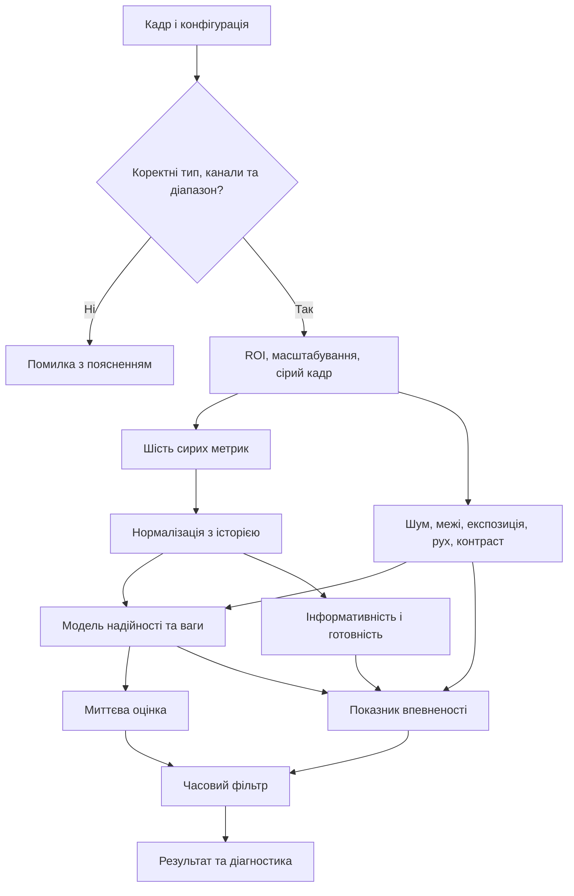
```mermaid
flowchart TD
 A["Кадр і конфігурація"] --> B{"Коректні тип, канали та діапазон?"}
 B -->|Ні| X["Помилка з поясненням"]
 B -->|Так| C["ROI, масштабування, сірий кадр"]
 C --> D["Шість сирих метрик"]
 C --> E["Шум, межі, експозиція, рух, контраст"]
 D --> F["Нормалізація з історією"]
 E --> G["Модель надійності та ваги"]
 F --> G
 F --> H["Інформативність і готовність"]
 G --> I["Миттєва оцінка"]
 E --> J["Показник впевненості"]
 G --> J
 H --> J
 I --> K["Часовий фільтр"]
 J --> K
 K --> L["Результат та діагностика"]
```

Реалізація: [evaluator.py](../src/adaptive_sharpness/evaluator.py),
[preprocess.py](../src/adaptive_sharpness/preprocess.py),
[ensemble.py](../src/adaptive_sharpness/ensemble.py).

---

## 2. Принцип роботи

### 2.1. Підготовка кадру

Перевіряються тип масиву, кількість каналів, порядок RGB/BGR та діапазон
інтенсивностей. За потреби задається `input_max` для даних, які займають лише
частину діапазону типу. ROI обрізається **перед** масштабуванням. Основне
зображення аналізу — одноканальне float32 у шкалі 0–255, стандартна ширина
**320 пікселів**. Геометричний масштаб зберігається для повернення координат у
систему вихідного кадру.

Результат підготовки може містити **повторно використаний робочий буфер**. Для
довгого зберігання або порівняння кількох кадрів потрібна власна копія — цей
факт колись зіпсував власний тест часового шуму, який через нього порівнював
кадр сам із собою.

### 2.2. Метрики

Очікувана поведінка — зростання показника зі збільшенням високочастотної
деталізації. Ця тенденція залежить від сцени, шуму та обробки; вона **не є**
універсальною гарантією правильного фокуса.

| Метрика | Операція | Особливість реалізації |
| --- | --- | --- |
| Лапласіан | Дисперсія другої похідної | Висока чутливість до дрібних деталей і шуму. |
| Тененград | Середня енергія градієнта Собеля | Об'єднуються горизонтальна й вертикальна складові. |
| Бреннер | Квадрати різниць інтенсивності зі зсувом 2 пікселі | Усереднюються два напрямки; модифікація одновимірного оператора. |
| Вейвлетна | Енергія смуг деталей перетворення Гаара | Два рівні; енергії скориговано на міжрівневе підсилення. |
| Фур'є | Частка високочастотної спектральної енергії | Віднімання середнього та вікно Ганна; відносний поріг частоти 0.25. |
| Ширина меж | Обернена медіанна оцінка ширини переходів | Локальний розмах / градієнт; морфологічне вікно 11; адаптивний поріг. |

Для енергетичних мір застосовано ділення на `max(середня інтенсивність², 1)`.
Це зменшує залежність від множення яскравості **у некліпованому діапазоні**; за
насичення пікселів або додавання шуму така інваріантність не гарантується.

Сьома міра — дисперсія градієнта (TENV) — реалізована, має апріорну вагу й
рядок чутливості, але **не входить** у стандартний набір: офлайн вона
розрізняла кроки краще за будь-яку з шести, онлайн — трохи гірша за кожним
критерієм.

Джерела: [gradient.py](../src/adaptive_sharpness/metrics/gradient.py),
[frequency.py](../src/adaptive_sharpness/metrics/frequency.py),
[edge.py](../src/adaptive_sharpness/metrics/edge.py).

### 2.3. Нормалізація та стан

Нехай `x` — сире значення метрики, `z = ln(1 + max(x, 0))`. Опорні значення `l`
і `h` — 5-й та 95-й процентилі історії. Логістичне відображення:

$$
s = \frac{1}{1+\exp[-g\,(z-(l+h)/2)/(h-l)]},\qquad g = 4.
$$

Аргумент експоненти обмежено; за дуже великих значень машинна арифметика може
створювати нічиї. Якщо діапазон недостатній, повертається нейтральне **0.5** та
ознака неінформативності. **Це значення не можна читати як «середню
різкість»** — саме воно давало 0.5 при повному розфокусуванні, коли жодна
метрика не мала інформативного діапазону.

Основна історія — до **960** спостережень, довша — до 1920. Автофіксація
розглядається після **240** спостережень і вимагає **120** перевірок без
перевищення порога росту діапазону **5 %** від опори інтервалу. Це
алгоритмічний критерій, а не доказ фізичної стаціонарності сцени. Автоматичне
розморожування **вимкнено** за замовчуванням: жоден поріг не дав кращого
результату за вимкнений стан.

**Схема 2. Оновлення та фіксація нормалізації.**

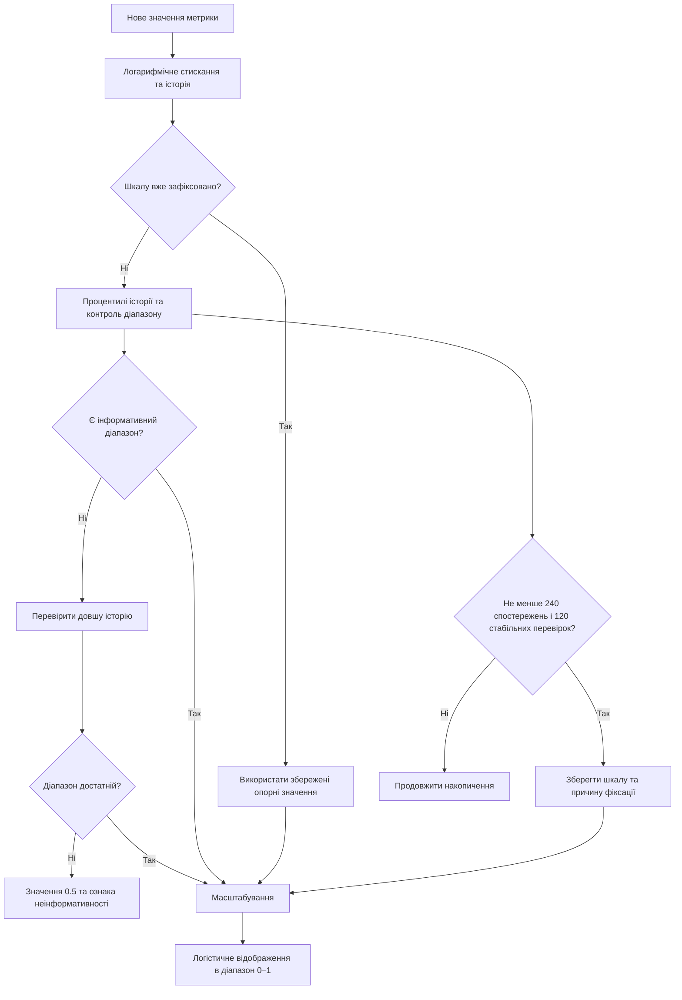
```mermaid
flowchart TD
 A["Нове значення метрики"] --> B["Логарифмічне стискання та історія"]
 B --> C{"Шкалу вже зафіксовано?"}
 C -->|Так| D["Використати збережені опорні значення"]
 C -->|Ні| E["Процентилі історії та контроль діапазону"]
 E --> F{"Є інформативний діапазон?"}
 F -->|Ні| G["Перевірити довшу історію"]
 G --> H{"Діапазон достатній?"}
 H -->|Ні| I["Значення 0.5 та ознака неінформативності"]
 H -->|Так| J["Масштабування"]
 F -->|Так| J
 E --> K{"Не менше 240 спостережень і 120 стабільних перевірок?"}
 K -->|Так| L["Зберегти шкалу та причину фіксації"]
 K -->|Ні| M["Продовжити накопичення"]
 D --> J
 L --> J
 J --> N["Логістичне відображення в діапазон 0–1"]
```

Ознака `ready` потребує завершеного накопичення **та** не менше 50 %
інформативних метрик. Це оцінка придатності числової шкали, а не гарантія
малого промаху фокуса. Джерело:
[normalize.py](../src/adaptive_sharpness/normalize.py).

### 2.4. Умови зображення й адаптивні ваги

Оцінюються шум, нестача меж, пересвіт або недостатня експозиція, глобальний рух
і низький контраст. Шум визначається за **75-м** процентилем абсолютних
HH-коефіцієнтів Гаара:

$$
\widehat\sigma = Q_{p}(|HH|)\,/\,\Phi^{-1}\!\left(\tfrac{1+p}{2}\right),\qquad p = 0.75.
$$

При `p = 0.5` це зводиться до класичного `median(|HH|)/0.6745` (Donoho &
Johnstone, 1994). Медіану довелося покинути, бо на 8-бітному потоці більшість
HH-коефіцієнтів дорівнюють **точно нулю**: медіана прилипає до нуля й показує
відсутність шуму незалежно від його величини. Це оцінювач за моделлю розподілу,
який реагує і на структуру зображення; він **не є** прямим вимірюванням лише
сенсорного шуму.

Глобальний рух оцінюється фазовою кореляцією; локальний рух об'єкта таким
зсувом не описується.

Надійність метрики `i` та її вага:

$$
r_i=\exp\!\left(-\sum_j\kappa_{ij}d_j\right),\qquad
u_i=\max(p_i r_i a_i,\;0.02),\qquad
w_i=\frac{u_i}{\sum_k u_k},\qquad S=\sum_i w_i s_i.
$$

`d` — чинники погіршення, `κ` — задані чутливості, `p` — апріорні ваги.
**Коефіцієнти κ задано евристично**; вони не оцінені як фізичні сталі. Нижня
межа 0.02 застосовується до ненормованої ваги й **не** гарантує кінцеву вагу
2 %.

Ядро згоди `a_i` **вимкнене** за замовчуванням, тобто `a_i = 1`. При ввімкненні
воно зменшує ваги мір, віддалених від зваженої медіани. Розбіжність метрик
продовжує впливати на впевненість і при вимкненому ядрі — це окремий шлях.

**Схема 3. Зважування та зв'язок із впевненістю.**

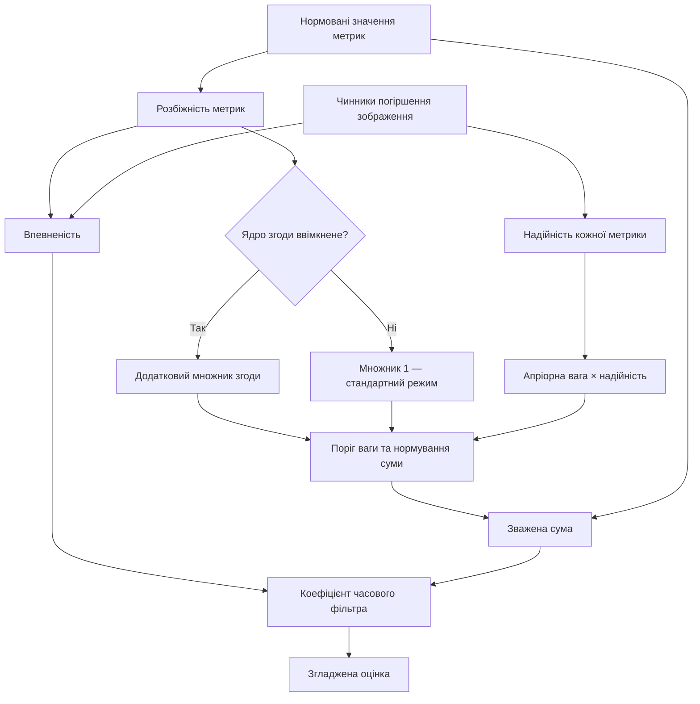
```mermaid
flowchart TD
 A["Чинники погіршення зображення"] --> B["Надійність кожної метрики"]
 B --> C["Апріорна вага × надійність"]
 D["Нормовані значення метрик"] --> E["Розбіжність метрик"]
 E --> F{"Ядро згоди ввімкнене?"}
 F -->|Так| G["Додатковий множник згоди"]
 F -->|Ні| H["Множник 1 — стандартний режим"]
 G --> I["Поріг ваги та нормування суми"]
 H --> I
 C --> I
 I --> J["Зважена сума"]
 D --> J
 E --> K["Впевненість"]
 A --> K
 K --> L["Коефіцієнт часового фільтра"]
 J --> L
 L --> M["Згладжена оцінка"]
```

### 2.5. Впевненість і часовий фільтр

Впевненість обчислюється з характеристик меж, сигнал/шум, експозиції,
контрасту, узгодженості, руху й стану нормалізації: геометричне середнє
чинників разом із обмеженням за необхідними умовами. Це **евристичний
індикатор, а не калібрована ймовірність** правильного фокуса.

Миттєвий `S` **не** множиться на впевненість. Натомість впевненість змінює
базовий коефіцієнт часового фільтра:

$$
\widehat S_t=\widehat S_{t-1}+\alpha_t\,(S_t-\widehat S_{t-1}).
$$

При великій інновації коефіцієнт наближається до 1; при малих змінах працює
згладжування. Прапорець `score_change_detected` повідомляє про стрибок сигналу,
причиною якого може бути фокус, рух, експозиція або зміна ROI. Керування
здійснюється **за кадрами**; число кадрів слід переводити в час за фактичними
часовими мітками.

Джерела: [analysis.py](../src/adaptive_sharpness/analysis.py),
[ensemble.py](../src/adaptive_sharpness/ensemble.py),
[temporal.py](../src/adaptive_sharpness/temporal.py).

**Схема 4. Місце модуля в майбутній інтеграції.**

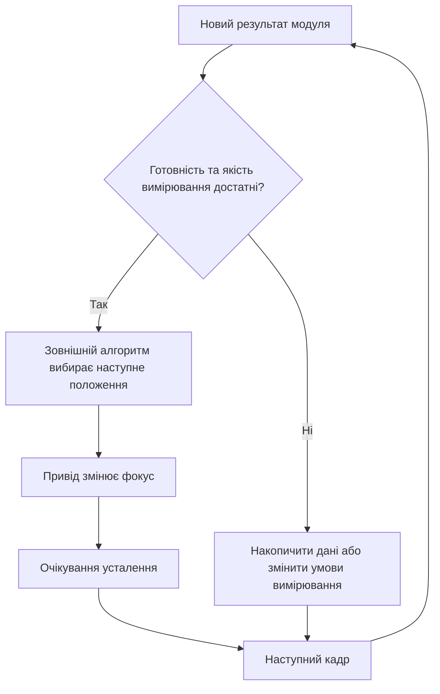
```mermaid
flowchart TD
 A["Новий результат модуля"] --> B{"Готовність та якість вимірювання достатні?"}
 B -->|Ні| C["Накопичити дані або змінити умови вимірювання"]
 B -->|Так| D["Зовнішній алгоритм вибирає наступне положення"]
 D --> E["Привід змінює фокус"]
 E --> F["Очікування усталення"]
 F --> G["Наступний кадр"]
 G --> A
 C --> G
```

Зовнішній контролер, механіка привода й умови завершення пошуку **не
перевірені** наведеними нижче графіками. Замкненого контуру не вимірювали
жодного разу.

---

## 3. Зміни від найпершої версії

Перший коміт уже містив шість метрик, аналіз умов, часовий фільтр і виправлення
низки низькорівневих дефектів. Тому ці механізми **не** зараховуються як додані
пізніше.

| Параметр або властивість | Перший коміт | Поточна версія |
| --- | --- | --- |
| Структура пакета | `sharpness`, `capture`, `tools` | Єдиний пакет `src/adaptive_sharpness` |
| Встановлювана конфігурація | Зовнішній `config/default.toml` | Конфігурація всередині пакета |
| Історія нормалізації | 120 кадрів | 960 кадрів і довший горизонт |
| Відображення шкали | Лінійне з обрізанням | Логістичне |
| Автоматична фіксація | Відсутня | 240 спостережень + контроль стабільності |
| Квантиль оцінювання шуму | Медіана, 50-й | 75-й |
| Опорний рух | 3 пікселі | 15 пікселів |
| Опорна щільність меж | 0.03 | 0.006 |
| Ядро згоди | Ввімкнене | **Вимкнене** за замовчуванням |
| Контракт входу | Неповні явні перевірки | Тип, канали, порядок кольорів, інтенсивність |
| Готовність результату | Обмежена діагностика | Явні `ready` та `informative_fraction` |
| Відтворення записів | Початковий засіб збору | Спільний реєстратор, PNG, протоколи й метадані |
| Автоматизована перевірка | 307 тестів | 480+ тестів |

Кожний наступний коміт — у [додатку A](#додаток-a-історія-змін).

---

## 4. Дані та методика

Корпус — **8 записів** від 16.09.2026, **9017** кадрів. Для порівняння одиничних
мір відібрано **6231** кадр після виключення фаз переміщення та, на точкових
записах, надмірного зміщення джерела.

Числові значення ISO/EV для чотирьох записів умов не відновлюються зі
збережених зведень, тому вони названі «Умови 1–4» без вигаданих режимів камери.

| Позначення | Ідентифікатор запису | Кадрів | Відібрано | Яскравість | Щільність меж |
| --- | --- | --- | --- | --- | --- |
| Умови 1 | `cond_20260916_110502` | 618 | 435 | 0.2 | 0.0000 |
| Умови 2 | `cond_20260916_110600` | 558 | 390 | 0.5 | 0.0000 |
| Умови 3 | `cond_20260916_110656` | 565 | 394 | 0.8 | 0.0011 |
| Умови 4 | `cond_20260916_110746` | 586 | 410 | 0.2 | 0.0000 |
| Точкове джерело 1 | `point_source_20260916_111545` | 1781 | 1204 | 0.1 | 0.0011 |
| Точкове джерело 2 | `point_source_20260916_111724` | 1690 | 1125 | 0.1 | 0.0012 |
| Мала фактурність | `sweep_plain_20260916_110955` | 1656 | 1181 | 0.6 | 0.0077 |
| Багата фактура | `sweep_texture_20260916_110108` | 1563 | 1092 | 0.7 | 0.0174 |

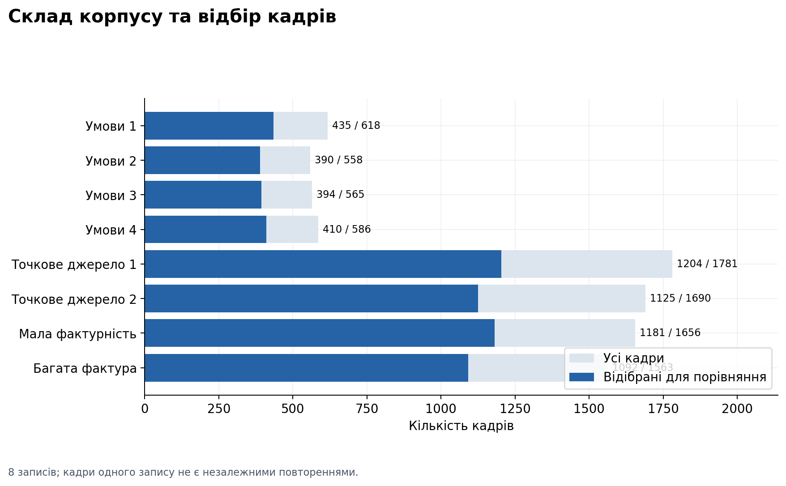

*Рисунок 1. Склад корпусу.*

**Що показано.** Світла смуга — усі кадри запису, темна — ті, що ввійшли в
порівняння. Виключено фази переміщення кільця та, на точкових записах, кадри
зі зміщенням джерела понад 20 пікселів.

**Як читати.** Відсіюється близько третини кадрів, рівномірно за записами
(70–71 % лишається скрізь). Це означає, що відбір не зміщує корпус на користь
якогось одного сценарію.

**Що з цього випливає.** 6231 кадр виглядає великою вибіркою, але **незалежних
одиниць тут вісім** — записи. Кадри всередині запису автокорельовані з лагом
декореляції 3–74 кадри ([Д07](STUDY_UA_RESULTS.md#д07-невизначеність-парних-різниць)),
тож усереднювати треба спочатку в межах запису.

**Чого не показує.** Чи достатньо восьми сцен. Усі вони зняті одним об'єктивом
в одній кімнаті за один день.

**Схема 5. Відтворюване дослідження.**

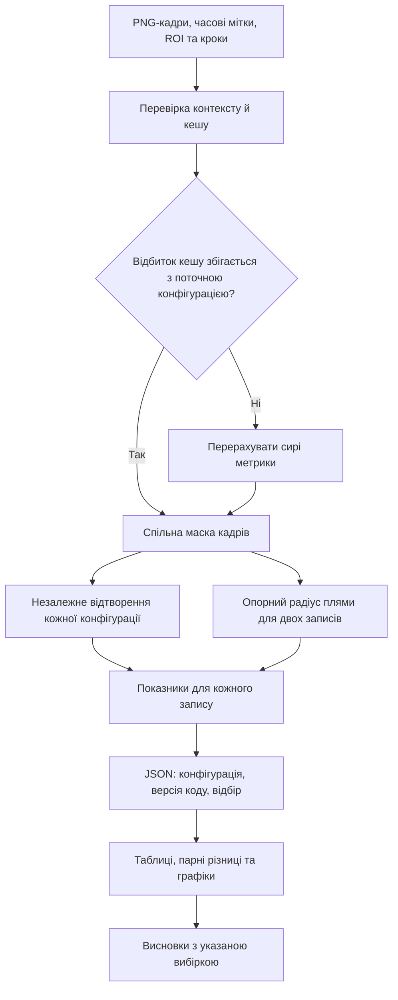
```mermaid
flowchart TD
 A["PNG-кадри, часові мітки, ROI та кроки"] --> B["Перевірка контексту й кешу"]
 B --> C{"Відбиток кешу збігається з поточною конфігурацією?"}
 C -->|Ні| D["Перерахувати сирі метрики"]
 C -->|Так| E["Спільна маска кадрів"]
 D --> E
 E --> F["Незалежне відтворення кожної конфігурації"]
 E --> G["Опорний радіус плями для двох записів"]
 F --> H["Показники для кожного запису"]
 G --> H
 H --> I["JSON: конфігурація, версія коду, відбір"]
 I --> J["Таблиці, парні різниці та графіки"]
 J --> K["Висновки з указаною вибіркою"]
```

**Опорне вимірювання.** Для точкового джерела використано радіус, що охоплює
задану частку суми інтенсивностей після віднімання оцінки фону. Основний
рецепт: **50 %, півширина вікна 80 пікселів, медіанний фон**. Менший радіус —
компактніша пляма. Це опорний порядок за 8-бітним попереднім переглядом, а
**не** вимірювання MTF чи гарантовано некліпованої PSF.

**Критерії, і на скількох записах кожен визначений.**

| Показник | Записів | Що вимірює |
| --- | --- | --- |
| Спірмен | **2** | Рангова кореляція оцінки з мінусом радіуса плями. Більше — краще. |
| `adj` | **8** | Середнє `abs(2·AUC−1)` між сусідніми групами кроків. Розрізнення, не правильність напряму. |
| Інверсії | **2** | Частка неправильних пар; нічия важить 0.5. Читати разом із часткою нічиїх. |
| `peak_plateau` | **2** | Ширина плато поблизу максимуму, відносно еталонного профілю. |
| `peak_plateau_steps` | **8** | Ширина плато за самим профілем кроків. **Це не те саме число.** |
| Насичення | **8** | Частка кадрів біля власних крайніх значень сигналу; допуск 10⁻⁶ від діапазону. |
| Час | **8** | Медіана та 95/99-й процентилі в кожному записі; зведення — середні цих показників. |

> **Дві ширини плато — окремі статистики, і їх легко сплутати.** Саме це
> сталося: таблиця в [CALIBRATION.md](CALIBRATION.md) мала заголовок «усі вісім
> записів», а в колонці плато стояли значення `peak_plateau` з **двох**
> точкових записів. Число було завищене втричі, а побудований на ньому висновок
> («одна міра взагалі не локалізує максимум») — хибний. Тепер обидві статистики
> друкуються з явною кількістю записів, а
> [tests/test_claims.py](../tests/test_claims.py) перевіряє кожне число в тексті
> **разом із його вибіркою**.

Кадри одного запису **часово залежні**. Розмах між записами не слід називати
довірчим інтервалом. Два рецепти того самого еталона **не** створюють нові
незалежні сцени.

---

## 5. Результати

### 5.1. Історичні й поточні параметри

Кореляція з еталоном змінилася з **−0.0715 до 0.9519** у першому точковому
записі та з **−0.2369 до 0.9788** у другому.

Варіант «до» — реконструкція історичних параметрів (`HISTORIC`) у **сучасному
коді**. Це не запуск першого коміту з його власними реалізаціями. Джерело:
[before_after.json](../reports/before_after.json).

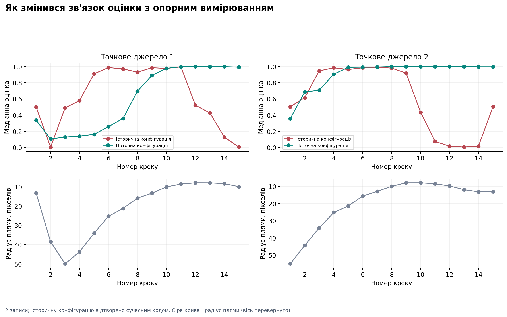

*Рисунок 2. Як змінився зв'язок оцінки з опорним вимірюванням.*

**Що показано.** Верхній ряд — медіанна оцінка за кроками для історичної та
поточної конфігурації. Нижній — радіус плями точкового джерела, вісь
перевернуто, тому **вгору = різкіше** в обох рядах.

**Як читати.** Червона крива вгорі має йти паралельно сірій унизу. Історична
не йде: вона майже пласка або спрямована протилежно.

**Що з цього випливає.** Метрики були справні — ламала їх нормалізація. Сира
вейвлетна міра відстежує еталон на 0.9875
([Д09](STUDY_UA_RESULTS.md#д09-нормалізація-поетапно)), тоді як історична
конфігурація давала −0.07 і −0.24.

**Чого не показує.** Варіант «до» тут — реконструкція параметрів у сучасному
коді. Сам перший коміт запущено окремо в
[Д08](STUDY_UA_RESULTS.md#д08-відтворення-першого-коду), і він дав −0.150 проти
−0.154 у реконструкції: розбіжність 0.004, тобто реконструкція чесна.

### 5.2. Шість метрик проти одиничних

Усі колонки — середнє за **вісьмома** записами:

| Варіант | `adj` | Плато, кроків | Насичення, % |
| --- | --- | --- | --- |
| **Шість метрик** | **0.822** | **1.00** | **0.46** |
| Бреннер | 0.747 | 2.00 | 9.02 |
| Вейвлетна | 0.743 | 2.12 | 9.03 |
| Тененград | 0.729 | 2.00 | 8.94 |
| Лапласіан | 0.720 | 2.50 | 16.51 |
| Ширина меж | 0.705 | 1.75 | 17.86 |
| Фур'є | 0.690 | 3.62 | 24.97 |

Розрив за `adj` — **0.075…0.132**, проти 0.025 на самому лише точковому
джерелі. Ансамбль виграє в **6 із 8** записів проти вейвлетної міри, і
найбільший відрив саме там, де злиття й має допомагати — на малотекстурному
проході (0.735 проти 0.640). Проти **найкращої одиничної міри, вибраної окремо
для кожного запису**, ансамбль виграє в 5 із 8; це ретроспективне порівняння, а
не реалізований автоматичний вибір міри.

Плато ансамбля вужче (1.00 проти 1.75…3.62 кроку), насичення — у **19…54 рази**
менше. Джерело: [ablation_singles.json](../reports/ablation_singles.json).

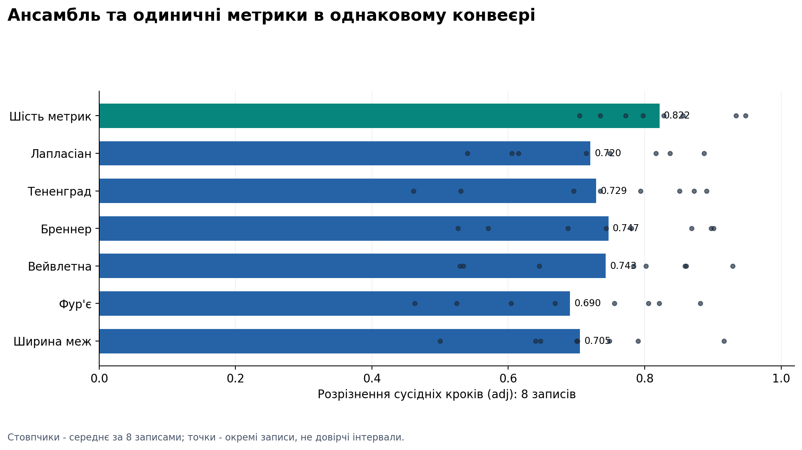

*Рисунок 3. Ансамбль та одиничні метрики в однаковому конвеєрі.*

**Що показано.** Стовпчик — середнє `adj` за вісьмома записами. Точки —
окремі записи. Усі варіанти проходять **той самий** нормалізатор, історію та
фільтр, тож різниця — це лише набір метрик.

**Як читати.** Розкид точок (0.6–0.95) **більший за різницю між стовпчиками**
(0.69–0.82). Це не довірчі інтервали: між записами сцена змінюється сильніше,
ніж між методами.

**Що з цього випливає.** Перевага ансамбля стабільна за напрямком, але будь-яке
порівняння двох сусідніх стовпчиків треба звіряти з інтервалом із
[Д07](STUDY_UA_RESULTS.md#д07-невизначеність-парних-різниць) — приблизно ±0.04.

**Чого не показує.** Що шість — оптимальний набір.
[Д15](STUDY_UA_RESULTS.md#д15-підмножини-метрик) перевірив усі 63 підмножини:
найкраща має п'ять метрик.

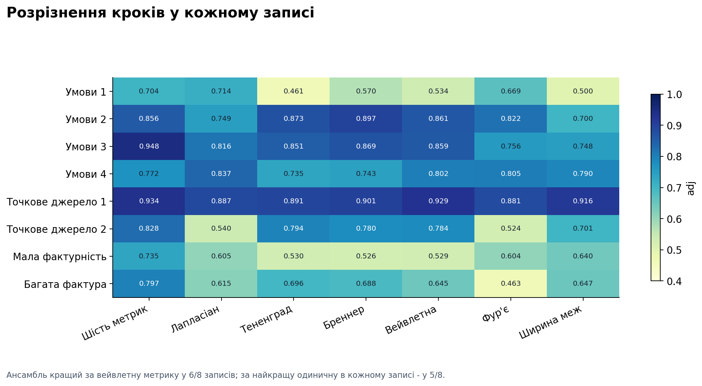

*Рисунок 4. Розрізнення кроків у кожному записі.*

**Що показано.** Клітинка — одна пара «запис × варіант». Темніше = краще
розрізнення сусідніх кроків.

**Як читати.** Рядки різняться сильніше за стовпці. `sweep_plain` (мала
фактурність) темний скрізь — там важко всім; `cond_20260916_110656` світлий
скрізь — там легко всім.

**Що з цього випливає.** Саме тому підрахунок перемог ведеться **з явним
суперником**: ансамбль виграє в 6/8 записів проти вейвлетної міри і в 5/8
проти найкращої одиничної **в кожному записі окремо**. Друге число —
ретроспективне: жоден механізм не вибирає міру автоматично.

**Чого не показує.** Чому саме запис важить більше за метод. Ймовірна причина —
кількість фактури в сцені, але це не виміряно окремо.

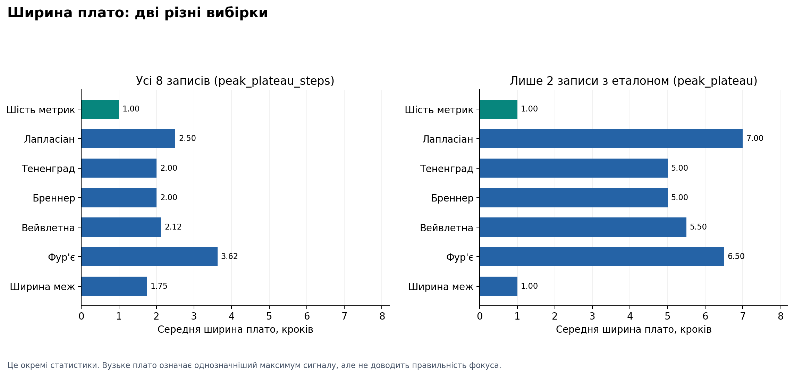

*Рисунок 5. Ширина плато: дві різні вибірки.*

**Що показано.** Ліворуч — `peak_plateau_steps`, порахований на **восьми**
записах. Праворуч — `peak_plateau`, визначений лише на **двох** із
еталоном. Обидва називаються «плато» і означають різне.

**Як читати.** Ліва панель: ансамбль 1.00, одиничні міри 1.75–3.62. Права:
ансамбль 1.00, одиничні 1.00–7.00.

**Що з цього випливає — і чому цей рисунок існує.** Раніше в
[CALIBRATION.md](CALIBRATION.md) стояла таблиця із заголовком «на всіх восьми
записах», у якої колонка плато була взята **з правої панелі**. Число було
завищене втричі, а побудований на ньому висновок («одна міра не локалізує
максимум узагалі») — хибний: `edge_width` у правій панелі теж дорівнює 1.

**Чого не показує.** Ширина плато залежить від допуску, яким його визначають:
за [Д20](STUDY_UA_RESULTS.md#д20-стійкість-критеріїв-оцінювання) вона зростає
з 1.00 до 3.38 кроку при зміні допуску від 0 до 10 %. Будь-яке число про плато
має йти з указаним допуском.

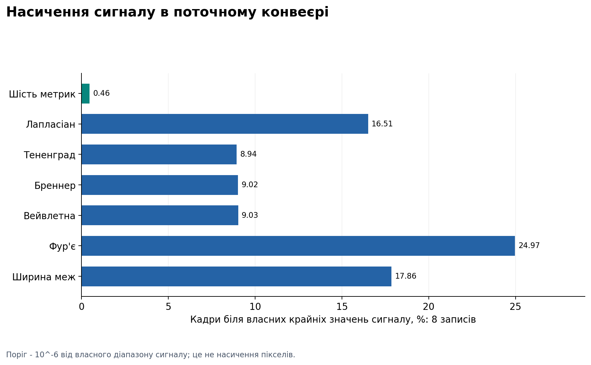

*Рисунок 6. Насичення сигналу.*

**Що показано.** Частка кадрів, чия оцінка стоїть на власному краю діапазону
(допуск 10⁻⁶). Це **не** насичення пікселів.

**Як читати.** Ансамбль 0.46 %, одиничні міри 8.9–25 %. Різниця в 19–54 рази.

**Що з цього випливає.** Кадр на краю шкали не несе інформації про напрямок:
дві однаково «одиничні» оцінки не розрізняються, скільки б не відрізнялися
насправді. Саме тому метрика з широким плато може мати мало **строгих**
інверсій — решта пар просто нічиї (рисунок 18).

**Чого не показує.** Насичення тут — властивість нормалізації, а не сцени.
[Д09](STUDY_UA_RESULTS.md#д09-нормалізація-поетапно) показує, що фіксована
лінійна шкала дає 10.16 % насичення, а логістична з тими самими даними —
0.33 %.

### 5.3. Що дають саме адаптивні ваги

**Це найнезручніший результат у документі, і два критерії дають протилежний
знак.**

| Порівняння | Спірмен, n=2 | `adj`, n=8 |
| --- | --- | --- |
| адаптивні − апріорні | **+0.0145** | **−0.0050** |
| адаптивні − рівні | **+0.0155** | **−0.0036** |

Покроково: адаптивні 0.965 / 0.822, апріорні 0.951 / 0.827, рівні 0.950 / 0.825.

Розподіл за записами пояснює, чому середнє від'ємне:

| Запис | Адаптивні | Апріорні | Різниця |
| --- | --- | --- | --- |
| Умови 1 | 0.704 | 0.827 | **−0.123** |
| Умови 4 | 0.772 | 0.829 | **−0.056** |
| Мала фактурність | 0.735 | 0.738 | −0.003 |
| Багата фактура | 0.797 | 0.790 | +0.007 |
| Точкове джерело 1 | 0.934 | 0.923 | +0.011 |
| Точкове джерело 2 | 0.828 | 0.801 | +0.027 |
| Умови 2 | 0.856 | 0.814 | +0.042 |
| Умови 3 | 0.948 | 0.894 | +0.054 |

**Адаптивні ваги виграють у 5 записах із 8 і все одно програють у середньому** —
бо дві поразки в кілька разів більші за будь-який виграш.

Ці дві — найтемніші записи корпусу: яскравість 0.2, виміряна щільність меж
0.0000 при `edge_ref_density` 0.006. Там і межовий, і експозиційний чинники
погіршення **притиснуті до своїх крайніх значень**, тобто модель надійності
будує ваги з входів, які вже насичені й перестали нести інформацію. Найбільший
виграш — «Умови 3», яскравість 0.8.

Це **асоціація на двох записах і правдоподібний механізм, а не доведена
причина**: точкові записи теж мають майже нульову щільність меж, і там
адаптивність виграє. Записано, бо це перевірюване передбачення (див. Д12) і бо
воно вказує на той самий дефект, що й «достатність меж» у §7.

**Висновок.** «Злиття шести краще за одну міру» і «адаптивні ваги краще за
фіксовані» — **різні твердження з різними доказами**. Перше тримається на всіх
восьми записах і за обома критеріями. Друге — ні.

> **Оновлено після Д07 і Д12.** Обидва дослідження зробили цей розділ
> точнішим, і одне з них зняло його головне твердження.
>
> **[Д07](STUDY_UA_RESULTS.md#д07-невизначеність-парних-різниць):** різниця
> −0.0050 має 95% інтервал **[−0.046, +0.029]** — приблизно вдев'ятеро ширший
> за саму оцінку. Отже **переконливої різниці не встановлено**; формулювання
> «програє за adj» вище слід читати саме так, а таблиця знаків нижче лишається
> описом, а не результатом. Рівноцінності це теж не доводить: корпус просто не
> здатен розділити ці варіанти.
>
> **[Д12](STUDY_UA_RESULTS.md#д12-поведінка-ваг):** ваги прочитано з кожного
> кадру, і вони **майже не рухаються** — розмах за весь запис 0.01–0.05 при
> середніх 0.04–0.24. Це пояснює Д07: розрізняти майже нічого.
>
> **Механізм із насиченими чинниками підтверджено лише частково.** Два
> найгірші записи справді мають найвище насичення меж (79 % і 76 % кадрів),
> але звʼязок по всіх восьми слабкий — ρ = −0.41, і `cond_20260916_110600` із
> 66 % насичення виграє. Насичення меж не є достатнім поясненням.


*Рисунок 16. Внесок адаптивності залежить від критерію й запису.*

**Що показано.** Ліворуч — різниця `adj` між адаптивними й апріорними вагами
для кожного з восьми записів. Праворуч — різниця Спірмена проти рівних ваг на
двох записах під двома рецептами еталона.

**Як читати.** Ліворуч: виграш у 5 записах із 8, але середнє **від'ємне**
(−0.0050), бо дві поразки (−0.123, −0.056) у рази більші за будь-який виграш.
Праворуч: усі чотири значення додатні.

**Що з цього випливає — після Д07 і Д12 інакше, ніж здавалося.** Ліва панель
виглядає як результат, але ним не є:
[Д07](STUDY_UA_RESULTS.md#д07-невизначеність-парних-різниць) дає для цієї
різниці 95% інтервал **[−0.046, +0.029]** — приблизно вдев'ятеро ширший за
оцінку — тобто **переконливої різниці не встановлено**. Рівноцінності це не
доводить.
[Д12](STUDY_UA_RESULTS.md#д12-поведінка-ваг) пояснює чому: ваги прочитано
покадрово, і вони майже не рухаються — розмах за весь запис 0.01–0.05.

**Чого не показує.** Чотири значення праворуч — це **2 записи × 2 рецепти**, а
не чотири незалежні експерименти.

### 5.4. Факторний план 2³

Перевірено всі вісім комбінацій моделі надійності **R**, ядра згоди **A** й
фільтра **F**. Поточна конфігурація — `R-F`.

За Спірменом описові контрасти: надійність **+0.0417**, ядро **−0.0419**,
фільтр +0.0023; взаємодія надійності й ядра **+0.0293**. За `adj` найбільший
позитивний контраст належить фільтру: **+0.0450**.

Контраст фактора — середній результат при ввімкненні мінус середній при
вимкненні, усереднений за іншими налаштуваннями. **Це не «частки загального
виграшу»**, і оцінку статистичної значущості не виконано. Велика взаємодія
R×A означає конкретну річ: значна частина того, що робила модель надійності,
була **виправленням шкоди від ядра згоди**. З вимкненим ядром її власний внесок
менший.

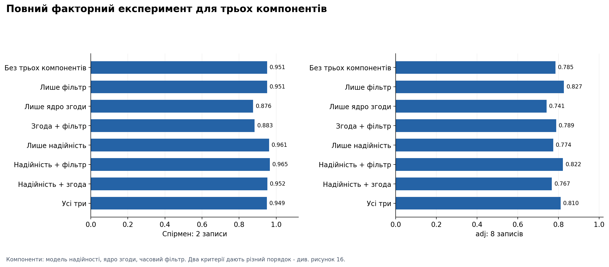

*Рисунок 8. Повний факторний план 2³.*

**Що показано.** Усі вісім комбінацій моделі надійності **R**, ядра згоди
**A** й фільтра **F**. Ліва панель — Спірмен на двох записах, права — `adj` на
восьми.

**Як читати.** Панелі впорядковують варіанти **по-різному**, і це не помилка:
критерії міряють різні властивості сигналу. За
[Д20](STUDY_UA_RESULTS.md#д20-стійкість-критеріїв-оцінювання) вони загалом
узгоджуються (ρ = 0.851 на 27 конфігураціях), тож розбіжність тут — властивість
цих конкретних варіантів, де ефекти крихітні.

**Що з цього випливає.** Найгірший квадрант — без моделі надійності. Найбільший
позитивний контраст за `adj` належить фільтру (+0.0450).

**Чого не показує.** Значущості. Контрасти описові; за
[Д07](STUDY_UA_RESULTS.md#д07-невизначеність-парних-різниць) інтервал для
різниць такого розміру — близько ±0.04, тобто більшість цих контрастів у нього
вкладаються.

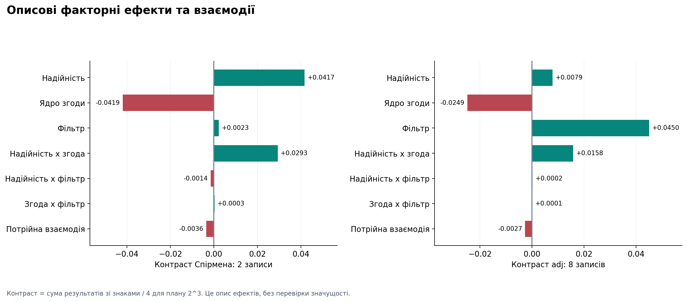

*Рисунок 19. Описові факторні ефекти та взаємодії.*

**Що показано.** Контраст фактора = середній результат при ввімкненні мінус
середній при вимкненні, усереднений за іншими налаштуваннями. Для взаємодій —
знакові контрасти плану 2³, поділені на 4.

**Як читати.** Надійність +0.0417, ядро згоди −0.0419, взаємодія R×A +0.0293.

**Що з цього випливає.** Велика взаємодія означає конкретну річ: значна частина
того, що робила модель надійності, була **виправленням шкоди від ядра згоди**.
З вимкненим ядром її власний внесок менший — і за
[Д07](STUDY_UA_RESULTS.md#д07-невизначеність-парних-різниць) статистично
не відокремлюваний від нуля на цьому корпусі.

**Чого не показує.** Це **не** «частки загального виграшу». Взаємодії тим і
означають, що внесок компонента залежить від того, що ввімкнено поруч, тож
складати контрасти не можна.

### 5.5. Ядро згоди

Кореляція: **0.9495** при стандартному масштабі 1.5, 0.9599 при масштабі 8,
**0.9653** при вимкненні. Залежність не строго монотонна, але розширення ядра
лише наближає результат до «вимкнено» — це не помилка налаштування.

Чого це **не** доводить: ядро існує, щоб захистити оцінку, коли одну міру
обманює дзеркальний відблиск або пересвічена ділянка, а **жоден із цих записів
такої відмови не містить**.

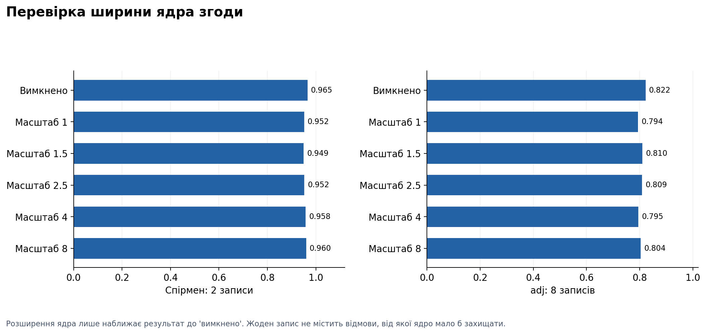

*Рисунок 11. Перевірка ширини ядра згоди.*

**Що показано.** Кореляція при різному масштабі ядра: 0.9495 при 1.5 (як
відвантажувалося), 0.9599 при 8, 0.9653 при вимкненні.

**Як читати.** Розширення ядра лише **наближає результат до «вимкнено»**.
Залежність не строго монотонна, але напрямок однозначний.

**Що з цього випливає.** Це не помилка налаштування: якби існувало добре
значення масштабу, крива мала б максимум усередині. Вона його не має, тож ядро
вимкнене за замовчуванням. Це одна з трьох заявлених складових методу, яка себе
не виправдала.

**Чого не показує.** Що ядро непотрібне взагалі. Воно існує проти ситуації,
коли одну міру обманює дзеркальний відблиск або пересвічена ділянка, а **жоден
із цих восьми записів такої відмови не містить**. Перевірити його призначення
цими даними неможливо.

### 5.6. Нормалізація й виправлення

Ковзна лінійна шкала — Спірмен **0.4638**, фіксована лінійна — **0.8062**,
фіксована логістична — **0.9495**. Насичення фіксованої лінійної — 16.73 %,
логістичної — 0.45 %.

Квантиль шуму зменшує частку нульових оцінок шуму з **97.59 % до 0.17 %**. Це
усуває числове виродження оцінювача, але не доводить точності оцінки фізичного
шуму.

Окремі виправлення **не** утворюють монотонної драбини: зміна лише порога
діапазону виправляє інформативність, але не усуває рух опорної шкали. Саме тому
потрібні спільні перевірки компонентів, а не по одній зміні за раз.

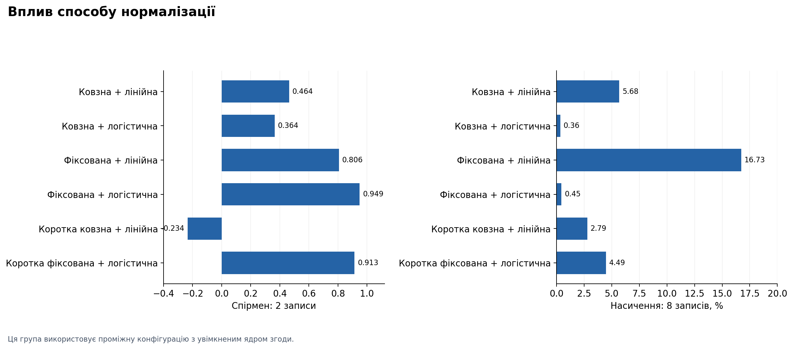

*Рисунок 9. Вплив способу нормалізації.*

**Що показано.** Шість способів масштабування: ковзна проти фіксованої шкали,
лінійна проти логістичної, коротка проти довгої історії.

**Як читати.** Ковзна лінійна — Спірмен 0.4638. Фіксована лінійна — 0.8062.
Фіксована логістична — 0.9495. Насичення падає з 16.73 % до 0.45 %.

**Що з цього випливає.** Рухома опорна шкала — головний дефект, який ламав
систему: поки процентилі рухаються, та сама фізична різкість отримує різні
числа. [Д11](STUDY_UA_RESULTS.md#д11-параметри-автофіксації) міряє це прямо —
без фіксації Спірмен 0.50, з нею 0.97.

**Чого не показує.** Ця група рахувалася на **проміжній** конфігурації з
увімкненим ядром згоди, тому абсолютні числа тут не збігаються з поточними.

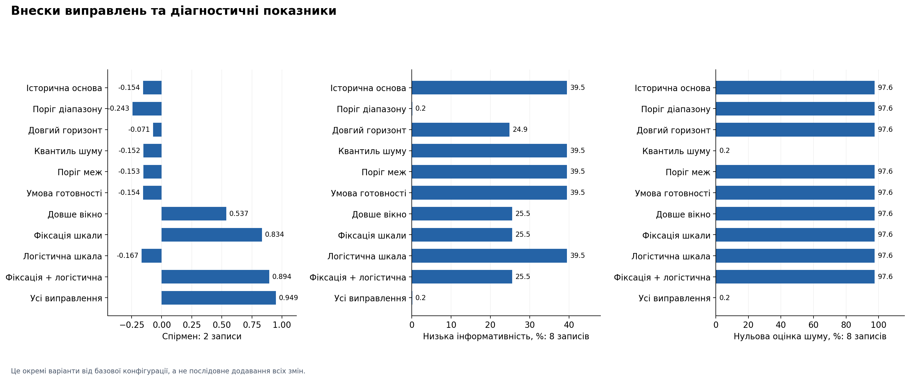

*Рисунок 10. Внески виправлень та діагностичні показники.*

**Що показано.** Кожен стовпчик — **окрема** зміна від історичної основи, а не
накопичувальне додавання.

**Як читати.** Драбина немонотонна: наприклад, зміна лише порога діапазону
виправляє інформативність, але не усуває рух опорної шкали, тож кореляція
лишається низькою.

**Що з цього випливає.** Компоненти треба перевіряти **разом**, а не по одному.
Квантиль шуму окремо зменшує частку нульових оцінок шуму з 97.59 % до 0.17 %,
і це чисте виправлення числового виродження: медіана HH-коефіцієнтів на
8-бітному потоці прилипає до нуля.

**Чого не показує.** Що оцінювач шуму став точним. За
[Д17](STUDY_UA_RESULTS.md#д17-штучні-деградації-реальних-кадрів) він читає
приблизно **третину** впорснутої σ (0.895 при впорснутих 2, 6.503 при 20) —
занижений, але монотонний.

### 5.7. Склад метрик і роздільність

При почерговому вилученні однієї міри: вилучення Тененграда змінює Спірмена на
**+0.0093**, Фур'є — на **−0.0096**, ширини меж — на **−0.0137**. Тобто **жодна
міра не є незамінною**, а вилучення однієї навіть трохи допомагає. Різниці в
межах міжзаписового розмаху, тож набір захищуваний, але не оптимальний.

Збільшення ширини аналізу з 320 до 640 пікселів піднімає медіану часу з **9.04
до 27.10 мс** і кореляцію **не покращує**. Ширший кадр змінює просторовий
масштаб операторів, тому це параметр, а не «більше — краще».

> Ця група рахувалася на проміжній конфігурації **з увімкненим ядром згоди**.
> Для поточної стандартної конфігурації її треба повторити — див. Д15.

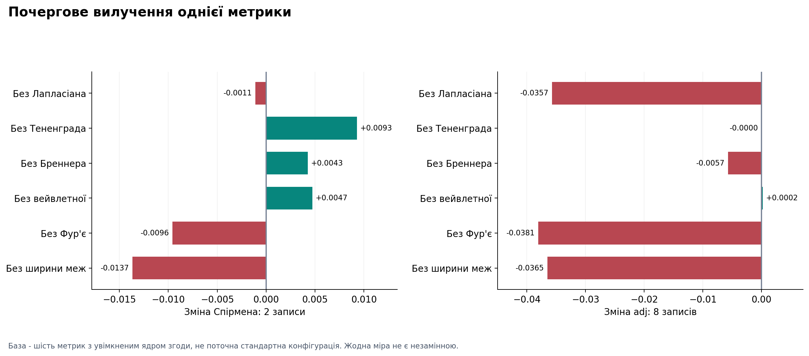

*Рисунок 12. Почергове вилучення однієї метрики.*

**Що показано.** Зміна результату при вилученні однієї міри з повного набору.
Бірюзове — покращення, червоне — погіршення.

**Як читати.** Вилучення Тененграда **покращує** Спірмена на +0.0093; вилучення
Фур'є і ширини меж псує на −0.0096 і −0.0137.

**Що з цього випливає.** **Жодна з шести метрик не є незамінною**, і одна навіть
заважає. Це незручний результат для набору, який подається як цілісний.

**Чого не показує.** База тут — проміжна конфігурація **з увімкненим ядром
згоди**, тож висновок не переносився на поточну.
[Д15](STUDY_UA_RESULTS.md#д15-підмножини-метрик) повторив це для конфігурації,
яка справді відвантажується, перебравши всі 63 підмножини: найкращий набір теж
без Тененграда (0.8348 проти 0.8218), але перевага +0.013 лежить усередині
інтервалу ±0.04 з Д07 і **не є підставою міняти стандартний набір**.

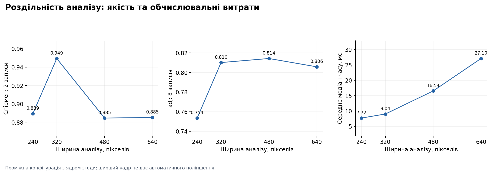

*Рисунок 13. Роздільність аналізу: якість та витрати.*

**Що показано.** Кореляція, розрізнення й час при ширині аналізу 240–640
пікселів.

**Як читати.** Час зростає з 9.04 до 27.10 мс, кореляція не покращується.

**Що з цього випливає.** Більша роздільність **не** є автоматично кращою:
зміна ширини змінює просторовий масштаб операторів. Є й окрема причина —
зменшення з усередненням 2×2 піднімає смугу Гаара над 8-бітним квантуванням, і
без нього оцінювач шуму повертається до нулів на 34–69 % кадрів.

**Чого не показує.** Область інтересу тут не змінювалася.
[Д16](STUDY_UA_RESULTS.md#д16-масштаб-та-область-інтересу) перевірив ширину
**разом** із ROI на поточній конфігурації: 320 пікселів по всьому кадру
найкращі за обома критеріями, а ширші кадри різко втрачають Спірмена
(0.965 → 0.857 → 0.831).

### 5.8. Чутливість опорного вимірювання

Змінено частку суми інтенсивностей 25/50/75 %, півширину вікна 50/80/120 пікселів
та оцінку фону. Частина рецептів добре узгоджується (0.98…0.997); **вікна
120 пікселів анти-корельовані** з меншими (−0.74…−0.89), бо захоплюють
сторонній вміст.

**Чи важлива ця чутливість для висновків — питання, на яке є відповідь.**
Факторний план прогнали проти обох рецептів. Заміна `r50_w80_median` на
`r25_w50_median` зсуває кореляцію **кожного** варіанта вниз на 0.004…0.011 —
це спільний зсув, — тоді як **різниці між варіантами** зсуваються лише на
0.002…0.005:

| Парна різниця | `r50_w80` | `r25_w50` | Зсув |
| --- | --- | --- | --- |
| адаптивні − апріорні | +0.0145 | +0.0114 | −0.0031 |
| адаптивні − рівні | +0.0155 | +0.0104 | −0.0050 |
| ядро вимкнено − ввімкнено | +0.0159 | +0.0136 | −0.0022 |

Тобто **парні різниці значно стійкіші до рецепта, ніж абсолютні кореляції**.
Звідси й наслідок для §5.9: розрив 0.023 приблизно **вп'ятеро** більший за
найбільший зсув від зміни рецепта, тож це не шум еталона.

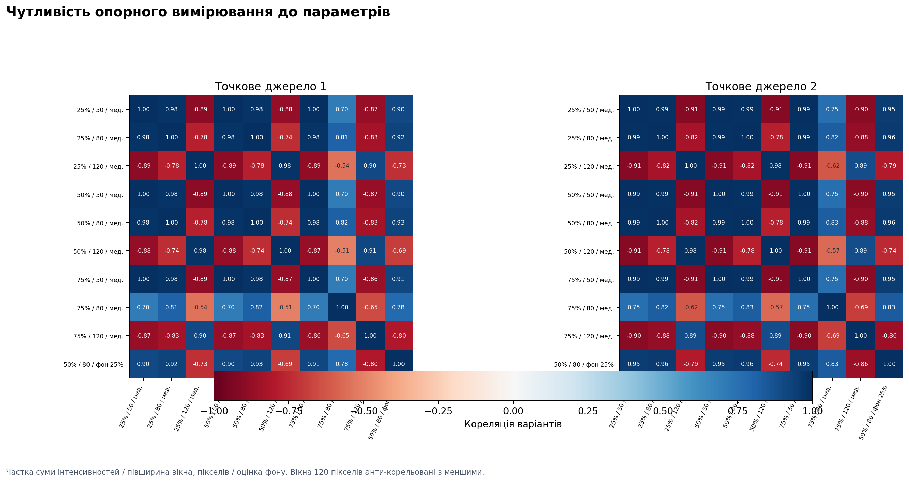

*Рисунок 14. Чутливість опорного вимірювання до параметрів.*

**Що показано.** Взаємна кореляція десяти рецептів еталона. Позначення:
частка суми інтенсивностей / півширина вікна / оцінка фону. Синій +1,
червоний −1.

**Як читати.** Більшість рецептів узгоджується на 0.98–0.997. Але **всі
варіанти з вікном 120 пікселів анти-корельовані** з рештою (−0.74…−0.89) —
велике вікно захоплює сторонній вміст і міряє щось інше.

**Що з цього випливає.** Еталон має вільні параметри, і його «істина» залежить
від них. Тому висновки перевірялися проти двох рецептів окремо.

**Чого не показує — і це виправлена помилка.** Кореляція 0.98 **між рецептами**
не є похибкою ±0.02 для кореляції **методу з рецептом**. Раніше в
[CALIBRATION.md](CALIBRATION.md) з цього виводили, що розрив 0.023 «нижче
роздільної здатності еталона». Пряме вимірювання (§5.8) показує інше: зміна
рецепта зсуває **парні різниці** лише на 0.002–0.005, тож 0.023 приблизно
вп'ятеро більший і реальний.

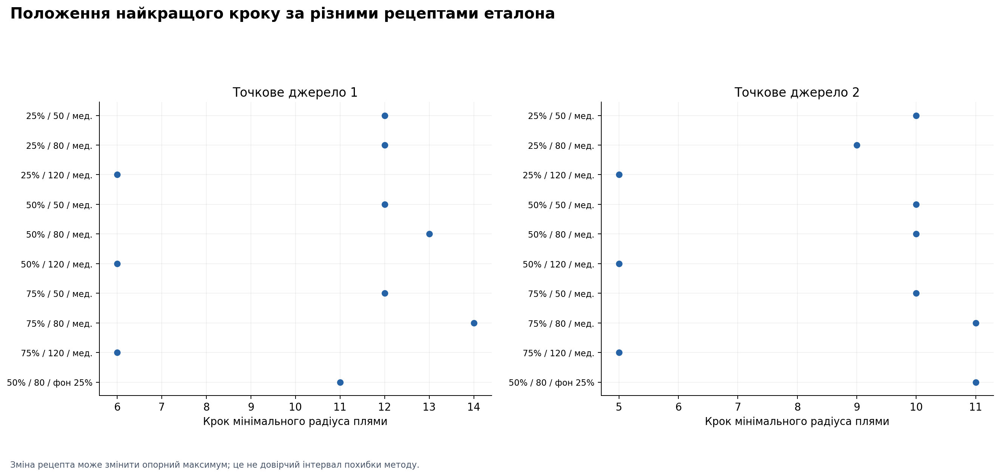

*Рисунок 15. Положення найкращого кроку за різними рецептами еталона.*

**Що показано.** Для кожного рецепта — інтервал кроків, де радіус плями
мінімальний.

**Як читати.** Інтервали переважно перекриваються, але не збігаються: зміна
рецепта може зрушити опорний максимум на крок.

**Що з цього випливає.** Еталон локалізує фокус із точністю приблизно до
**одного кроку** — і саме ця панель є підставою так казати, а не сама по собі
величина `peak_err`. Звідси наслідок: похибка піка порядку 1.0–1.5 слабко
розділяє моделі.
[Д20](STUDY_UA_RESULTS.md#д20-стійкість-критеріїв-оцінювання) міряє це прямо —
похибка піка корелює з `adj` лише на 0.18, тобто ранжує конфігурації за іншою
властивістю, ніж рангові критерії.

**Чого не показує.** Це **не** довірчий інтервал похибки методу. Два рецепти
того самого еталона на тих самих кадрах — не два незалежні вимірювання.

> Раніше в [CALIBRATION.md](CALIBRATION.md) стояло, що 0.023 «нижче роздільної
> здатності еталона», бо рецепти узгоджуються на 0.98. Це некоректне
> міркування: кореляція **між двома рецептами** не є похибкою кореляції **між
> методом і рецептом**. Твердження прибрано й замінено вимірюванням.

### 5.9. Сирі метрики та повні конвеєри

На точкових записах сира вейвлетна міра має кореляцію **0.9875**, її одиничний
конвеєр — **0.9366**, поточний ансамбль — **0.9653**. Розрив між сирою мірою й
ансамблем — **0.0222**.

Сира міра обчислюється з одного кадру й **чудово працює онлайн** — це не
офлайнова категорія. Їй бракує обмеженої шкали, показника впевненості й того,
що можна зливати. **Порівнюваності між сценами конвеєр теж не дає** — шкалу
підігнано під історію одного потоку.

Для пошуку максимуму **в межах одного потоку** шкала взагалі не потрібна,
потрібен лише порядок, і сира міра дає кращий. Чи варті ці властивості 0.023 —
вибір, а не наслідок; на восьми реальних записах конвеєр відбиває цю втрату з
надлишком, на точковому джерелі — ні.

> **Оновлено після [Д09](STUDY_UA_RESULTS.md#д09-нормалізація-поетапно).**
> Розрив 0.023 — це **чистий** результат після ремонту, і сам по собі ховає
> те, що відбувається всередині. Драбина стадій розкладає його:
>
> | Крок | adj (8) | Зміна |
> | --- | --- | --- |
> | Сира міра | 0.890 | — |
> | Офлайнове масштабування (логарифм + логістична) | 0.890 | **0.000** |
> | Потокова шкала, одна міра | 0.697 | **−0.193** |
> | + злиття шести | 0.774 | +0.077 |
> | + часовий фільтр | 0.822 | +0.048 |
>
> Отже **шкала не коштує нічого** — офлайн вона безкоштовна. Коштує
> **цей спосіб оцінювати діапазон онлайн**: −0.193 adj і −0.039 Спірмена.
> Злиття й фільтр існують, щоб це відремонтувати, і повертають дві третини.
> Насичення 8.93 % на потоковій одиничній мірі злиття знімає повністю (до
> 0.33 %).
>
> Виміряно **одну** реалізацію — ковзні процентилі з логарифмом, автофіксацією
> та логістичним відображенням. Стверджувати, що стільки коштує потокова
> робота взагалі, ці дані не дозволяють: альтернативних онлайнових
> нормалізаторів не перевіряли.

Джерело: [fair_comparison.json](../reports/fair_comparison.json).

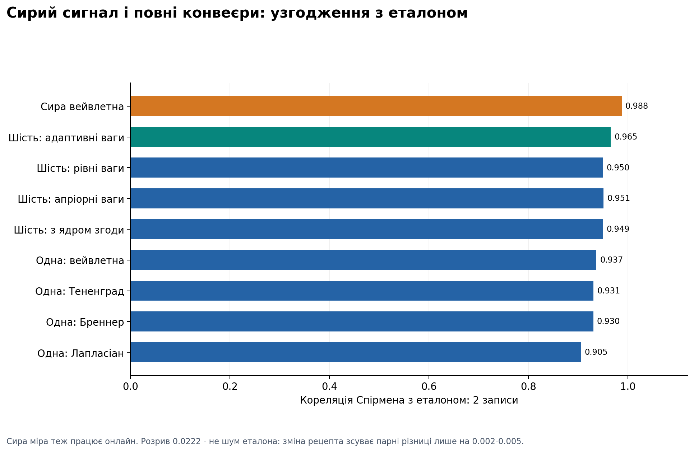

*Рисунок 7. Сирий сигнал і повні конвеєри.*

**Що показано.** Помаранчева смуга — сира вейвлетна міра без нормалізації,
історії та фільтра. Бірюзова — повна система. Сині — проміжні конфігурації.

**Як читати.** Сира міра попереду: 0.9875 проти 0.9653. Розрив 0.0222.

**Що з цього випливає.** Сира міра рахується з одного кадру й **чудово працює
онлайн** — це не офлайнова категорія. Але розрив оманливий, якщо читати його
як «ціну конвеєра».
[Д09](STUDY_UA_RESULTS.md#д09-нормалізація-поетапно) розкладає його: офлайнове
масштабування безкоштовне, робота онлайн коштує −0.193 adj, а злиття з
фільтром повертають дві третини. 0.023 — це **залишок після ремонту**, а не
його вартість.

**Чого не показує.** Ці два записи — яскрава точка на чорному, найлегша мішень
для високочастотної міри й рівно те місце, де стійкість, заради якої існує
злиття, не перевіряється.

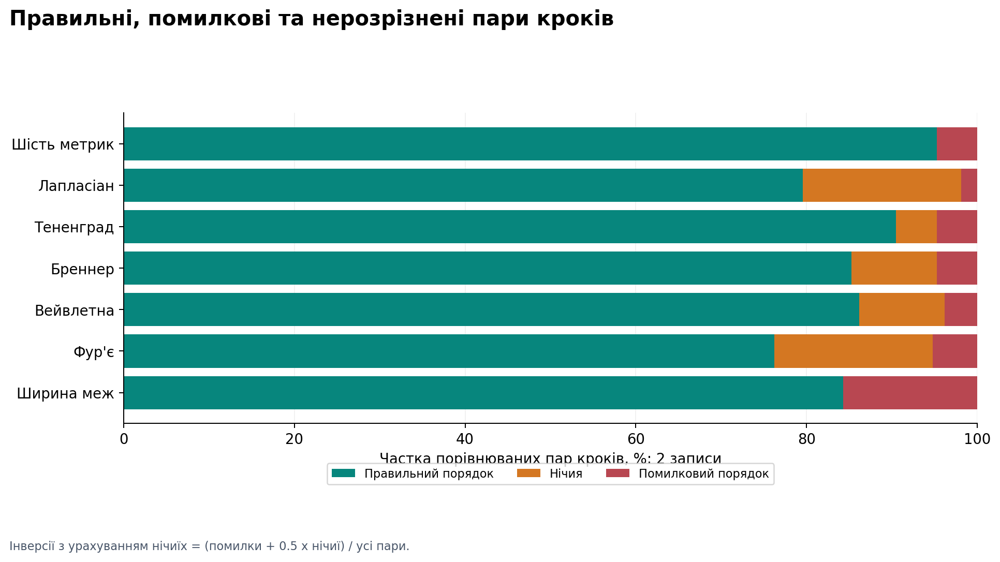

*Рисунок 18. Правильні, помилкові та нерозрізнені пари кроків.*

**Що показано.** Розклад усіх пар кроків на правильно впорядковані, помилкові
й **нічиї** — пари, які метрика взагалі не розрізнила.

**Як читати.** В ансамбля нічиїх немає (`resolved` = 1.000); в одиничних мір
їх до 19 %.

**Що з цього випливає.** Це пояснює пастку в читанні інверсій. Метрика з
широким плато має мало **строгих** помилок — але не тому, що вона точна, а
тому, що більшість пар у неї просто нічиї. Саме тому інверсії завжди
подаються разом із часткою розв'язаних пар, а нічия важить 0.5.

**Чого не показує.** Ця панель — середнє за **двома** записами з еталоном, бо
без нього правильний порядок пари невідомий.

### 5.10. Обчислювальні витрати

Середня медіана часу повної системи — **9.25 мс** на кадр, середнє 99-х
процентилів — **11.50 мс** (8 записів). Значення з `fair_comparison` належать
іншому прогону й лише двом записам; **змішувати їх не можна**.

Час обробки **не** включає затримок захоплення, інтерфейсу, запису й привода.
Висновок про повну частоту контуру потребує окремого вимірювання.

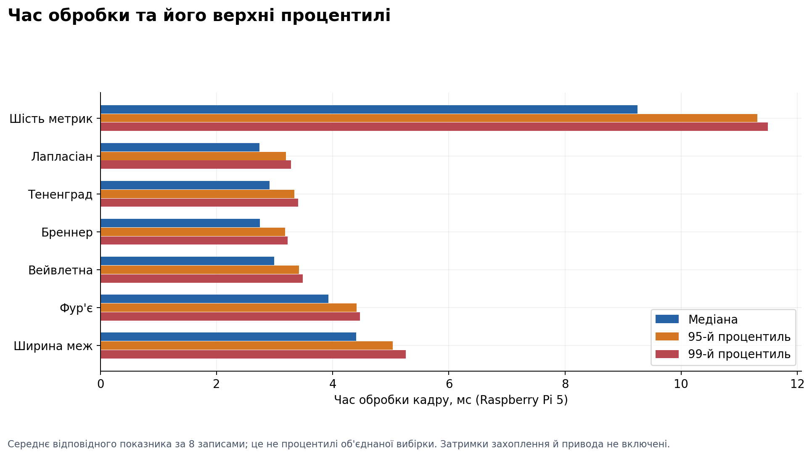

*Рисунок 17. Час обробки та його верхні процентилі.*

**Що показано.** Медіана та 95/99-й процентилі часу обробки кадру, виміряні на
Raspberry Pi 5.

**Як читати.** Кожен стовпчик — **середнє відповідного показника за вісьмома
записами**, а не процентиль об'єднаної вибірки. Повна система: медіана 9.25 мс,
99-й процентиль 11.50 мс.

**Що з цього випливає.** Хвіст короткий — 99-й процентиль лише на 24 % вищий за
медіану, тобто окремих довгих кадрів немає.

**Чого не показує.** Це **лише обробка**. Захоплення, інтерфейс, збереження й
привід сюди не входять, тож частоту замкненого контуру з цього числа вивести
не можна. Заміри з `fair_comparison` належать іншому прогону й лише двом
записам — змішувати їх не можна. Числа в
[STUDY_UA_RESULTS.md](STUDY_UA_RESULTS.md) отримані на робочій станції, не на
Pi, і для порівняння продуктивності непридатні.

---

## 6. Що знайшов зовнішній перегляд і що з цим зробили

| Зауваження | Стан | Що зроблено |
| --- | --- | --- |
| `fair_comparison` читає сирий NPZ без перевірки відбитка конфігурації | **Виправлено** | Відбиток винесено у спільний `processing_fingerprint()`; інструмент вимагає перевірений `cached.raw` і відмовляється рахувати зі застарілим кешем. |
| Плато 5–7 кроків узято з 2 записів, а подано як 8 | **Виправлено** | Прозові таблиці переведено на `peak_plateau_steps`; кожна згенерована таблиця друкує кількість записів; додано `claims.toml` і тест. |
| Внесок адаптивності подано як однозначний виграш | **Виправлено** | §5.3: обидва критерії, розподіл за записами, зв'язок із насиченими чинниками. |
| «Порівнюваність між сценами» суперечить README | **Виправлено** | Твердження прибрано з CALIBRATION; §5.9. |
| «0.023 нижче роздільної здатності еталона» | **Виправлено** | Замінено вимірюванням стійкості парних різниць; §5.8. |
| `ALGORITHM.md` описує медіанний оцінювач шуму | **Виправлено** | Записано формулу з квантилем і зазначено зведення до класичної при p=0.5. |
| Ядро згоди описане як активний етап | **Виправлено** | `ALGORITHM.md` §5 і README позначено «вимкнено за замовчуванням». |
| Плутанина походження варіантів (`HISTORIC`/`REPAIRED`/поточний) | **Частково** | Підписи вказують конфігурацію; §5.7 позначено явно. Повторення груп для поточної конфігурації — Д15, Д16. |
| Порівнювати прирости `adj` і Спірмена як кратні величини | **Враховано** | Критерії всюди подані окремо, з різною кількістю записів. |

---

## 7. Відкриті питання та точні межі висновків

- Незалежний від мір різкості еталон є **лише для двох записів**; він залежить
  від рецепта та 8-бітної обробки камери.
- `adj` **не визначає напряму** зміни справжньої різкості: висока
  розрізнюваність може супроводжуватися неправильним порядком.
- Перевага ансамблю над одиничною метрикою й перевага адаптивних ваг над
  фіксованими — **різні гіпотези з різною доказовою базою** (§5.3).
- **Достатність меж вимірюється циклічно.** Щільність меж на кадр падає до
  нуля саме там, де вона потрібна: за
  [Д12](STUDY_UA_RESULTS.md#д12-поведінка-ваг) вона стоїть на мінімумі на
  24–79 % кадрів. Передбачуваний напрям виправлення — оцінювати структуру
  сцени за історією, а критерієм робити криву покриття/помилки.
- `auto_freeze` має **чотири сталі, підібрані на тих самих записах**, що їх
  оцінюють. [Д11](STUDY_UA_RESULTS.md#д11-параметри-автофіксації) уточнює, у
  чому ризик: без фіксації Спірмен 0.50, а по сітці з 27 наборів він
  коливається 0.591…0.971 — і весь розкид пояснюється тим, **на скількох
  записах фіксація встигла спрацювати**. Набори, що спрацьовують на всіх
  восьми, дають 0.915…0.971; ті, що на половині, — 0.591…0.592. Механізм
  критичний, а пороги вирішують його своєчасність, і на довшому чи коротшому
  записі придатний діапазон порогів буде іншим.
- Оцінка шуму має структурно залежну нижню межу й читає приблизно на 35 %
  нижче. Це відносний сигнал, не вимірювання.
- Показник впевненості **не калібрований** як ймовірність — і, за
  [Д13](STUDY_UA_RESULTS.md#д13-якість-показника-впевненості), не працює навіть
  як порядковий індикатор: впевнені кадри точніші лише на 4 записах із 8.
  Гейтувати вимірювання за порогом впевненості цими даними не підтримано.
- Частина абляцій рахувалася на `REPAIRED` з ядром згоди; переносити їх на
  поточний стандартний набір параметрів **без перевірки не можна**.
- ~~Порівняння «до/після» відтворює **параметри**, а не перший код~~ —
  [Д08](STUDY_UA_RESULTS.md#д08-відтворення-першого-коду) запустив сам перший
  коміт: Спірмен −0.150 проти −0.154 у реконструкції. Питання закрите.
- **Замкненого контуру не вимірювали.** Усе виміряне — сигнал, який споживав би
  пошук, і жодного разу не сам пошук. Затримки автофокуса не міряли, бо
  положення об'єктива не записували.
- Крок протоколу — **номер ручного кроку**, не каліброване положення об'єктива,
  і кроки не рівновіддалені за розфокусуванням.
- **Оцінка сліпа до рівномірного розфокусу всього потоку.** За
  [Д17](STUDY_UA_RESULTS.md#д17-штучні-деградації-реальних-кадрів) розмиття
  кожного кадру не знижує середньої оцінки (Δ = +0.000…+0.014): нормалізатор
  підганяє шкалу під те, що бачить. Система повідомляє, що один кадр різкіший
  за інший **у тому ж потоці**, і не може повідомити, що весь потік не у фокусі.
- **Оцінка істотно залежить від моменту ввімкнення потоку.** За
  [Д10](STUDY_UA_RESULTS.md#д10-залежність-від-передісторії) той самий кадр при
  старті з середини запису отримує оцінку, що різниться до 0.64, а узгодження
  рангів падає до 0.56. Це не тонкий ефект, і для реального циклу він означає:
  те, що камера бачила до пошуку, впливає на числа під час пошуку.

---

## 8. Подальші дослідження на наявних даних

**Програму виконано повністю.** Д01–Д06 були відповіддю на вже опубліковані
зведення; Д07–Д20 виконані на самих кадрах і описані в окремому документі —
[STUDY_UA_RESULTS.md](STUDY_UA_RESULTS.md), де для кожного вказано **що
тестували, як, що отримали й чого це не доводить**.

Сім із чотирнадцяти змінили твердження цього звіту; зведення змін — у
[таблиці наприкінці результатів](STUDY_UA_RESULTS.md#що-з-цього-треба-змінити-в-основному-звіті).

| Код | Напрям | Стан | Головне, що показало |
| --- | --- | --- | --- |
| Д01 | Внесок адаптивності | виконано | §5.3; парні різниці за трьома схемами ваг. |
| Д02 | Ефекти та взаємодії | виконано | §5.4; велика взаємодія R×A. |
| Д03 | Варіативність між записами | виконано | §5.2; 5/8 проти найкращої одиничної. |
| Д04 | Плато та нічиї | виконано | §4; дві статистики плато — різні вибірки. |
| Д05 | Чутливість еталона | виконано | §5.8; парні різниці стійкі до рецепта. |
| Д06 | Компроміс швидкість–якість | виконано | §5.7, §5.10. |
| [Д07](STUDY_UA_RESULTS.md#д07-невизначеність-парних-різниць) | Невизначеність парних різниць | **виконано** | Інтервал [−0.046, +0.029] — **переконливої різниці не встановлено** (не доказ рівноцінності). |
| [Д08](STUDY_UA_RESULTS.md#д08-відтворення-першого-коду) | Відтворення першого коду | **виконано** | Справжній перший коміт: −0.150 проти −0.154 у реконструкції. Реконструкція була чесною. |
| [Д09](STUDY_UA_RESULTS.md#д09-нормалізація-поетапно) | Нормалізація поетапно | **виконано** | Офлайнова шкала безкоштовна; уся ціна — робота онлайн (−0.193 adj), ремонт повертає ⅔. |
| [Д10](STUDY_UA_RESULTS.md#д10-залежність-від-передісторії) | Залежність від передісторії | **виконано** | Той самий кадр при старті з 50 %: узгодження рангів 0.56. |
| [Д11](STUDY_UA_RESULTS.md#д11-параметри-автофіксації) | Параметри автофіксації | **виконано** | Фіксація дає **+0.46 Спірмена** — найбільший ефект у проєкті; пороги вирішують, чи спрацює вона вчасно на кожному записі. |
| [Д12](STUDY_UA_RESULTS.md#д12-поведінка-ваг) | Поведінка ваг | **виконано** | Ваги майже не рухаються (розмах 0.01–0.05). Механізм із §5.3 підтверджено лише частково. |
| [Д13](STUDY_UA_RESULTS.md#д13-якість-показника-впевненості) | Якість впевненості | **виконано** | Корисна на 4 записах із 8; як гейт кадрів не працює. |
| [Д14](STUDY_UA_RESULTS.md#д14-часовий-фільтр) | Часовий фільтр | **виконано** | +0.027 adj ціною подвоєння затримки; Спірмена не змінює. |
| [Д15](STUDY_UA_RESULTS.md#д15-підмножини-метрик) | Підмножини метрик | **виконано** | Усі 63 набори; пʼять краще за шість, але в межах шуму Д07. |
| [Д16](STUDY_UA_RESULTS.md#д16-масштаб-та-область-інтересу) | Масштаб та ROI | **виконано** | 320 пікселів по всьому кадру — найкраще за обома критеріями. |
| [Д17](STUDY_UA_RESULTS.md#д17-штучні-деградації-реальних-кадрів) | Штучні деградації | **виконано** | Оцінка **сліпа до рівномірного розфокусу**; шум — єдине, що справді шкодить. |
| [Д18](STUDY_UA_RESULTS.md#д18-чутливість-коефіцієнтів-надійності) | Чутливість κ | **виконано** | Коефіцієнти майже не важать; підбір без розділення дав би погіршення. |
| [Д19](STUDY_UA_RESULTS.md#д19-пошук-по-записаному-проходу) | Пошук по проходу | **виконано** | Тернарний пошук: у межах 1 кроку від еталона у 100 % уже за 4 оцінки. |
| [Д20](STUDY_UA_RESULTS.md#д20-стійкість-критеріїв-оцінювання) | Стійкість критеріїв | **виконано** | adj і Спірмен узгоджуються (0.851); похибка піка міряє інше й слабко ранжує. |

**Що лишається відкритим після програми.** Усе, для чого потрібні **нові
записи**, а не нові обчислення тих самих кадрів: інші сцени, інші об'єктиви,
замкнений контур із реальним приводом і перевірка того, чи переноситься
висновок «пʼять метрик краще за шість» за межі цього корпусу. Повторні
обчислення цих кадрів такої перевірки не створять.

Для порівняння різних сцен або об'єктивів потрібні **незалежні записи**;
повторні обчислення тих самих кадрів такої перевірки не створять.

---

## 9. Глобальний аналіз: що можна сказати про алгоритм

Двадцять досліджень на восьми записах дають достатньо, щоб сказати про цей
алгоритм конкретні речі — зокрема кілька незручних. Цей розділ зводить їх
разом і не повторює обережностей із §7: вони чинні.

### 9.1. Метод називається не на честь того, що в ньому працює

Метод подається як три механізми: **злиття шести метрик**, **адаптивне
зважування за надійністю** і **ядро згоди**. Нормалізація й часовий фільтр
проходили як інфраструктура.

Виміряні внески кажуть інше — **і два критерії ранжують компоненти
протилежно**, що саме по собі є головним структурним висновком.

| Компонент | Δ Спірмена (2 записи) | Δ adj (8 записів) | Чим виміряно |
| --- | --- | --- | --- |
| **Фіксація шкали** | **+0.464** | +0.012 | [Д11](STUDY_UA_RESULTS.md#д11-параметри-автофіксації) |
| **Злиття шести метрик** | +0.013 | **+0.077** | [Д09](STUDY_UA_RESULTS.md#д09-нормалізація-поетапно) |
| **Часовий фільтр** | +0.004 | **+0.048** | [Д09](STUDY_UA_RESULTS.md#д09-нормалізація-поетапно), [Д14](STUDY_UA_RESULTS.md#д14-часовий-фільтр) |
| Адаптивне зважування | різниці не встановлено | різниці не встановлено | [Д07](STUDY_UA_RESULTS.md#д07-невизначеність-парних-різниць) |
| Ядро згоди | −0.016 | −0.012 | §5.5, вимкнене |

**Компоненти роблять різні роботи, і жоден не замінює іншого.**

**Фіксація шкали відповідає за правильність напрямку.** Поки опорні процентилі
рухаються, та сама фізична різкість отримує різні числа, і рангова кореляція з
фізичним еталоном падає до 0.50 — рівень випадкового впорядкування. Фіксація
піднімає її до 0.97. Але на розрізнення сусідніх кроків вона майже не впливає
(+0.012): виправляючи напрямок, вона не додає роздільності.

**Злиття й фільтр відповідають за роздільність.** Разом вони дають +0.125 adj,
але лише +0.017 Спірмена. Вони не роблять сигнал «правильнішим» — вони роблять
його достатньо тонким, щоб розрізнити два сусідні положення.

Звідси й практичний наслідок: **не можна оптимізувати щось одне**. Система без
фіксації вказує не туди; система без злиття вказує туди, але не може сказати,
наскільки саме.

**І найбільший ефект дає компонент, якого немає в назві методу.** З трьох
заявлених механізмів: **один працює** (злиття), **один не доведений**
(адаптивність), **один шкодить** (ядро згоди). Те, що тримає результат, —
нормалізація, яка проходила як інфраструктура.

### 9.2. Конвеєр існує, щоб ремонтувати вартість роботи онлайн

[Д09](STUDY_UA_RESULTS.md#д09-нормалізація-поетапно) розкладає шлях від сирої
міри до оцінки й дає найточніше формулювання призначення системи:

```
сира міра            0.890 adj
+ логарифм           0.890      ±0.000   монотонне, нічого не змінює
+ офлайнова шкала    0.890      ±0.000   безкоштовно
─────────────────────────────────────────────────────────────────
+ ПОТОКОВИЙ РЕЖИМ    0.697      −0.193   уся ціна тут
+ злиття шести       0.774      +0.077   ремонт
+ часовий фільтр     0.822      +0.048   ремонт
```

Шкала не коштує нічого — офлайн вона безкоштовна. Коштує **незнання
майбутнього**. Онлайн нормалізатор мусить оцінювати діапазон із того, що вже
бачив, і помиляється; злиття й фільтр існують, щоб цю помилку компенсувати, і
повертають дві третини.

Це змінює й прочитання §5.9. Розрив 0.023 між сирою вейвлетною мірою й повною
системою — **залишок після ремонту**, а не його ціна. Валова ціна — 0.193 adj,
і без злиття з фільтром система була б значно гіршою за будь-яку одиничну міру.

### 9.3. Чому адаптивність не виявилась: механізм майже не вмикається

Тут два дослідження змикаються в одну відповідь.

[Д07](STUDY_UA_RESULTS.md#д07-невизначеність-парних-різниць) дає для різниці
«адаптивні мінус фіксовані ваги» інтервал **[−0.046, +0.029]** при оцінці
−0.005 — приблизно вдев'ятеро ширший за саму оцінку.

[Д12](STUDY_UA_RESULTS.md#д12-поведінка-ваг) пояснює чому, прочитавши ваги з
кожного кадру: **вони майже не рухаються**. За весь запис вага метрики
проходить 0.01–0.05 при середніх 0.04–0.24. Чинники, які мають їх рухати,
насичені: щільність меж стоїть на мінімумі на 24–79 % кадрів.

Звідси й [Д18](STUDY_UA_RESULTS.md#д18-чутливість-коефіцієнтів-надійності):
множення всієї матриці κ на будь-що від 0.25 до 8 зсуває adj у межах 0.016 —
менше за половину роздільної здатності корпусу з Д07.
Коефіцієнти не важать, бо не важить механізм, який вони параметризують.

**Це не доводить, що адаптивність непотрібна.** Вона побудована проти ситуацій,
яких у цих восьми записах **немає**: дзеркальний відблиск, що обманює одну
міру; справді шумний сенсор; різка зміна умов усередині проходу. Перевірити її
призначення на цьому корпусі неможливо — і саме так це слід формулювати, а не
«адаптивність працює».

### 9.4. Три речі, яких система не робить, і про них треба знати

**Вона не може сказати, що весь потік не у фокусі.**
[Д17](STUDY_UA_RESULTS.md#д17-штучні-деградації-реальних-кадрів): розмиття
кожного кадру не знижує середньої оцінки взагалі (Δ = +0.000…+0.014).
Нормалізатор підганяє шкалу під те, що бачить, тож найменш розмитий із
розмитих лишається «найрізкішим». Оцінка відповідає на питання «різкіше за те,
що цей оцінювач бачив останнім часом», і ні на яке інше.

**Вона суттєво залежить від моменту ввімкнення.**
[Д10](STUDY_UA_RESULTS.md#д10-залежність-від-передісторії): ті самі кадри після
іншої передісторії отримують оцінки, що різняться до **0.64**, узгодження
рангів падає до **0.56**, у найгіршому випадку максимум зсувається на три
кроки. Це більше за будь-яку різницю між методами, виміряну будь-де в цьому
проєкті.

**Показник впевненості не відбирає точні кадри.**
[Д13](STUDY_UA_RESULTS.md#д13-якість-показника-впевненості): у межах кроку, де
справжній фокус сталий, впевнені кадри точніші лише на **4 записах із 8**;
кореляція між впевненістю й похибкою коливається від −0.71 до +0.63. Як гейт
він не працює. Його складові корисні для діагностики — сам скаляр ні.

### 9.5. Що система робить добре

**Веде пошук.** [Д19](STUDY_UA_RESULTS.md#д19-пошук-по-записаному-проходу):
тернарний пошук потрапляє в межі одного кроку від фізичного еталона у **100 %**
запусків уже за **4 оцінки**; сходження вгору — у 97 % за 5.6. Залишкова
похибка 1.0 крок відповідає роздільності еталона, встановленій окремо в §5.8.
*(Це програвання записаного профілю: приводу, люфту й часу усталення тут
немає.)*

**Розрізняє сусідні кроки краще за будь-яку одиничну міру.** 0.822 проти
0.690–0.747, на всіх восьми записах, з найбільшим відривом на бідній фактурі —
саме там, де злиття й має допомагати.

**Не насичується.** 0.46 % кадрів на краю шкали проти 8.9–25 % в одиничних мір.
Кадр на краю не несе напрямку, тож це прямо впливає на придатність до пошуку.

**Працює в реальному часі на цільовому залізі.** Медіана 9.25 мс на Raspberry
Pi 5, 99-й процентиль 11.50 мс — хвіст короткий, окремих довгих кадрів немає.

**Робочу точку підтверджено.** [Д16](STUDY_UA_RESULTS.md#д16-масштаб-та-область-інтересу):
320 пікселів по всьому кадру найкращі за обома критеріями; ширші кадри
втрачають Спірмена (0.965 → 0.831) і коштують до 2.4 раза дорожче.

### 9.6. Чесна оцінка внеску

Якщо питати, що в цій роботі нове, відповідь **не** «адаптивне зважування» —
воно не доведене. Реальний внесок інший і скромніший:

1. **Інженерна дисципліна щодо нормалізації.** Фіксація шкали, логістичне
   відображення замість лінійного з обрізанням, відносний поріг діапазону,
   квантильний оцінювач шуму замість медіанного. Це виправлення дефектів, не
   новизна — але саме вони дають різницю між −0.15 і +0.97.
2. **Вимірювальна інфраструктура.** Незалежний від мір різкості еталон,
   спільний відбір кадрів, відбитки конфігурації, звіти з походженням,
   перевірка чисел у тексті проти звітів. Більшість помилок у цьому проєкті
   знайшли **вимірювання, а не читання коду**.
3. **Записаний корпус із мітками кроків** і двома записами з фізичним еталоном.

Злиття метрик — відома практика; тут воно підтверджене на реальних кадрах із
конкретною величиною внеску. Адаптивне зважування лишається гіпотезою.

### 9.7. Що я змінив би в коді за цими результатами

| Зміна | Підстава | Ризик |
| --- | --- | --- |
| Прибрати ядро згоди з коду, не лише з умовчань | від'ємний внесок, розширення лише наближає до «вимкнено» | втрачаємо захист від відблиску, якого не перевірили |
| Позначити впевненість як діагностичну, прибрати поріг із прикладів інтеграції | [Д13](STUDY_UA_RESULTS.md#д13-якість-показника-впевненості) | немає; це вже зроблено в [INTEGRATION.md](INTEGRATION.md) |
| Додати явний прапорець «шкала ще не зафіксована» у публічний результат | [Д10](STUDY_UA_RESULTS.md#д10-залежність-від-передісторії), [Д11](STUDY_UA_RESULTS.md#д11-параметри-автофіксації) | немає |
| **Не** прибирати Тененград, попри Д15 | перевага +0.013 всередині інтервалу ±0.04 | вибір на тих самих записах, де й оцінка |
| **Не** змінювати κ | [Д18](STUDY_UA_RESULTS.md#д18-чутливість-коефіцієнтів-надійності): підбір на частині корпусу погіршив результат на відкладеній | класична пастка підгонки |
| **Не** змінювати α фільтра | компроміс реальний, але без приводу вибрати неможливо | оптимізація за критерієм, що не є метою |

Чотири з шести рядків — «не змінювати». Це не обережність заради обережності:
[Д18](STUDY_UA_RESULTS.md#д18-чутливість-коефіцієнтів-надійності) показує прямо,
що підбір на цьому корпусі без розділення дає **погіршення** на відкладених
записах.

### 9.8. Що змінило б картину

Усе, для чого потрібні **нові записи**, а не нові обчислення тих самих кадрів:

- **Сцени з відблисками та справжнім високим ISO** — єдиний спосіб перевірити
  те, заради чого існують модель надійності й ядро згоди.
- **Інші об'єктиви й приміщення** — перевірити, чи переноситься «пʼять метрик
  краще за шість» і чи лишається 320 пікселів робочою точкою.
- **Замкнений контур із записаним положенням об'єктива** — єдиний спосіб
  сказати щось про затримку автофокуса. Зараз не виміряно нічого з цього.
- **Більше сцен** — вісім записів дають роздільність близько 0.04; щоб
  розрізнити ефект розміру 0.01, потрібні десятки незалежних сцен.

Повторні обчислення цих самих кадрів такої перевірки не створять — і саме тому
програма Д07–Д20 завершена: усе, що ці кадри могли сказати, вони сказали.

---

## Правила аналізу

- Однакові кадри, маски й початкові стани для парного порівняння.
- Зберігати часовий порядок; перестановки — лише як окрема діагностика.
- Усереднювати **спочатку в межах запису**; тисячі кадрів не замінюють
  незалежні сцени.
- Вказувати походження часу: обробка, захоплення, інтерфейс і збереження мають
  різні витрати.
- Показувати невдалі випадки й точні параметри; не підбирати конфігурацію на
  всьому корпусі з подальшим оголошенням цього ж корпусу перевіркою.
- Не перетворювати 2 записи × 2 рецепти еталона на 4 незалежні повторення.
- **Друкувати кількість записів поряд із кожним показником.**

---

## Додаток A. Історія змін

Усього 25 комітів: початковий `1f1c75c` від 05.09.2026 і 24 наступні.

| Дата | Коміт | Область | Що змінено |
| --- | --- | --- | --- |
| 09-06 | `68990e5` | Пакування | Єдиний пакет `adaptive_sharpness` у `src`; конфігурація й `py.typed` входять у wheel; вилучено неробочі консольні точки входу. |
| 09-06 | `7d905dd` | Контракт API | Перевірки каналів, типів і діапазону; RGB/BGR та `input_max`; виправлено масштаб координат ROI; окремі миттєвий/фільтрований score, готовність, структурований експорт. |
| 09-06 | `9353210` | Критерій пошуку й CI | Пошук проходить плато, має бюджет кроків і повертає найкраще відвідане положення; додано CI та перевірку чистого встановлення wheel. |
| 09-06 | `b5457ae` | Залежності | Усунено несумісні поєднання OpenCV/NumPy; піднято мінімальну версію OpenCV. |
| 09-06 | `9967331` | Тест максимуму | Замість залежного від порядку `argmax` перевіряється входження правильного фокуса у вузьке плато. |
| 09-06 | `4e9e448` | Запис та аналіз | PNG замість JPEG, фонове збереження, тривалість і крок запису; manifest та журнал; автоматичний аналіз 11 типів відмов. |
| 09-06 | `f031091` | Спільний реєстратор | `RunRecorder` перенесено в бібліотеку; кнопка запису; уніфіковано формат UI й пакетного збору. |
| 09-09 | `82ebfcc` | Впевненість і діагностика | Опорний рух 3→15 пікселів; виправлено аналіз переваги об'єкта без конкурента; **дані записів виключено з Git**. |
| 09-10 | `bbce13e` | Реальні кадри | Аналіз залежності від порядку, розрізнення позицій, штучного розмиття; у перевірці PSF відкидаються пари з різним вмістом сцени. |
| 09-10 | `3460ca1` | Базові методи | Дев'ять додаткових мір різкості та стандартні правила злиття. |
| 09-10 | `e2cbb20` | Коректність порівняння | До рейтингу внесено власний ансамбль; узгоджено нормалізацію сигналів і критерій роздільності. |
| 09-10 | `845377c` | Протоколи збору | Чотири сценарії запису; підказки утримання/переміщення; номер кроку й фаза записуються явно. |
| 09-16 | `8343021` | Нормалізація та умови | Вікно 120→960; довша історія, автофіксація, логістична шкала, відносний поріг діапазону; квантиль шуму 50→75; поріг меж 0.03→0.006; ядро згоди вимкнено; виправлено `freeze`/`fit`. |
| 09-16 | `6523138` | Ілюстрації | Графічне представлення результатів калібрувального дослідження. |
| 09-16 | `f2a28a7` | Вимірювальний код | Явні `VariantSpec` і заборона дубльованих варіантів; окремий облік пар і нічиїх; спільний відбір кадрів; відбитки кешу; виправлено накопичувальний ріст діапазону при автофіксації. |
| 09-16 | `7d71891` | Збереження результатів | JSON записується **до** друку таблиці; збій кодування консолі більше не втрачає прогін. |
| 09-16 | `4c3a950` | Повторний аналіз | Результати перераховано після виправлення інструментів; план 2³, вилучення метрик, альтернативний еталон, генератор таблиць. |
| 09-16 | `e85a59d` | Конфігурація, кеш, ROI | Конфігурація читається з бібліотеки; `single:wavelet`; спільні завантажувач кешу та `replay_in_context`; звіти в `reports/`. |
| 09-16 | `ba902de` | Порівняння до/після | Варіант «після» відповідає поточним стандартним параметрам, а не проміжному `REPAIRED`. |
| 09-16 | `1a75050` | Походження даних | Уточнено облік змінених файлів; метадані додано до `protocol_study`. |
| 09-17 | `d0ff8c0` | Стан вихідного коду | Ознака зміни коду перевіряє лише відповідні каталоги; запис звіту не робить код «зміненим». |
| 09-17 | `ce8c4eb` | Відтворення звітів | Опубліковано десять JSON-звітів; порівняння сирої вейвлетної міри з її конвеєром та поточною системою. |
| 09-17 | `a8b00c9` | Одиничні метрики | Порівняння ансамблю з окремими метриками поширено на всі вісім записів. |
| 09-17 | `7cf121f` | Звіт про одиничні міри | Одинадцятий звіт `ablation_singles`, графіки й таблиці. |

---

## Як відтворити

Таблиці й англомовні графіки:

```bash
python3 tools/render_results.py reports --out docs/RESULTS.md --figures docs/figures
```

Українські графіки та схеми — лише зі збережених JSON і цього документа, без
доступу до кадрів:

```bash
python3 tools/figures_ua.py
```

Записує 19 рисунків (PNG і SVG) у `docs/figures/ua/` і п'ять схем у
[`docs/figures/ua/schemes/`](figures/ua/schemes/) як окремі `.mmd`-файли для
редакторів Mermaid.

> **Схеми редагуються тут, у цьому файлі.** `.mmd`-файли **генеровані**: правка
> в них губиться при наступному прогоні. [tests/test_claims.py](../tests/test_claims.py)
> перевіряє, що документ і файли збігаються, і що схеми пронумеровані за
> порядком читання — цей документ уже мав «Схему 5» перед «Схемою 4».

Перевірка чисел у тексті проти звітів:

```bash
python3 -m pytest tests/test_claims.py -q
```
