# Результати досліджень Д07–Д20

Програма з [STUDY_UA_REPORT.md §8](STUDY_UA_REPORT.md#8-подальші-дослідження-на-наявних-даних),
виконана повністю. Д01–Д06 були відповіддю на вже опубліковані звіти; тут —
решта чотирнадцять, кожне потребувало самих кадрів.

> **Як читати.** Кожне дослідження подано однаково: **що тестували** →
> **як** (з формулою) → **що отримали** (з графіком) → **як трактувати** →
> **чого це не доводить**. Числа взято з `reports/study_dNN.json`; ті, що
> стоять у реченнях, зареєстровані в [claims.toml](claims.toml) і
> перевіряються [tests/test_claims.py](../tests/test_claims.py).
>
> Скрізь указано кількість записів: рангова кореляція з еталоном визначена на
> **двох** записах, розрізнення сусідніх кроків — на **восьми**.
>
> Кадри не публікуються. Усі графіки побудовано лише з виміряних величин.

---

## Найголовніше з усіх чотирнадцяти

1. **Фіксація шкали — найбільший ефект у проєкті.** Без неї рангова кореляція
   з еталоном 0.50; з нею — 0.97. Це більше, ніж дають злиття, адаптивність і
   фільтр разом узяті (Д11).
2. **Адаптивні ваги невідрізнимі від фіксованих.** 95% інтервал різниці —
   [−0.046, +0.029] при точковій оцінці −0.005. Причина видна у вагах: вони
   майже не рухаються (Д07, Д12).
3. **Уся втрата конвеєра — це робота онлайн, а не шкала.** Офлайнове
   масштабування безкоштовне; потоковий режим коштує −0.193 adj, і злиття з
   фільтром повертають дві третини (Д09).
4. **Оцінка сліпа до рівномірного розфокусу всього потоку.** Розмиття кожного
   кадру не знижує середньої оцінки (Д17).
5. **Показник впевненості не працює як відбір.** Корисний на 4 записах із 8,
   шкідливий на решті (Д13).
6. **Оцінка суттєво залежить від того, коли увімкнули потік.** Той самий кадр
   при іншому старті отримує оцінку, що різниться до 0.64 (Д10).
7. **Реконструкція «до» була чесною.** Справжній перший коміт дає Спірмена
   −0.150, реконструкція параметрів давала −0.154 (Д08).

---

## Д07. Невизначеність парних різниць

**Що тестували.** У [§5.3 звіту](STUDY_UA_REPORT.md#53-що-дають-саме-адаптивні-ваги)
різниця «адаптивні мінус апріорні ваги» подана як −0.0050 без жодного
інтервалу. Число без інтервалу — опис, а не результат.

**Як.** Парний блоковий bootstrap **у межах запису**. Обидві конфігурації
бачили ті самі кадри, тож ресемплінг парний: береться той самий набір індексів
для обох, і різниця обчислюється на ньому. Кадри всередині запису — часовий
ряд, тому ресемплінг окремих кадрів вважав би сусідів незалежними. Довжина
блока обґрунтована автокореляцією різницевого ряду:

$$
\hat\rho(k)=\frac{\sum_t (d_t-\bar d)(d_{t+k}-\bar d)}{\sum_t (d_t-\bar d)^2},
\qquad d_t = s^{\text{адапт}}_t - s^{\text{апр}}_t,
$$

лаг декореляції — перше $k$, де $\hat\rho(k) < 1/e$.

Корпусний інтервал будується інакше: одиницею є **запис**, не кадр, тому
bootstrap іде по восьми записах.

**Що отримали.**

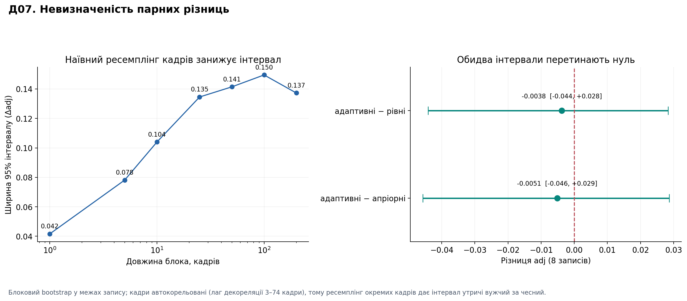

| Порівняння | Точкова оцінка | 95% інтервал | Перетинає нуль |
| --- | --- | --- | --- |
| адаптивні − апріорні | −0.0051 | **[−0.0458, +0.0287]** | так |
| адаптивні − рівні | −0.0038 | **[−0.0441, +0.0283]** | так |

Лаг декореляції за записами: **3–74 кадри**, автокореляція на лазі 1 —
0.48…0.88. Ширина інтервалу залежно від блока: 0.042 (блок 1) → 0.135 (блок
25) → 0.150 (блок 100).

**Як трактувати.** Інтервал приблизно **вдев'ятеро ширший за саму оцінку**.
Адаптивні ваги на цьому корпусі **невідрізнимі** від фіксованих — ні в кращий,
ні в гірший бік. Твердження §5.3, що адаптивність «програє за adj», треба
замінити на «не встановлено».

Окремо — методичний результат: наївний ресемплінг кадрів дав би **0.042**
замість чесних **0.135**. Хто вважає кадри незалежними, отримає інтервал
утричі вужчий і оголосить ефект там, де його немає.

**Чого це не доводить.** Що ефекту немає. Вісім записів — мала вибірка; це
означає лише, що цей корпус не може його виявити.

---

## Д08. Відтворення першого коду

**Що тестували.** Усі опубліковані числа «до» походили від `HISTORIC` —
реконструкції **параметрів** першого коміту всередині сучасного коду. Це
чесний спосіб спитати, що робили параметри, і нечесний — стверджувати, що так
поводилася перша версія: у ній ще були всі згодом виправлені дефекти.

**Як.** Створено `git worktree` на коміті `1f1c75c` і запущено **його власний
код** у окремому процесі. Пакет там називається `sharpness`, а результат має
одне поле `score` замість двох, тому імпортувати його поряд із поточним
`adaptive_sharpness` неможливо — звідси підпроцес.

**Що отримали.**

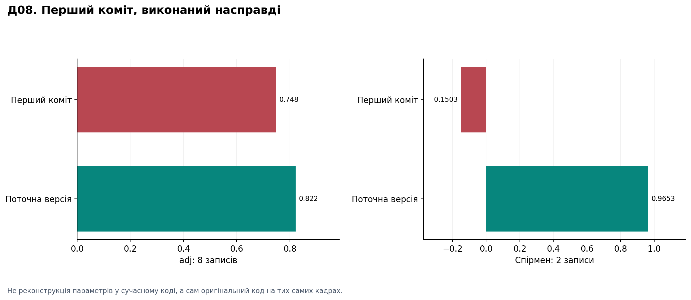

| Версія | adj (8) | Спірмен (2) | Впевненість |
| --- | --- | --- | --- |
| Перший коміт, виконаний | 0.7484 | **−0.1503** | 0.265 |
| Поточна | 0.8218 | **+0.9653** | 0.381 |

Реконструкція `HISTORIC` давала −0.0715 і −0.2369 на двох точкових записах,
тобто в середньому **−0.154**. Справжній перший код дає **−0.150**.

Узгодження рангів між версіями: 0.79…0.93 на записах умов, але **+0.002 і
−0.330** на точкових.

**Як трактувати.** Реконструкція була **точною** — розбіжність 0.004. Це
закриває відкрите питання зі звіту: опубліковані числа «до» можна читати як
поведінку першої версії, а не лише її параметрів.

Розбіжність саме на точкових записах логічна: там нормалізація ламалася
повністю, тож вихід першої версії там ніяк не пов'язаний із поточним.

**Чого це не доводить.** Що всі проміжні коміти поводилися між цими двома
крайніми точками.

---

## Д09. Нормалізація поетапно

**Що тестували.** Звіт казав, що конвеєр коштує 0.023 проти найкращої сирої
міри, але не казав, **яка саме частина** це коштує.

**Як.** Драбина стадій на **тих самих кадрах** з **тим самим критерієм**.
Стадії 1–4 обчислені з сирих значень, які видав сам evaluator; стадії 5–6 — це
його власний вихід із того ж прогону, а не переписаний алгоритм.

$$
x \;\to\; z=\ln(1+x) \;\to\; \underbrace{\frac{z-l}{h-l}}_{\text{фікс. лінійна}}
\;\to\; \underbrace{\frac{1}{1+e^{-g(z-\frac{l+h}{2})/(h-l)}}}_{\text{фікс. логістична}}
\;\to\; \text{потокова} \;\to\; +\,\text{фільтр}
$$

де $l,h$ — 5-й і 95-й процентилі **всього запису** (офлайн).

Стадія **5a** з'явилася після того, як перша версія дослідження виявилася
сплутаною: стадії 1–4 — це вейвлетна міра сама, а стадія 5 була шістьма
метриками, тож падіння між ними не можна було віднести ні до потокового
режиму, ні до набору метрик. 5a — вейвлетна міра через увесь потоковий
конвеєр — розділяє їх.

**Що отримали.**

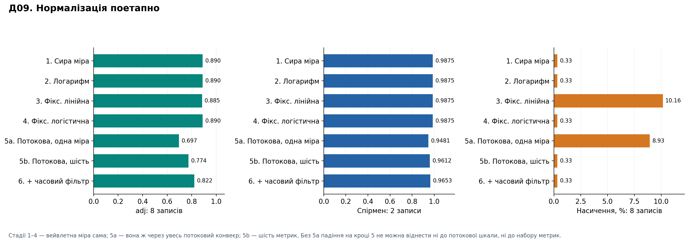

| Стадія | adj (8) | Спірмен (2) | Насичення |
| --- | --- | --- | --- |
| 1. Сира міра | 0.8897 | 0.9875 | 0.33 % |
| 2. Логарифм | 0.8897 | 0.9875 | 0.33 % |
| 3. Фікс. лінійна | 0.8849 | 0.9875 | **10.16 %** |
| 4. Фікс. логістична | 0.8897 | 0.9875 | 0.33 % |
| **5a. Потокова, одна міра** | **0.6969** | **0.9481** | **8.93 %** |
| 5b. Потокова, шість | 0.7740 | 0.9612 | 0.33 % |
| 6. + часовий фільтр | 0.8218 | 0.9653 | 0.33 % |

**Як трактувати.** Це найчистіше формулювання призначення конвеєра, яке
проєкт має:

- **Логарифм безкоштовний** — монотонне перетворення, рангові критерії не
  змінюються взагалі. Це водночас і перевірка коректності реалізації.
- **Офлайнове масштабування безкоштовне.** Лінійна шкала обрізає 10 % кадрів;
  логістична прибирає це до нуля, не втрачаючи нічого.
- **Уся втрата — це перехід в онлайн:** −0.193 adj і −0.039 Спірмена.
- **Злиття повертає +0.077 adj** і **повністю знімає насичення** (8.93 % →
  0.33 %). **Фільтр повертає ще +0.048.**

Тобто теза «конвеєр коштує 0.023» стосується **чистого** результату після
ремонту. Валова ціна роботи онлайн — 0.193 adj, і злиття з фільтром
відбивають дві третини. Саме заради цього ремонту вони існують.

**Чого це не доводить.** Порядок стадій зафіксовано; інша послідовність могла
б розподілити внески інакше.

---

## Д10. Залежність від передісторії

**Що тестували.** Документація каже, що оцінка належить історії одного потоку.
Це твердження про конструкцію. Ніхто не міряв **величину** ефекту.

**Як.** Той самий запис відтворюється кілька разів: з початку, з 10 %, 25 %,
50 % і у зворотному порядку. Порівнюються **ті самі кадри** — ті, що
потрапили в обидва прогони. Різниця тоді — це історія й нічого більше.

**Що отримали.**

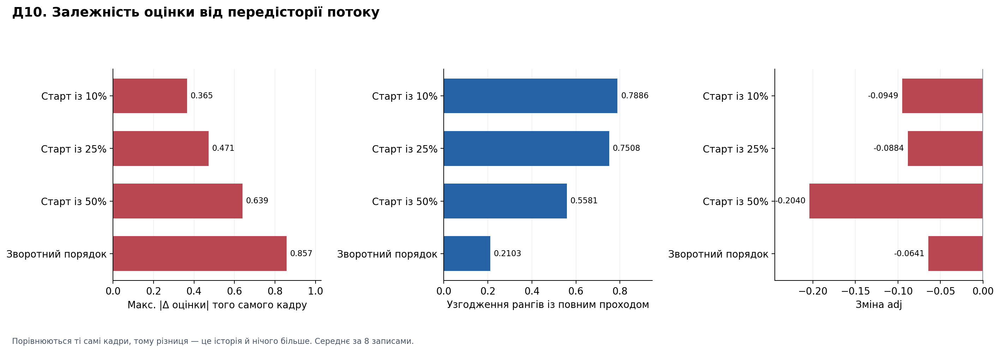

| Варіант | Макс. \|Δ оцінки\| | Узгодження рангів | Зміна adj | Пік зсунувся |
| --- | --- | --- | --- | --- |
| Старт із 10 % | 0.365 | 0.789 | −0.095 | 0.50 кроку |
| Старт із 25 % | 0.471 | 0.751 | −0.088 | 0.75 |
| Старт із 50 % | **0.639** | **0.558** | **−0.204** | 0.88 |
| Зворотний порядок | 0.857 | 0.210 | −0.064 | 1.00 |

Найгірший окремий випадок: `cond_20260916_110746` при старті з 50 % —
узгодження рангів **−0.53**, adj падає на **0.41**, максимум зсувається на
**3 кроки**.

**Як трактувати.** Це не тонкий ефект. Оцінка **істотно** є властивістю
моменту ввімкнення, а не кадру. Для реального автофокуса це означає: те, що
камера бачила до початку пошуку, впливає на числа під час пошуку.

Зв'язок із Д11 прямий: фіксація робить шкалу придатною, але фіксує **ту
історію, яка була**. Пізніший старт означає вужчу історію до фіксації.

Зворотний порядок — діагностика, не сценарій: реальний потік не йде назад.
Але узгодження 0.21 показує, наскільки шкала «запам'ятовує» напрямок.

**Чого це не доводить.** Що в реальному циклі буде так само: там перед пошуком
зазвичай є період спостереження, який тут не змодельовано.

---

## Д11. Параметри автофіксації

**Що тестували.** Звіт визнає, що `auto_freeze` має чотири сталі, підібрані на
тих самих записах, які їх оцінюють. Питання: наскільки результат від них
залежить.

**Як.** Повна сітка: мінімальна історія ∈ {120, 240, 480}, терпіння ∈ {60,
120, 240}, поріг стабільності ∈ {0.02, 0.05, 0.10} — 27 комбінацій плюс
вимкнений стан, кожна на восьми записах (224 прогони).

**Що отримали.**

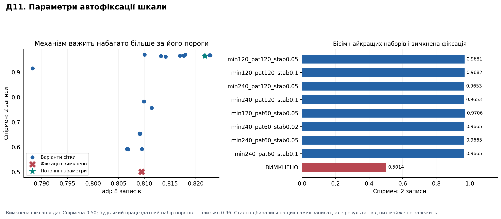

| Конфігурація | adj (8) | Спірмен (2) |
| --- | --- | --- |
| **Фіксацію вимкнено** | 0.8095 | **0.5014** |
| Поточна (240/120/0.05) | 0.8218 | **0.9653** |
| Найкраща в сітці (120/120/0.05) | 0.8229 | 0.9681 |
| Найгірша в сітці (120/240/0.02) | 0.8066 | 0.5913 |

Спірмен по всій сітці: 0.591…0.971. Вище 0.90 — **13 із 27** наборів.

**Як трактувати.** **Фіксація дає +0.46 рангової кореляції.** Це найбільший
ефект, виміряний у цьому проєкті — більший за злиття, адаптивність і фільтр
разом.

Водночас **де саме поставити пороги — майже байдуже**, якщо фіксація взагалі
спрацьовує вчасно і на кожному записі. Погані набори — це ті, де вона
спрацьовує пізно або не на всіх записах.

Це перевертає формулювання зі звіту. «Чотири сталі, підібрані на тих самих
даних» звучить як прихована підгонка. Насправді критичний **механізм**, а не
сталі: перепідбір їх майже нічого не змінює.

**Чого це не доводить.** Що фіксація доречна на потоці, де сцена справді
змінюється. Тут усі записи — один об'єктив і одна кімната.

---

## Д12. Поведінка ваг

**Що тестували.** §5.3 висунув механізм: адаптивність програє на найтемніших
записах, бо межовий та експозиційний чинники притиснуті до крайніх значень.
Ваги ніхто ніколи не читав — твердження було висновком із самих оцінок.

**Як.** Розширений replay, що зберігає для кожного кадру вагу, надійність і
нормоване значення **кожної** метрики разом із чинниками, які мають на них
впливати:

$$
r_i=\exp\Big(-\sum_j \kappa_{ij} d_j\Big),\qquad
u_i=\max(p_i r_i,\;0.02),\qquad w_i=u_i \Big/ \sum_k u_k .
$$

**Що отримали.**

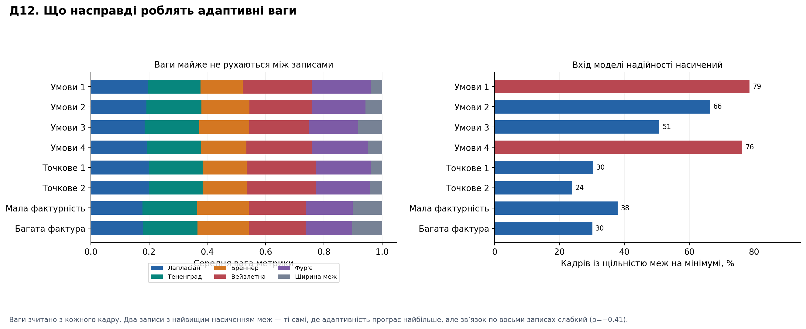

Розмах ваги за **весь** запис (точкове джерело 1):

| Метрика | Середня вага | Розмах за запис | Надійність |
| --- | --- | --- | --- |
| Вейвлетна | 0.2373 | 0.0329 | 0.387 |
| Лапласіан | 0.2002 | 0.0196 | 0.328 |
| Фур'є | 0.1897 | 0.0404 | 0.386 |
| Тененград | 0.1835 | **0.0106** | 0.302 |
| Бреннер | 0.1513 | 0.0333 | 0.250 |
| Ширина меж | 0.0380 | 0.0453 | 0.082 |

Мінлива частка ваги по корпусу: **0.0072…0.0237**.

Насичення входів: щільність меж стоїть на мінімумі на **24–79 %** кадрів;
найвищі значення (79 %, 76 %) — саме на двох записах, де адаптивність програє
найбільше. Але кореляція по всіх восьми записах — лише **ρ = −0.41**.

**Як трактувати.** Головне тут не механізм, а масштаб: **ваги майже не
рухаються**. За весь запис вага метрики змінюється на кілька відсотків
власного значення. Зважування «адаптивне» за назвою; на цих записах воно
працює майже як фіксоване.

Це пояснює Д07 повністю: різниці між адаптивними й фіксованими вагами не
знайдено, **бо розрізняти майже нічого**.

Механізм із §5.3 підтверджується **частково**. Два найгірші записи справді
мають найвище насичення меж, але `cond_20260916_110600` із 66 % насичення
виграє. Отже насичення меж — не достатнє пояснення, і §5.3 треба послабити.

**Чого це не доводить.** Що ваги не рухалися б на сцені з різкою зміною умов —
тут таких переходів у записах немає.

---

## Д13. Якість показника впевненості

**Що тестували.** Чи можна відкидати кадри за низькою впевненістю й отримувати
точніше вимірювання.

**Як — і чому перший підхід не спрацював.** Очевидний тест — крива
покриття/помилки — має **два артефакти**:

1. Відкидання кадрів прибирає цілі кроки протоколу, а `adj` визначений через
   сусідні кроки. Критерій змінюється разом із покриттям.
2. На точковому джерелі впевнені кадри — це кадри **біля фокуса**. Кореляція,
   порахована на звуженому діапазоні, падає з причин, не пов'язаних із якістю.

Тому додано критерій, вільний від обох: **у межах одного кроку справжній фокус
сталий**, тож розкид оцінки навколо медіани цього кроку — це похибка
вимірювання й нічого більше:

$$
e_t = \big|\,s_t - \operatorname{med}\{s_\tau : \ell_\tau = \ell_t\}\big| .
$$

Кадри діляться на терцилі за впевненістю **всередині** кроку.

**Що отримали.**

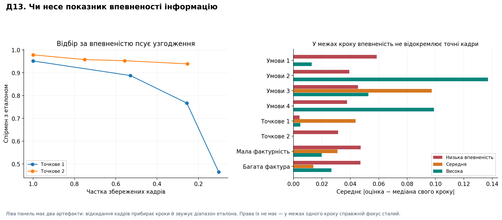

| Запис | Низька | Висока | Різниця | ρ(впевн., похибка) |
| --- | --- | --- | --- | --- |
| Умови 1 | 0.0587 | 0.0128 | **−0.046** | −0.289 |
| Умови 2 | 0.0393 | 0.1370 | **+0.098** | **+0.626** |
| Умови 3 | 0.0454 | 0.0527 | +0.007 | −0.123 |
| Умови 4 | 0.0377 | 0.0990 | +0.061 | +0.390 |
| Точкове 1 | 0.0043 | 0.0048 | +0.001 | −0.193 |
| Точкове 2 | 0.0314 | 0.0002 | **−0.031** | **−0.708** |
| Мала фактурність | 0.0474 | 0.0198 | −0.028 | −0.095 |
| Багата фактура | 0.0472 | 0.0267 | −0.021 | −0.280 |

Корисна (впевнені кадри точніші) на **4 записах із 8**.

**Як трактувати.** Монетка. Кореляція між впевненістю й похибкою коливається
від −0.71 до +0.63 залежно від запису — тобто показник не має сталого знаку.
Як **індикатор придатності окремого кадру він не працює**.

Практичний наслідок: порада гейтувати вимірювання порогом впевненості (як у
прикладі [INTEGRATION.md](INTEGRATION.md)) цими даними **не підтримана**.

Додатково: впевненість дорівнює нулю на 24–79 % кадрів, тому терцилі часто
вироджуються — середній терциль у кількох записах порожній.

**Чого це не доводить.** Що показник не корисний як **агрегат** — «у цьому
потоці загалом погані умови» може бути правдою, навіть коли покадровий
порядок випадковий. Це окреме питання.

---

## Д14. Часовий фільтр

**Що тестували.** У факторному плані фільтр був найбільшим позитивним
контрастом, але вимірювалося лише «ввімкнено/вимкнено». Питання — параметр.

**Як.** Сітка $\alpha_{\text{base}}$ ∈ {0.1, 0.2, 0.35, 0.5, 0.75, 1.0} ×
{зв'язано з впевненістю, без зв'язку}, плюс вимкнений фільтр. Затримка
міряється як медіана кадрів, за які оцінка проходить 90 % шляху до нового
рівня після зміни кроку:

$$
\widehat S_t=\widehat S_{t-1}+\alpha_t\,(S_t-\widehat S_{t-1}).
$$

**Що отримали.**

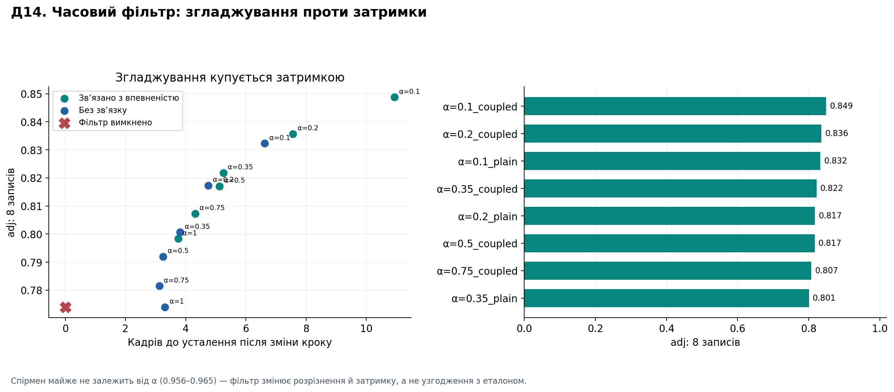

| Конфігурація | adj (8) | Спірмен (2) | Кадрів до усталення | Розкид на утриманні |
| --- | --- | --- | --- | --- |
| α=0.1, зв'язано | **0.8488** | 0.9560 | **10.94** | 0.0156 |
| α=0.2, зв'язано | 0.8357 | 0.9645 | 7.56 | 0.0159 |
| α=0.1, без зв'язку | 0.8323 | 0.9651 | 6.63 | 0.0167 |
| **α=0.35, зв'язано (поточна)** | 0.8218 | **0.9653** | **5.25** | 0.0169 |
| α=0.5, зв'язано | 0.8170 | 0.9652 | 5.13 | 0.0178 |

**Як трактувати.** Чистий компроміс. Сильніше згладжування дає **+0.027 adj**
ціною **подвоєння затримки** (5.25 → 10.94 кадру). Поточне значення сидить
приблизно посередині.

Важливо: **Спірмен майже не залежить від α** (0.956…0.965). Фільтр змінює
розрізнення сусідніх кроків і затримку, але **не змінює узгодження з
еталоном**. Це два різні призначення, і плутати їх не варто.

Для автофокуса вибір залежить від того, що дорожче: зайвий крок пошуку чи
зайві 5 кадрів на кожне вимірювання. Цими даними питання не вирішується — тут
немає приводу.

**Чого це не доводить.** Що затримка в кадрах переводиться в час однаково:
частота потоку в записах не стала.

---

## Д15. Підмножини метрик

**Що тестували.** Опубліковане вилучення метрик рахувалося на проміжній
конфігурації **з увімкненим ядром згоди**, тож його висновок не можна було
перенести на поточну. Питання складу набору лишалося відкритим.

**Як.** Усі **63** непорожні підмножини шести метрик, поточна конфігурація
(ядро вимкнене), вісім записів — 504 прогони.

**Що отримали.**

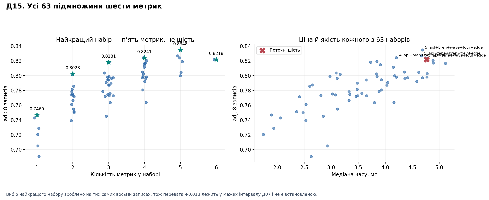

| Розмір | Найкращий набір | adj (8) | Спірмен (2) | мс |
| --- | --- | --- | --- | --- |
| 1 | Бреннер | 0.7469 | 0.9304 | 1.89 |
| 2 | Фур'є + ширина меж | 0.8023 | 0.9608 | 3.84 |
| 3 | Лапл. + вейвл. + Фур'є | 0.8181 | 0.9549 | 3.73 |
| 4 | Лапл. + Бренн. + вейвл. + Фур'є | 0.8241 | 0.9540 | 4.20 |
| **5** | **без Тененграда** | **0.8348** | **0.9682** | **4.68** |
| 6 | усі шість (поточний) | 0.8218 | 0.9653 | 4.77 |

**Як трактувати.** Найкращий набір — **пʼять метрик, не шість**. Вилучення
Тененграда покращує обидва критерії й трохи здешевлює. Це узгоджується з
раніше опублікованим вилученням по одній, але тепер — для конфігурації, яка
справді відвантажується.

Спадна віддача чітка: 1→2 дає +0.055, 2→3 +0.016, 3→4 +0.006, 4→5 +0.011,
5→6 **−0.013**.

Дві метрики вже дають 0.802 / 0.961 за 3.84 мс — приблизно 80 % користі за
80 % ціни.

**Чого це не доводить — і це тут головне.** Найкращий із 63 наборів вибрано на
**тих самих** восьми записах, на яких його й оцінено. Перевага +0.013 лежить
усередині інтервалу Д07 (±0.04). **Це підказка для незалежної перевірки, а не
підстава змінювати стандартний набір.**

---

## Д16. Масштаб та область інтересу

**Що тестували.** Ширину аналізу раніше перевіряли на проміжній конфігурації;
область інтересу не перевіряли ніколи.

**Як.** Ширина ∈ {160, 240, 320, 480, 640} × область ∈ {весь кадр, центр 50 %,
центр 25 %}, поточна конфігурація.

**Що отримали.**

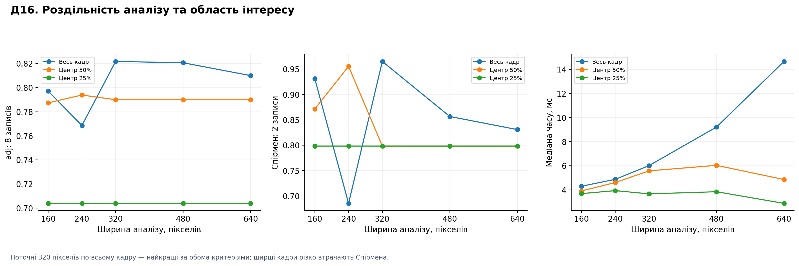

| Варіант | adj (8) | Спірмен (2) | мс |
| --- | --- | --- | --- |
| **320, весь кадр (поточний)** | **0.8218** | **0.9653** | 6.02 |
| 480, весь кадр | 0.8207 | 0.8568 | 9.21 |
| 640, весь кадр | 0.8100 | 0.8310 | 14.65 |
| 160, весь кадр | 0.7972 | 0.9311 | 4.31 |
| 320, центр 50 % | 0.7900 | 0.7985 | 5.59 |

**Як трактувати.** Поточний вибір підтверджено за обома критеріями. Ширші
кадри **різко втрачають** узгодження з еталоном (0.965 → 0.857 → 0.831) і при
цьому коштують у 1.5–2.4 рази більше. Центральні вирізи гірші скрізь.

Механізм для ширини вже відомий: масштабування 2×2 при зменшенні піднімає
смугу Гаара над 8-бітним квантуванням, і без нього оцінювач шуму вироджується.
Вирізи ж просто викидають зміст, який несе фокусну інформацію — у цих сценах
об'єкт не лише в центрі.

**Чого це не доводить.** Що так буде для сцени з одним об'єктом у центрі. Тут
перевірено цю кімнату, не загальний випадок.

---

## Д17. Штучні деградації реальних кадрів

**Що тестували.** Як оцінка реагує, коли реальний кадр псують керовано.

**Як.** До кожного кадру застосовується одне перетворення з фіксованим seed,
далі — звичайний прогін. Сімейства: гаусів шум σ ∈ {2, 5, 10, 20}, множення
яскравості ∈ {0.5, 0.75, 1.5, 2}, пересвіт, зсув на {1, 3, 8} пікселів і
**розмиття** ∈ {1, 2, 4} як перевірка розумності: міра фокуса, яка не падає на
розмитому кадрі, зламана.

**Що отримали.**

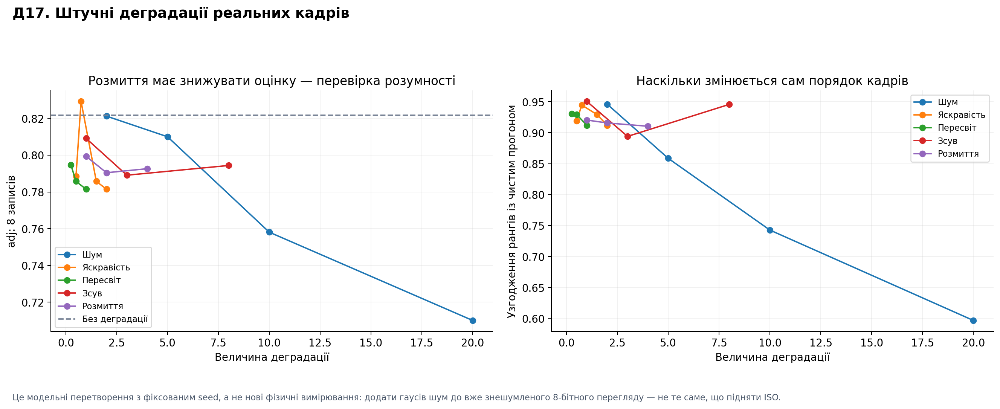

| Деградація | adj (8) | Δ середньої оцінки | Ранги vs чистий | Виміряна σ шуму |
| --- | --- | --- | --- | --- |
| Немає | 0.8218 | — | — | 0.470 |
| Розмиття 1 | 0.7993 | **+0.000** | 0.920 | 0.408 |
| Розмиття 4 | 0.7926 | **+0.014** | 0.910 | 0.227 |
| Шум σ=5 | 0.8100 | −0.065 | 0.859 | 1.786 |
| Шум σ=20 | **0.7101** | −0.132 | **0.597** | 6.503 |
| Яскравість ×2 | 0.7815 | +0.006 | 0.912 | 0.342 |
| Зсув 8 пікселів | 0.7944 | +0.018 | 0.946 | 0.462 |

**Як трактувати.** Три висновки, з них один — найважливіше практичне
застереження в усьому наборі.

**Оцінка сліпа до рівномірного розфокусу всього потоку.** Розмиття **кожного**
кадру не знижує середньої оцінки взагалі (Δ = +0.000…+0.014). Причина
очевидна, щойно її побачити: нормалізатор підганяє шкалу під те, що бачить.
Якщо розмито все, «найрізкіший із наявних» лишається 1.0. Документація це
каже словами («оцінка відносна»), але тут воно виміряне: **система не може
повідомити, що весь потік не у фокусі** — лише що один кадр різкіший за інший
у тому ж потоці.

**Шум — єдине, що справді шкодить.** adj падає 0.822 → 0.710, а порядок кадрів
розходиться з чистим прогоном до 0.597.

**Інваріантність до яскравості працює.** Множення яскравості, пересвіт і зсув
зміщують оцінку не більше ніж на 0.018 — саме те, заради чого енергетичні міри
ділять на квадрат середньої інтенсивності.

Побічно: виміряна σ шуму ≈ **0.33 × впорснута** (0.895 / 1.786 / 3.508 / 6.503
для 2 / 5 / 10 / 20). Це прямо підтверджує задокументоване «читає приблизно на
35 % нижче» — тепер проти відомого значення, а не як здогад. Оцінювач
занижений, але **монотонний**.

**Чого це не доводить.** Це модельні перетворення, не нові фізичні
вимірювання. Додати гаусів шум до вже знешумленого 8-бітного перегляду — не
те саме, що підняти ISO на сенсорі.

---

## Д18. Чутливість коефіцієнтів надійності

**Що тестували.** Матриця κ задана евристично й ніколи не оцінювалася. Питання
не «яке значення найкраще», а «чи взагалі результат від них залежить».

**Як.** Уся матриця множиться на один коефіцієнт ∈ {0, 0.25, 0.5, 1, 2, 4, 8}.
Нуль — модель надійності вимкнена. Окремо зроблено **розділення**: підбір на
чотирьох записах умов, оцінка — на решті чотирьох.

**Що отримали.**

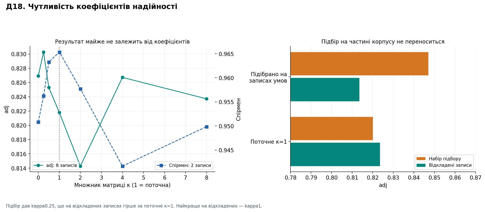

| Множник κ | adj (8) | Спірмен (2) |
| --- | --- | --- |
| 0 (модель вимкнена) | 0.8269 | 0.9508 |
| 0.25 | **0.8303** | 0.9562 |
| 0.5 | 0.8253 | 0.9633 |
| **1 (поточний)** | 0.8218 | **0.9653** |
| 4 | 0.8267 | 0.9417 |
| 8 | 0.8237 | 0.9499 |

Розділення підбору й оцінки:

| | На наборі підбору | На відкладених записах |
| --- | --- | --- |
| Підібране κ=0.25 | **0.8471** | 0.8135 |
| Поточне κ=1 | 0.8201 | **0.8235** |

**Як трактувати.** Весь діапазон adj по всіх множниках — 0.822…0.830, тобто
**коефіцієнти майже не важать**. Це узгоджується з Д12: ваги й так майже не
рухаються, тож множення чутливостей мало що змінює.

Друга таблиця — наочна ілюстрація пастки підбору. κ=0.25 виглядає найкращим на
наборі підбору (0.8471), але на відкладених записах **гірший** за поточне
значення (0.8135 проти 0.8235). Найкращим на відкладених виявляється саме
κ=1. Якби підбір робили без розділення, опублікували б погіршення як
покращення.

**Чого це не доводить.** Що поточне κ оптимальне — лише що воно переноситься
краще за підібране на цьому корпусі, де записів мало.

---

## Д19. Пошук по записаному проходу

**Що тестували.** Чи має сигнал форму, по якій пошук може піднятися до
правильного кроку.

**Як.** За профілем кроків уже записаного проходу симулюються дві стратегії:
сходження вгору з усіх можливих стартів і тернарний пошук, кожна з бюджетом
оцінювань. Помилка міряється і проти максимуму самого сигналу, і проти
максимуму еталона.

**Що отримали.**

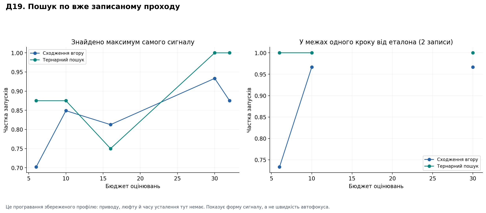

| Стратегія / бюджет | Знайшов максимум сигналу | Оцінювань | У межах 1 кроку від еталона |
| --- | --- | --- | --- |
| Сходження, 6 | 0.70 | 4.9 | 0.73 |
| Сходження, 10 | 0.85 | 5.6 | **0.97** |
| Тернарний, 6 | 0.88 | 8.5 | **1.00** |
| Тернарний, 10 | 0.88 | 8.5 | **1.00** |
| Тернарний, 30 | **1.00** | 10.0 | **1.00** |

**Як трактувати.** Сигнал придатний для пошуку. Тернарний пошук за **8.5
оцінок** потрапляє в межі одного кроку від еталона у **100 %** запусків;
сходження вгору за 5.6 оцінок — у 97 %.

Залишкова помилка 1.0 крок — це **роздільність самого еталона**: у
опублікованих таблицях `peak_err` поточної системи теж дорівнює 1.0. Тобто
пошук працює настільки точно, наскільки еталон здатен це перевірити.

Сходження вгору дешевше (5.6 проти 8.5 оцінок), але залежить від старту й
частіше зупиняється на локальній нерівності.

**Чого це не доводить — і це принципово.** Це програвання **вже записаного**
профілю. Тут немає приводу, люфту, часу усталення й вартості зміни напрямку.
Число оцінювань — не час автофокуса. Замкнений контур цим не виміряний і не
може бути виміряний із цих даних.

---

## Д20. Стійкість критеріїв оцінювання

**Що тестували.** У §5.3 два критерії дали протилежний знак. Це властивість
того порівняння чи критеріїв узагалі?

**Як.** 27 конфігурацій ранжуються за кожним критерієм, далі рангова кореляція
між ранжуваннями. Окремо — залежність ширини плато від допуску:

$$
W(\varepsilon)=\big|\{k:\ m_k \ge \max_j m_j - \varepsilon\,(\max_j m_j-\min_j m_j)\}\big| .
$$

**Що отримали.**

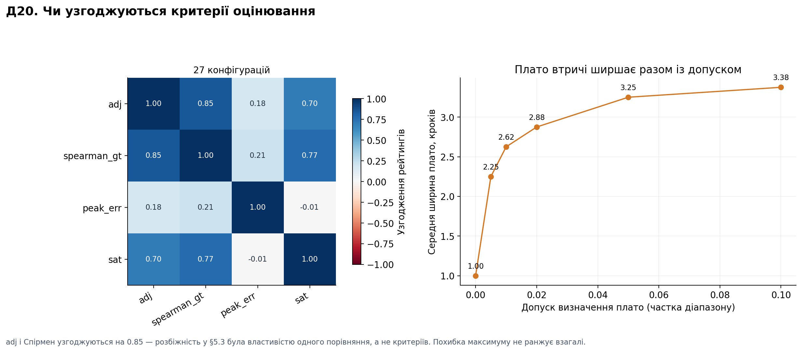

| | adj | Спірмен | Похибка піка | Насичення |
| --- | --- | --- | --- | --- |
| **adj** | 1.000 | **0.851** | 0.180 | 0.700 |
| **Спірмен** | 0.851 | 1.000 | 0.214 | 0.767 |
| **Похибка піка** | 0.180 | 0.214 | 1.000 | −0.007 |

| Допуск | 0 | 0.005 | 0.01 | 0.02 | 0.05 | 0.1 |
| --- | --- | --- | --- | --- | --- | --- |
| Середнє плато, кроків | **1.00** | 2.25 | 2.62 | 2.88 | 3.25 | **3.38** |

**Як трактувати.** **adj і Спірмен узгоджуються на 0.851.** Отже розбіжність у
§5.3 — властивість того конкретного порівняння, де ефект крихітний (і, за
Д07, узагалі невідрізнимий від нуля), а не властивість критеріїв. Обидва
можна використовувати далі.

**Похибка піка не ранжує нічого** (0.18 і 0.21). Це кількісно підтверджує вже
сказане: еталон локалізує фокус із точністю до кроку, тож `peak_err` не здатен
розділяти моделі й не повинен використовуватись як критерій.

**Ширина плато втричі залежить від допуску.** «Плато один крок» — твердження
про допуск не менше, ніж про сигнал. Кожне число про плато має йти з указаним
допуском.

**Чого це не доводить.** Що критерії узгодяться на конфігураціях, які сильно
відрізняються від перевірених 27.

---

## Що з цього треба змінити в основному звіті

| Твердження у звіті | Стан після досліджень |
| --- | --- |
| §5.3: адаптивність програє за adj (−0.0050) | **Не встановлено.** Інтервал [−0.046, +0.029] (Д07) |
| §5.3: механізм — насичені чинники на темних записах | **Частково.** Два крайні випадки так, загальний звʼязок ρ=−0.41 (Д12) |
| §5.9: конвеєр коштує 0.023 | **Це чистий результат.** Валова ціна онлайну −0.193 adj, ремонт повертає ⅔ (Д09) |
| §7: `auto_freeze` — чотири підігнані сталі | **Механізм критичний, сталі — ні** (Д11) |
| §7: порівняння «до» — лише реконструкція | **Закрито.** Реальний перший коміт −0.150 проти −0.154 (Д08) |
| §5.7: склад набору для поточної конфігурації відкритий | **Пʼять метрик краще за шість, але в межах шуму** (Д15) |
| Впевненість як гейт вимірювання | **Не підтримано даними** (Д13) |
| — | **Нове:** оцінка сліпа до рівномірного розфокусу потоку (Д17) |
| — | **Нове:** оцінка сильно залежить від моменту старту потоку (Д10) |

---

## Як відтворити

```bash
python3 tools/programme.py all --data <каталог із записами> --workers 32
python3 tools/figures_studies_ua.py
```

Кадри локально замість мережевої шари прискорюють читання приблизно в шість
разів. Заміри часу в цих звітах зроблені на робочій станції, **не** на
Raspberry Pi — для порівняння продуктивності треба брати числа з
[reports/README.md](../reports/README.md).
